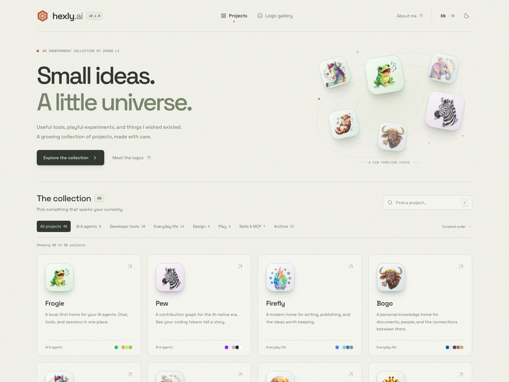

<p align="center">
  
</p>
<h1 align="center">hexly.ai</h1>
<p align="center">
  <strong>个人项目的小宇宙</strong><br />
  浏览项目 · 收藏原标 · 对照尺寸 · 查看色板
</p>
<p align="center">
  <a href="https://github.com/nocoo/hexly.ai/releases"></a>
  
  
  
  <a href="https://github.com/nocoo/hexly.ai/actions/workflows/ci.yml"></a>
  <a href="LICENSE"></a>
</p>



---

## 这是什么

[hexly.ai](https://hexly.ai) 是我的个人项目导航站，也是项目视觉身份的收藏柜。它从 [GitHub profile](https://github.com/nocoo) 整理项目名称、描述与 Emoji，保存各仓库的实际 Logo 和色板，让散落的工具、游戏与实验有一个统一入口。

目前收录 70 个项目，备份 56 份原始图像；其余 14 个项目沿用已有 Emoji，并明确标注来源。所有项目都有中英文介绍、颜色依据和独立档案。Logo 家族同时支持重绘与原图规范化：保留喜欢的动物，补充专属底纹和展示版本，原图与完整过程都留在档案中。

## 功能

- **项目导航** — 按分类浏览、搜索中英文名称与描述，访问已核实的站点或源码仓库。
- **服务状态** — 在 [status.hexly.ai](https://status.hexly.ai) 查看活跃网站的 `/api/live`，每 5 分钟检查一次，保留最近 7 天记录，支持小时历史、响应时间和异常筛选。
- **Logo 画廊** — 宽幅新旧对照，图标、透明和白底视图，128 / 64 / 32 / 16 px 尺寸与侧栏、浏览器场景；浅深底色检查、可复制色板、生成提示词或展示说明，以及原始文件下载。Refined 项目在列表、分类和搜索结果中优先展示。
- **真实色板** — 展示项目的前景色、背景色与点缀色，点击复制颜色值。
- **原标备份** — 下载保留原始字节的图像，追溯来源路径、提交版本与 SHA-256。
- **中英文与明暗主题** — 首次访问跟随系统偏好，之后记住手动选择。
- **可分享的状态** — 搜索、分类、排序和选中的 Logo 保存在 URL 中，支持刷新与浏览器返回。

## 安装

直接访问 **[hexly.ai](https://hexly.ai)**，无需安装或登录。也可以打开 [Logo 画廊](https://hexly.ai/logos/frogie)。

## 命令一览

| 命令 | 用途 |
| --- | --- |
| `bun run dev` | 启动 Vite 7048 与 Wrangler 37048，自动初始化本地 SQLite D1 模拟数据 |
| `bun run build` | 构建静态站点和版本元数据 |
| `bun run preview:worker` | 在本地 Workers 运行时预览构建结果 |
| `bun run gate:commit` | 静态分析、单元测试覆盖率和暂存区密钥检查 |
| `bun run gate:push` | HTTP 集成测试、依赖漏洞和 Git 历史密钥检查 |
| `bun run test:browser` | 运行桌面与移动端浏览器测试 |
| `bun run assets:build` | 生成 32 / 64 / 160 / 1024 px WebP 预览 |
| `bun run assets:check` | 校验原图哈希和全部预览图 |
| `bun run docs:profiles` | 从项目数据生成独立档案 |
| `bun run release -- --dry-run` | 预览版本与发布说明，不修改文件或远端 |
| `bun run release -- 0.1.0` | 发布指定版本，等待 CI/CD 后创建 Tag 和 Release |
| `bun run verify:production` | 核实生产版本、Git 提交、页面与资源 |

## 项目结构

```text
hexly.ai/
├── src/
│   ├── components/       # 页面组件
│   ├── data/             # 项目目录、双语文案和版本
│   ├── model/            # 筛选、导航、偏好等纯逻辑
│   ├── App.tsx           # 状态与交互编排
│   └── styles/           # 主题、布局和图标展示
├── public/logos/         # 原图、Emoji 和 WebP 预览
├── scripts/             # 本地模拟库、资源生成、质量门控和发布
├── worker/              # 路由、Status API 与定时健康检查
├── migrations/          # D1 表结构迁移
├── tests/               # 单元、HTTP 与浏览器测试
├── docs/                # 规则、部署、来源快照和项目档案
├── .github/workflows/   # CI 与自动部署
└── wrangler.jsonc       # Workers Static Assets 配置
```

## 技术栈

| 技术 | 用途 |
| --- | --- |
| [React 19](https://react.dev/) · [TypeScript 7](https://www.typescriptlang.org/) | 界面与类型约束 |
| [Vite 8](https://vite.dev/) · [Bun 1.4](https://bun.sh/) | 开发、构建与脚本 |
| [Cloudflare Workers](https://developers.cloudflare.com/workers/static-assets/) | 静态资源托管与自定义域名 |
| [Cloudflare D1](https://developers.cloudflare.com/d1/) · [Cron Triggers](https://developers.cloudflare.com/workers/configuration/cron-triggers/) | 状态记录、每 5 分钟探测和 7 天自动清理 |
| [Sharp](https://sharp.pixelplumbing.com/) | 图像尺寸转换与原图校验 |
| [Vitest](https://vitest.dev/) · [Playwright](https://playwright.dev/) | 单元、HTTP 与浏览器测试 |
| [Biome](https://biomejs.dev/) · [OSV](https://google.github.io/osv-scanner/) · [Gitleaks](https://github.com/gitleaks/gitleaks) | 格式、静态分析和安全检查 |

## 开发

需要 Bun 1.4.0 和 Node.js 24 以上；发布任务固定使用 Node.js 26.7.0。

```sh
git clone https://github.com/nocoo/hexly.ai.git
cd hexly.ai
bun install --frozen-lockfile
bun run dev
```

默认地址为 `http://127.0.0.1:7048`。本机通过 Caddy 使用 **[index.dev.hexly.ai](https://index.dev.hexly.ai)**，配置见[开发与部署](docs/04-development.md)。

本地状态页位于 `/status`，通过真实 Worker API 读取 Wrangler 的 SQLite D1。
开发脚本自动载入 7 天模拟记录，页面明确标注模拟数据；本地不会探测生产站点。
存储和定时方案见[Status 实现说明](docs/11-status-monitoring.md)。

项目资料按项目拆在 [`src/data/projects/`](src/data/projects/)，页面启动时加载 `/data/projects.json`。构建会生成首页与 `/logos/<project>` 的 HTML 快照、[`/llms.txt`](https://hexly.ai/llms.txt)、sitemap，以及产品站可复用的 [`/api/share`](https://hexly.ai/api/share.json) 分享元数据。接入说明见 [`docs/10-social-share.md`](docs/10-social-share.md)。更新 GitHub profile 时，同时更新本站的数据、Logo 备份和色板，再生成预览与档案。普通构建直接使用仓库内的资源，不依赖相邻项目或运行时 GitHub 请求。

## 测试

实现之前已建立六维质量体系，提交和推送由 Husky 执行本地门控，GitHub Actions 通过全部检查后自动部署 `main`。

| 维度 | 检查内容 |
| --- | --- |
| L1 | 目录、交互模型、发布规则和隔离逻辑，四项覆盖率均至少 90% |
| L2 | Workers 本地运行时的真实 HTTP 响应、版本信息、资源与校验和 |
| L3 | 桌面与移动端流程、双语、明暗主题、画廊、剪贴板和无障碍 |
| G1 | 严格 TypeScript 与 Biome 零警告 |
| G2 | OSV 依赖漏洞与 Gitleaks 密钥扫描 |
| D1 | 独立测试端口与状态目录，不绑定生产服务或存储 |

D1 在这里表示测试隔离维度。本站无需数据库。首次运行浏览器测试前，执行 `bunx playwright install chromium`；完整门控还需要安装 `gitleaks` 和 `osv-scanner`。

## 文档

- [整体设计与架构](docs/01-overview.md)
- [身份与内容通用规则](docs/02-identity-rules.md)
- [六维质量体系](docs/03-quality.md)
- [本地开发与 Cloudflare 部署](docs/04-development.md)
- [版本与发布流程](docs/05-release.md)
- [项目档案与色板](docs/profiles/README.md)
- [来源快照](docs/sources/README.md)
- [Changelog](CHANGELOG.md)

## License

[MIT](LICENSE) © 2026 Zheng Li
