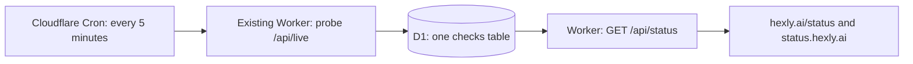

# Status page: storage and scheduling review

Status: approved on 2026-09-11. Database name: `hexly-status`. The existing CD
token has D1 permissions. Implementation and deployment are authorized.

## Recommendation

Extend the existing Worker with a Cloudflare Cron Trigger and one D1 database.
Use the existing React application for `/status`, also served at the root of
`status.hexly.ai`. Keep the catalogue as the source of monitored projects.

D1 directly supports the required inserts, retention deletes, and time-range
queries. Durable Objects would also work, but these independent scheduled probes
do not need an actor, per-object alarms, or persistent connections. No additional
runtime dependency or separately deployed status application is needed.

## Fixed constraints

- Probe every five minutes, with `*/5 * * * *` in Wrangler configuration.
- Retain a rolling seven days of individual check results.
- Monitor non-archived catalogue projects with an independent public website.
- Derive the target as the website origin plus `/api/live`.
- Links to package registries and app stores are not independent project sites.
- Keep projects without a site visible in a separate coverage section, outside
  availability calculations. Archived projects are not displayed or probed.

The catalogue on 2026-09-11 contains 54 active projects, including 28 independent
websites and three distribution-page links. At this size, seven days contains at
most `28 × 12 × 24 × 7 = 56,448` scheduled check records, before retries. Retries
belong to their original check and do not add another statistical sample.

## Storage

One `checks` table, with these fields:

| Field | Purpose |
| --- | --- |
| `project_id` | Stable catalogue project ID |
| `endpoint` | Exact public health-check URL, to separate endpoint changes |
| `slot` | UTC five-minute schedule bucket; deduplication key |
| `checked_at` | Actual completion timestamp |
| `status` | Operational, degraded, unavailable, or invalid endpoint response |
| `http_status` | HTTP status, nullable for connection failures |
| `latency_ms` | Observed response time |
| `error_code` | Bounded public error category; no raw error or response body |
| `version` | Optional, bounded public version string |

Use a composite primary key `(project_id, slot)` and an index on `checked_at`.
Insert with `ON CONFLICT DO NOTHING`. Cloudflare rescheduling or a repeated
invocation cannot double-count the same project and five-minute slot.

After probing, submit the inserts and
`DELETE FROM checks WHERE checked_at < ?` in one D1 batch transaction. The cutoff
is the current time minus seven days. Run cleanup even if the project list is
empty or probes fail. Normal cleanup lag is at most one five-minute interval;
after an interrupted schedule, the next successful run catches up.

Every read also applies the seven-day cutoff. Old records never reappear in the
public API if a cleanup run is delayed. Current state, sample availability, and
hourly history are computed from this small table; there are no separate rollup,
latest-state, incident, or queue tables to keep consistent.

## Scheduling and failure behavior

The Cron handler probes the fixed catalogue targets on the server, with bounded
concurrency and per-request timeouts. A transient timeout or server failure gets
one retry within the same scheduled sample. A healthy response requires a
successful HTTP status and a JSON health response; an HTML SPA fallback must
never count as healthy. Current legacy formats and missing endpoints are shown
explicitly, without silently treating them as successful integrations.

The handler waits for its writes to finish. Visitors only read stored results;
opening or refreshing the status page does not trigger upstream probes. Cron is
configured with the deployment and continues without browser traffic. No
self-rescheduling alarm chain, external service, or secret write endpoint is
needed.

Missing samples are unknown. They are not fabricated as uptime or downtime.
Show sample availability together with sampling coverage. A last result older
than ten minutes is stale and must not continue to claim current operational
status. Latency represents this Cloudflare probe, not a global average.

## Public page and API

- `GET /api/status`: bounded JSON containing latest results, seven-day totals,
  hourly history, coverage, and last-check time.
- Cache the public response briefly (60 seconds); preserve its original data
  timestamps so the UI can detect staleness even from a cached response.
- The React page uses the site's existing typography, themes, bilingual copy,
  navigation, project logos, and accessible controls.
- Provide system summary, service rows, seven-day history, response times, and
  endpoint integration details. All displayed history comes from real samples.
- Bind `status.hexly.ai` as another custom domain on the existing Worker and
  serve the status view at its root. Keep `hexly.ai/status` as a second entry.

## Validation before deployment

Use a separate local/test D1 binding and explicit test fixtures. Verify archive
and distribution-link filtering, JSON versus HTML responses, timeouts, duplicate
samples, rolling retention, missing data, and stale status. Check real SQL in the
local Workers runtime, and browser layout/accessibility in both themes on desktop
and mobile. Production endpoints must not be called by automated tests.

## Local mock data

`bun run dev` starts Vite at `http://127.0.0.1:7048` and Wrangler at `37048`.
The local `/status` page reads the real Worker API against Wrangler's SQLite D1,
not an intercepted API response. `scripts/local-status.ts` applies migrations and
seeds seven days of synthetic checks, including outages, recovery, degraded
responses, an unconfigured endpoint, missing hours, and a never-sampled service.
The API marks the snapshot `mode: "demo"`; the page shows a visible disclosure.
Fixtures refresh every five minutes in development and stay fixed during tests.

Production uses database `hexly-status`
(`4d79ab15-804e-4b4c-893d-796986eaf954`). Local environments use fake IDs and
separate SQLite paths: `.wrangler/dev`, `.wrangler/preview`, `.wrangler/http`, and
`.wrangler/browser`. Cron is disabled in local configuration. Calling a local
test schedule only prunes expired data; public probes require `STATUS_MODE=live`.

Deployment applies `migrations/` with the existing CD token before deploying the
Worker. Cloudflare manages the custom domain's DNS and TLS. The first public
history is empty until the first Cron run; it is never backfilled with fixtures.

## References

- [Cloudflare Cron Triggers](https://developers.cloudflare.com/workers/configuration/cron-triggers/)
- [D1 batch transactions](https://developers.cloudflare.com/d1/worker-api/d1-database/#batch)
- [Durable Objects SQLite storage](https://developers.cloudflare.com/durable-objects/api/sqlite-storage-api/)
- [UptimeFlare](https://github.com/lyc8503/UptimeFlare) — existing Cloudflare status
  application; its current implementation uses D1. Used as a reference, not a
  replacement for the site's design and deployment.
