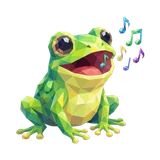

# 🐸 Frogie

## Profile

- Repository: [nocoo/frogie](https://github.com/nocoo/frogie)
- Website: No current website verified; navigation opens the repository.
- Website evidence: Not applicable
- Category: ai
- English: A local-first home for your AI agents. Chat, tools, and sessions in one place.
- Chinese: AI 智能体的本地工作台，把对话、工具与会话放在一起。
- Profile section: Recent Projects
- Profile revision: `9a7ad63e1e96428f9dcd12214bcdbd470b3b51c6`
- Repository revision inspected: `3643e162ef3e3b784a1f8a7c88bd433fae0d5e45`

## Current logo

- Type: Original project artwork, copied without modification
- Subject: Full-body green frog with musical notes
- [Source](https://github.com/nocoo/frogie/blob/3643e162ef3e3b784a1f8a7c88bd433fae0d5e45/logo.png): `logo.png`
- [Preserved asset](../../public/logos/originals/frogie.png)
- Original dimensions: 2048 × 2048
- Original size: 3135551 bytes
- SHA-256: `cf53c0a17c5a025dcfa4b3b1eb50e1088a62aa89c1d51813881f8a751c61fbb6`
- Locally modified source: No
- Display derivatives: 32, 64, 160, and 1024 px WebP; contain-fit, transparent padding, no recoloring or cropping.

## Current palette

| Role | Value | Evidence |
| --- | --- | --- |
| primary | `#21c45d` | packages/web/src/index.css --primary: 142 71% 45% |
| background | `#eeeff2` | packages/web/src/index.css --background: 220 14% 94% |
| accent | `#ceb557` | Preserved project artwork, sampled pixel |
| accent | `#c3ee75` | Preserved project artwork, sampled pixel |
| accent | `#91d144` | Preserved project artwork, sampled pixel |

Theme tokens take precedence. Additional colors are sampled from the preserved artwork. A transparent background means the source does not define an opaque background; the gallery's surrounding paper is not part of the project palette.

## Future family notes

This is a preferred family reference. Preserve its recognizable subject and balance of dominant color with multicolored details.

Use head portraits for large animals and optionally full-body poses for small animals. Compare artwork, app icon, sidebar, and favicon sizes in both themes before adopting a replacement. No new logo is generated in phase one.
