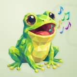

# 🐸 Frogie

## Profile

- Repository: [nocoo/frogie](https://github.com/nocoo/frogie)
- Website: No current website verified; navigation opens the repository.
- Website evidence: Not applicable
- Category: ai
- English: A local-first home for your AI agents. Chat, tools, and sessions in one place.
- Chinese: AI 智能体的本地工作台，把对话、工具与会话放在一起。
- Profile section: Recent Projects
- Profile revision: `9a7ad63e1e96428f9dcd12214bcdbd470b3b51c6`
- Repository revision inspected: `d8ad4237f4ee6f08895d641ba4fa339d4d34751a`

## Current logo

- Type: Original project artwork, copied without modification
- Subject: Full-body green frog with musical notes
- [Source](https://github.com/nocoo/frogie/blob/d8ad4237f4ee6f08895d641ba4fa339d4d34751a/logo.png): `logo.png`
- [Preserved asset](../../public/logos/originals/frogie-2026-09-06.png)
- Original dimensions: 2048 × 2048
- Original size: 3588507 bytes
- SHA-256: `752fae79301d175093cc726313c470b4cef4b7b56d299d2e802a4a0f59e39a2b`
- Locally modified source: No
- Display derivatives: 32, 64, 160, and 1024 px WebP; contain-fit, transparent padding, no recoloring or cropping.

## Current palette

| Role | Value | Evidence |
| --- | --- | --- |
| primary | `#21c45d` | packages/web/src/index.css --primary: 142 71% 45% |
| background | `#eeeff2` | packages/web/src/index.css --background: 220 14% 94% |
| background | `#dce6ca` | Approved Frogie family presentation, finishing 02: background.base #DCE6CA |
| primary | `#86c32c` | Frogie native generation 2097aa50fe3a, sampled sRGB pixel (1065, 512); palette.json |
| accent | `#fbf4a8` | Frogie native generation 2097aa50fe3a, sampled sRGB pixel (1024, 1331); palette.json |
| accent | `#3b1220` | Frogie native generation 2097aa50fe3a, sampled sRGB pixel (1085, 717); palette.json |
| accent | `#f78571` | Frogie native generation 2097aa50fe3a, sampled sRGB pixel (1167, 860); palette.json |
| accent | `#56c8ee` | Frogie native generation 2097aa50fe3a, sampled sRGB pixel (1597, 307); palette.json |
| accent | `#9a4fbd` | Frogie native generation 2097aa50fe3a, sampled sRGB pixel (1803, 713); palette.json |

Theme tokens take precedence. Additional colors are sampled from the preserved artwork. A transparent background means the source does not define an opaque background; the gallery's surrounding paper is not part of the project palette.

## Adopted animal family

- Adopted: 2026-09-06; study `2026-09-06-01`, finishing `02`
- [Full process archive](https://github.com/nocoo/hexly.ai/tree/aeeac5d/artwork/logo-family/frogie/2026-09-06-01)
- [Square icon](../../public/logos/family/frogie/2026-09-06-01/icon.png), [rounded icon](../../public/logos/family/frogie/2026-09-06-01/rounded.png), [white version](../../public/logos/family/frogie/2026-09-06-01/white.png)
- [Untouched generation](../../public/logos/family/frogie/2026-09-06-01/raw.png), [exact prompt](../../public/logos/family/frogie/2026-09-06-01/prompt.txt), [public asset checksums](../../public/logos/family/frogie/2026-09-06-01/manifest.json)
- [Previous original](../../public/logos/originals/frogie.png), copied from [its immutable source](https://github.com/nocoo/frogie/blob/3643e162ef3e3b784a1f8a7c88bd433fae0d5e45/logo.png)
- Previous SHA-256: `cf53c0a17c5a025dcfa4b3b1eb50e1088a62aa89c1d51813881f8a751c61fbb6`
- Generation: Azure Foundry · gpt-image-2, native 2048 × 2048; transparent extraction and presentation are separate finishing steps.
- Application previews use the approved square icon without extra padding, backgrounds, or circular masks. Artwork previews retain the transparent foreground.

### A diagonal balance

The seated frog carries the lower-left weight. Six colorful musical shapes lead the eye into the upper-right space.

蹲坐的小青蛙稳住左下方的重心，六个彩色音符把视线带向右上方的留白。

### Flat, connected facets

Broad planes clarify the face and belly. Smaller polygons describe the eyes, open mouth, and familiar little toes.

脸和肚子由大块平面构成，眼睛、张开的嘴巴和脚趾用更细的多边形刻画，保留熟悉的表情。

### A softer color field

Pale sage, quiet curved motifs, fine grain, and shallow shadows give the green character a matte paper setting.

淡鼠尾草绿、低对比弧线、细微颗粒与浅阴影，让绿色角色像落在一张有触感的纸上。

Small-size observation: At 16 px the green silhouette and open mouth lead; individual facets and musical notes merge into small color accents.

## Further refinements

This is a preferred family reference. Preserve its recognizable subject and balance of dominant color with multicolored details.

Use head portraits for large animals and optionally full-body poses for small animals. Compare artwork, app icon, sidebar, and favicon sizes in both themes before adopting a replacement. Preserve this approved composition and its archived predecessors.
