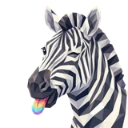
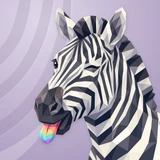

# 🦓 Pew

## Profile

- Repository: [nocoo/pew](https://github.com/nocoo/pew)
- Website: [https://pew.md](https://pew.md)
- Website evidence: GitHub repository homepage
- Category: ai
- Archived repository: No; [repository status evidence](../sources/repository-status-2026-09-06.json)
- English: A contribution graph for the AI-native era. See your coding tokens tell a story.
- Chinese: AI 时代的贡献图，把不同编程工具的 Token 使用记录变成可见的轨迹。
- Profile section: Recent Projects
- Profile revision: `9a7ad63e1e96428f9dcd12214bcdbd470b3b51c6`
- Repository revision inspected: `44351912506d0584bf59fdcefaec9b4e2be7eeef`

## Current logo

- Type: Original project artwork, copied without modification
- Subject: Zebra portrait with a rainbow tongue
- [Source](https://github.com/nocoo/pew/blob/44351912506d0584bf59fdcefaec9b4e2be7eeef/logo.png): `logo.png`
- [Preserved asset](../../public/logos/originals/pew.png)
- Original dimensions: 2048 × 2048
- Original size: 3835152 bytes
- SHA-256: `2b94fa9b0b0521008a08caa3bae34552f68785fd591c8dc578ceee943addc35e`
- Locally modified source: No
- Display derivatives: 32, 64, 160, and 1024 px WebP; contain-fit, transparent padding, no recoloring or cropping.

## Current palette

| Role | Value | Evidence |
| --- | --- | --- |
| primary | `#851ded` | packages/web/src/app/globals.css --primary: 270 85% 52% |
| background | `#f1f0f5` | packages/web/src/app/globals.css --background: 260 20% 95% |
| accent | `#b4b4b8` | Preserved project artwork, sampled pixel |
| accent | `#252335` | Preserved project artwork, sampled pixel |
| accent | `#ffffff` | Preserved project artwork, sampled pixel |

Theme tokens take precedence. Additional colors are sampled from the preserved artwork. A transparent background means the source does not define an opaque background; the gallery's surrounding paper is not part of the project palette.

## Refined identity

- Status: Local review; this finishing pass has not been adopted in the source project; updated 2026-09-06.
- Study `2026-09-06-01`, finishing `04`
- Site path: `/logos/pew`; [local gallery](https://index.dev.hexly.ai/logos/pew)
- [Static review HTML](../../artwork/logo-family/pew/2026-09-06-01/review.html)
- [Full process archive](https://github.com/nocoo/hexly.ai/tree/main/artwork/logo-family/pew/2026-09-06-01)
- [Transparent foreground](../../public/logos/family/pew/2026-09-06-01/04/transparent.png); SHA-256: `5c002bb5dcfb31f4db5ca52958e58175ad32bf0a34288828ddf443375b573ecb`
- [Square icon](../../public/logos/family/pew/2026-09-06-01/04/icon.png), [rounded icon](../../public/logos/family/pew/2026-09-06-01/04/rounded.png), [white version](../../public/logos/family/pew/2026-09-06-01/04/white.png)
- [Untouched generation](../../public/logos/family/pew/2026-09-06-01/04/raw.png), [exact prompt](../../public/logos/family/pew/2026-09-06-01/04/prompt.txt), [public asset checksums](../../public/logos/family/pew/2026-09-06-01/04/manifest.json)
- [Previous original](../../public/logos/originals/pew.png), copied from [its immutable source](https://github.com/nocoo/pew/blob/44351912506d0584bf59fdcefaec9b4e2be7eeef/logo.png)
- Previous SHA-256: `2b94fa9b0b0521008a08caa3bae34552f68785fd591c8dc578ceee943addc35e`
- Generation: Azure Foundry · gpt-image-2, native 2048 × 2048; transparent extraction and presentation are separate finishing steps.
- The finishing archive includes transparent, square, and rounded PNGs at 2048, 1024, 512, 256, 128, 64, 48, 32, 24, and 16 px.
- Application previews use the refined square icon without extra padding, backgrounds, or circular masks. Artwork previews and downloads use its own transparent foreground, independently of the preserved source logo above.

### Refined palette

| Role | Value | Evidence |
| --- | --- | --- |
| background | `#bfb2cf` | Local Pew stripe-motif study, finishing 04; background.base and unique background.pattern in archived settings.json |
| primary | `#fcf8f0` | Pew native generation efa6aff9f478, sampled sRGB pixel (1510, 1740); palette.json |
| accent | `#232637` | Pew native generation efa6aff9f478, sampled sRGB pixel (1140, 415); palette.json |
| accent | `#827f8e` | Pew native generation efa6aff9f478, sampled sRGB pixel (770, 334); palette.json |
| accent | `#fb9383` | Pew native generation efa6aff9f478, sampled sRGB pixel (593, 1620); palette.json |
| accent | `#73dce7` | Pew native generation efa6aff9f478, sampled sRGB pixel (589, 1759); palette.json |
| accent | `#b97ce6` | Pew native generation efa6aff9f478, sampled sRGB pixel (631, 1806); palette.json |

### Just inside the frame

The continuous neck enters from the bottom and right edge, with the ears, wink, muzzle, and rainbow tongue kept inside the rounded tile.

颈部从底部与右侧自然延伸出画面，耳朵、眨眼、鼻口和彩虹舌头完整留在圆角图标内。

### Stripes become facets

Broad ivory and charcoal planes carry the familiar zebra. Smaller facets articulate the wink, dark nose, and little rainbow tongue.

大块象牙白与炭黑平面保留熟悉的斑马，细一些的切面刻画眨眼、深色鼻子与彩虹舌头。

### A rhythm of its own

Tapered stripes fan through the lilac negative space, with fine light edges and shallow shadows. Their geometry echoes the zebra’s markings and belongs only to Pew.

舒展的条纹掠过淡紫色留白，细亮边与浅阴影带出浮雕质感。纹样呼应斑马的条纹，为 Pew 单独设计。

Small-size observation: At 16 px the striped silhouette leads; the wink and individual facets merge, while the rainbow tongue becomes a small color accent.

## Further refinements

This is a preferred family reference. Preserve its recognizable subject and balance of dominant color with multicolored details.

Use head portraits for large animals and optionally full-body poses for small animals. Compare artwork, app icon, sidebar, and favicon sizes in both themes before adopting a replacement. Preserve this reviewed composition and its archived predecessors.
