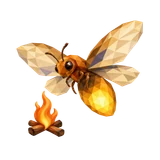
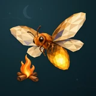

# 🔥 Firefly

## Profile

- Repository: [nocoo/firefly](https://github.com/nocoo/firefly)
- Website: [https://lizheng.blog](https://lizheng.blog)
- Website evidence: nocoo/nocoo README.md Writing link
- Category: everyday
- Archived repository: No; [repository status evidence](../sources/repository-status-2026-09-06.json)
- English: A modern home for writing, publishing, and the ideas worth keeping.
- Chinese: 写作、发布，也留住值得记录的想法。由 WordPress 迁移而来的博客平台。
- Profile section: Recent Projects
- Profile revision: `9a7ad63e1e96428f9dcd12214bcdbd470b3b51c6`
- Repository revision inspected: `10793b5b25712b9251bddcdbbb85fc99f1e0f91b`

## Current logo

- Type: Original project artwork, copied without modification
- Subject: Broad-winged faceted firefly with a small campfire
- [Source](https://github.com/nocoo/firefly/blob/10793b5b25712b9251bddcdbbb85fc99f1e0f91b/logo.png): `logo.png`
- [Preserved asset](../../public/logos/originals/firefly-2026-09-06.png)
- Original dimensions: 2048 × 2048
- Original size: 2583578 bytes
- SHA-256: `a2c29a6601fb041c27c7fcc4a4493ae8b0ae09dc72d3d0da6e475400dd167759`
- Locally modified source: No
- Display derivatives: 32, 64, 160, and 1024 px WebP; contain-fit, transparent padding, no recoloring or cropping.

## Current palette

| Role | Value | Evidence |
| --- | --- | --- |
| primary | `#3c83f6` | src/app/styles/tokens.css --primary: 217 91% 60% |
| background | `#eeeff2` | src/app/styles/tokens.css --background: 220 14% 94% |
| background | `#10282e` | Adopted Firefly presentation, finishing 02; background.base in archived settings.json |
| primary | `#fbaa3a` | Firefly native generation 384fff12838b1e9b282879ffb008f9b9aa8af110ba28400050ef6cd489f48d25, sampled sRGB pixel (940, 695); palette.json |
| accent | `#fcf375` | Firefly native generation 384fff12838b1e9b282879ffb008f9b9aa8af110ba28400050ef6cd489f48d25, sampled sRGB pixel (1390, 1370); palette.json |
| accent | `#fae1b1` | Firefly native generation 384fff12838b1e9b282879ffb008f9b9aa8af110ba28400050ef6cd489f48d25, sampled sRGB pixel (1586, 429); palette.json |
| accent | `#271815` | Firefly native generation 384fff12838b1e9b282879ffb008f9b9aa8af110ba28400050ef6cd489f48d25, sampled sRGB pixel (833, 795); palette.json |
| accent | `#706170` | Firefly native generation 384fff12838b1e9b282879ffb008f9b9aa8af110ba28400050ef6cd489f48d25, sampled sRGB pixel (1348, 695); palette.json |
| accent | `#fc8816` | Firefly native generation 384fff12838b1e9b282879ffb008f9b9aa8af110ba28400050ef6cd489f48d25, sampled sRGB pixel (452, 1474); palette.json |

Theme tokens take precedence. Additional colors are sampled from the preserved artwork. A transparent background means the source does not define an opaque background; the gallery's surrounding paper is not part of the project palette.

## Refined identity

- Status: Adopted in the source project; updated 2026-09-06.
- Study `2026-09-06-10`, finishing `02`
- Refined subject: Broad-winged faceted firefly with a small campfire
- Site path: `/logos/firefly`; [local gallery](https://index.dev.hexly.ai/logos/firefly)
- [Static review HTML](../../artwork/logo-family/firefly/2026-09-06-10/review.html)
- [Full process archive](https://github.com/nocoo/hexly.ai/tree/main/artwork/logo-family/firefly/2026-09-06-10)
- [Transparent foreground](../../public/logos/family/firefly/2026-09-06-10/02/transparent.png); SHA-256: `a2c29a6601fb041c27c7fcc4a4493ae8b0ae09dc72d3d0da6e475400dd167759`
- [Square icon](../../public/logos/family/firefly/2026-09-06-10/02/icon.png), [rounded icon](../../public/logos/family/firefly/2026-09-06-10/02/rounded.png), [white version](../../public/logos/family/firefly/2026-09-06-10/02/white.png)
- [Untouched generation](../../public/logos/family/firefly/2026-09-06-10/02/raw.png), [exact prompt](../../public/logos/family/firefly/2026-09-06-10/02/prompt.txt), [public asset checksums](../../public/logos/family/firefly/2026-09-06-10/02/manifest.json)
- [Previous original](../../public/logos/originals/firefly.png), copied from [its immutable source](https://github.com/nocoo/firefly/blob/94a16050f87867458d530e63442b99229603e72b/logo.png)
- Previous SHA-256: `2c07a3d70ee783d69d2f839ad7f3bc0ca340804a6e66e2702fbe0bc36a845269`
- Generation: Azure Foundry · gpt-image-2, native 2048 × 2048; transparent extraction and presentation are separate finishing steps.
- The finishing archive includes transparent, square, and rounded PNGs at 2048, 1024, 512, 256, 128, 64, 48, 32, 24, and 16 px.
- Application previews use the refined square icon without extra padding, backgrounds, or circular masks. Artwork previews and downloads use its own transparent foreground, independently of the preserved source logo above.

### Refined palette

| Role | Value | Evidence |
| --- | --- | --- |
| background | `#10282e` | Adopted Firefly presentation, finishing 02; background.base in archived settings.json |
| primary | `#fbaa3a` | Firefly native generation 384fff12838b1e9b282879ffb008f9b9aa8af110ba28400050ef6cd489f48d25, sampled sRGB pixel (940, 695); palette.json |
| accent | `#fcf375` | Firefly native generation 384fff12838b1e9b282879ffb008f9b9aa8af110ba28400050ef6cd489f48d25, sampled sRGB pixel (1390, 1370); palette.json |
| accent | `#fae1b1` | Firefly native generation 384fff12838b1e9b282879ffb008f9b9aa8af110ba28400050ef6cd489f48d25, sampled sRGB pixel (1586, 429); palette.json |
| accent | `#271815` | Firefly native generation 384fff12838b1e9b282879ffb008f9b9aa8af110ba28400050ef6cd489f48d25, sampled sRGB pixel (833, 795); palette.json |
| accent | `#706170` | Firefly native generation 384fff12838b1e9b282879ffb008f9b9aa8af110ba28400050ef6cd489f48d25, sampled sRGB pixel (1348, 695); palette.json |
| accent | `#fc8816` | Firefly native generation 384fff12838b1e9b282879ffb008f9b9aa8af110ba28400050ef6cd489f48d25, sampled sRGB pixel (452, 1474); palette.json |

### Room for the wings

The broad-winged firefly leads the mark. A small fire below its gaze supplies the second point of interest, with clear space around the complete silhouette.

舒展双翼的萤火虫占据主体，视线下方的小篝火形成第二处兴趣点。完整的轮廓四周留出空间，让翅尖远离圆角边缘。

### Faceted light, living fire

Connected champagne, bronze, and gold planes describe the insect. Two visible eyes give its gaze direction; curved flame and wood grain add tactile depth to the small campfire.

香槟色、青铜色与金色的连续切面构成萤火虫，两只清楚的眼睛交代视线。弯曲的火焰与木纹为小篝火增添立体质感。

### Two lights after dark

A deep blue-green field carries a quiet crescent, sparse stars, and cloud contours. Warm light around the flame and abdomen lifts the mark from the matte night surface.

深蓝绿色底面上浮现安静的月牙、疏星与云纹。火焰和尾部的暖光，让主体从哑光的夜色中轻轻浮起。

Small-size observation: At 24–32 px, the broad wings, amber abdomen, and small fire carry the identity. At 16 px, eyes, fine legs, and wood grain simplify into the warm silhouette.

## Further refinements

Keep this asset as the phase-one baseline. A future family version should use a recognizable animal, one principal hue, and restrained multicolored geometric fragments.

Use head portraits for large animals and optionally full-body poses for small animals. Compare artwork, app icon, sidebar, and favicon sizes in both themes before adopting a replacement. Preserve this reviewed composition and its archived predecessors.
