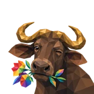
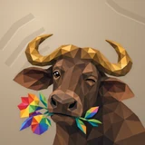

# 📚 Bogo

## Profile

- Repository: [nocoo/bogo](https://github.com/nocoo/bogo)
- Website: [https://bogo.hexly.ai](https://bogo.hexly.ai)
- Website evidence: CLAUDE.md Live-check
- Category: everyday
- Archived repository: No; [repository status evidence](../sources/repository-status-2026-09-06.json)
- English: A personal knowledge home for documents, people, and the connections between them.
- Chinese: 把文档、人物与工作空间放在一起，整理个人知识和它们之间的联系。
- Profile section: Recent Projects
- Profile revision: `9a7ad63e1e96428f9dcd12214bcdbd470b3b51c6`
- Repository revision inspected: `59e6a1656b3b5bfe99a6a54cc53da7458017b082`

## Current logo

- Type: Original project artwork, copied without modification
- Subject: Winking faceted buffalo with a plain muzzle and one rainbow flower sprig
- [Source](https://github.com/nocoo/bogo/blob/59e6a1656b3b5bfe99a6a54cc53da7458017b082/logo.png): `logo.png`
- [Preserved asset](../../public/logos/originals/bogo-2026-09-07.png)
- Original dimensions: 2048 × 2048
- Original size: 3637079 bytes
- SHA-256: `54bff5a21a25489a94b5ad3d816332dc7082ed4a41510d782a3c33a05a17fac1`
- Locally modified source: No
- Display derivatives: 32, 64, 160, and 1024 px WebP; contain-fit, transparent padding, no recoloring or cropping.

## Current palette

| Role | Value | Evidence |
| --- | --- | --- |
| primary | `#0051bd` | packages/ui/src/index.css --primary: oklch(0.45 0.2 250) |
| background | `#e3edf2` | packages/ui/src/index.css --background: oklch(0.94 0.012 230) |
| background | `#b7a186` | Bogo study 05 local presentation, finishing 04; archived background.base and mineral horn arches |
| primary | `#6d4c3c` | Bogo native generation 40919d744626f8def06dcc98ebfd7b85d3474e00387d7edf68b0591ca6b8a1db, sampled sRGB pixel (980, 650); palette.json |
| accent | `#fac15e` | Bogo native generation 40919d744626f8def06dcc98ebfd7b85d3474e00387d7edf68b0591ca6b8a1db, sampled sRGB pixel (449, 150); palette.json |
| accent | `#4d3529` | Bogo native generation 40919d744626f8def06dcc98ebfd7b85d3474e00387d7edf68b0591ca6b8a1db, sampled sRGB pixel (1210, 830); palette.json |
| accent | `#e43e3e` | Bogo native generation 40919d744626f8def06dcc98ebfd7b85d3474e00387d7edf68b0591ca6b8a1db, sampled sRGB pixel (236, 1300); palette.json |
| accent | `#81b64f` | Bogo native generation 40919d744626f8def06dcc98ebfd7b85d3474e00387d7edf68b0591ca6b8a1db, sampled sRGB pixel (1395, 1630); palette.json |
| accent | `#0c7b6b` | Bogo native generation 40919d744626f8def06dcc98ebfd7b85d3474e00387d7edf68b0591ca6b8a1db, sampled sRGB pixel (1315, 1595); palette.json |
| accent | `#0e8eb1` | Bogo native generation 40919d744626f8def06dcc98ebfd7b85d3474e00387d7edf68b0591ca6b8a1db, sampled sRGB pixel (1388, 1698); palette.json |
| accent | `#863a9a` | Bogo native generation 40919d744626f8def06dcc98ebfd7b85d3474e00387d7edf68b0591ca6b8a1db, sampled sRGB pixel (371, 1800); palette.json |

Theme tokens take precedence. Additional colors are sampled from the preserved artwork. A transparent background means the source does not define an opaque background; the gallery's surrounding paper is not part of the project palette.

## Refined identity

- Status: Adopted in the source project; updated 2026-09-07.
- Study `2026-09-07-05`, finishing `04`
- Refined subject: Winking faceted buffalo with a plain muzzle and one rainbow flower sprig
- Site path: `/logos/bogo`; [local gallery](https://index.dev.hexly.ai/logos/bogo)
- [Static review HTML](../../artwork/logo-family/bogo/2026-09-07-05/review.html)
- [Full process archive](https://github.com/nocoo/hexly.ai/tree/main/artwork/logo-family/bogo/2026-09-07-05)
- [Transparent foreground](../../public/logos/family/bogo/2026-09-07-05/04/transparent.png); SHA-256: `54bff5a21a25489a94b5ad3d816332dc7082ed4a41510d782a3c33a05a17fac1`
- [Square icon](../../public/logos/family/bogo/2026-09-07-05/04/icon.png), [rounded icon](../../public/logos/family/bogo/2026-09-07-05/04/rounded.png), [white version](../../public/logos/family/bogo/2026-09-07-05/04/white.png)
- [Untouched generation](../../public/logos/family/bogo/2026-09-07-05/04/raw.png), [exact prompt](../../public/logos/family/bogo/2026-09-07-05/04/prompt.txt), [public asset checksums](../../public/logos/family/bogo/2026-09-07-05/04/manifest.json)
- [Previous original](../../public/logos/originals/bogo.png), copied from [its immutable source](https://github.com/nocoo/bogo/blob/2e2d986edffd9d320a3e172f37affe5e3406cabe/logo.png)
- Previous SHA-256: `eeaf1c419feb02f3990451d642432dbf2fbda2c5ddd1d71269d804e3ce8dd3a1`
- Generation: Azure Foundry · gpt-image-2, native 2048 × 2048; transparent extraction and presentation are separate finishing steps.
- The finishing archive includes transparent, square, and rounded PNGs at 2048, 1024, 512, 256, 128, 64, 48, 32, 24, and 16 px.
- Application previews use the refined square icon without extra padding, backgrounds, or circular masks. Artwork previews and downloads use its own transparent foreground, independently of the preserved source logo above.

### Refined palette

| Role | Value | Evidence |
| --- | --- | --- |
| background | `#b7a186` | Bogo study 05 local presentation, finishing 04; archived background.base and mineral horn arches |
| primary | `#6d4c3c` | Bogo native generation 40919d744626f8def06dcc98ebfd7b85d3474e00387d7edf68b0591ca6b8a1db, sampled sRGB pixel (980, 650); palette.json |
| accent | `#fac15e` | Bogo native generation 40919d744626f8def06dcc98ebfd7b85d3474e00387d7edf68b0591ca6b8a1db, sampled sRGB pixel (449, 150); palette.json |
| accent | `#4d3529` | Bogo native generation 40919d744626f8def06dcc98ebfd7b85d3474e00387d7edf68b0591ca6b8a1db, sampled sRGB pixel (1210, 830); palette.json |
| accent | `#e43e3e` | Bogo native generation 40919d744626f8def06dcc98ebfd7b85d3474e00387d7edf68b0591ca6b8a1db, sampled sRGB pixel (236, 1300); palette.json |
| accent | `#81b64f` | Bogo native generation 40919d744626f8def06dcc98ebfd7b85d3474e00387d7edf68b0591ca6b8a1db, sampled sRGB pixel (1395, 1630); palette.json |
| accent | `#0c7b6b` | Bogo native generation 40919d744626f8def06dcc98ebfd7b85d3474e00387d7edf68b0591ca6b8a1db, sampled sRGB pixel (1315, 1595); palette.json |
| accent | `#0e8eb1` | Bogo native generation 40919d744626f8def06dcc98ebfd7b85d3474e00387d7edf68b0591ca6b8a1db, sampled sRGB pixel (1388, 1698); palette.json |
| accent | `#863a9a` | Bogo native generation 40919d744626f8def06dcc98ebfd7b85d3474e00387d7edf68b0591ca6b8a1db, sampled sRGB pixel (371, 1800); palette.json |

### A close encounter

The face and flower sprig share a close portrait. A short natural neck enters through the lower frame, with room around the horns, ears, and the complete colorful gesture.

脸部与花枝组成紧凑的特写，短而自然的颈部从下方入画。牛角、耳朵和完整的彩色花枝四周留出空间，保留探头时的轻松神态。

### One bright gesture

Broad walnut and gold facets shape the head, curved horns, and relaxed shoulders. A plain muzzle keeps attention on the wink and the single mouth-held rainbow sprig.

胡桃棕与金色的大切面构成脸部、弯角和自然的肩线。鼻部保持干净，多彩装饰集中在嘴边的一枝花叶上。

### Warm mineral relief

Broken angular arches sit quietly in the warm mineral field. Fine grain and soft contact shadows give the flat facets a tactile setting.

断开的折线拱纹安静地铺在暖矿色底面上，细腻颗粒与柔和接触阴影，为平面的碎片带来触手可及的质感。

Small-size observation: At 32 px, the broad golden horns, brown face, and colorful sprig carry the identity. At 16 px, the wink and separate petals simplify into the silhouette and a small rainbow accent.

## Further refinements

Keep this asset as the phase-one baseline. A future family version should use a recognizable animal, one principal hue, and restrained multicolored geometric fragments.

Use head portraits for large animals and optionally full-body poses for small animals. Compare artwork, app icon, sidebar, and favicon sizes in both themes before adopting a replacement. Preserve this reviewed composition and its archived predecessors.
