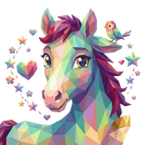

# 🐎 Steed

## Profile

- Repository: [nocoo/steed](https://github.com/nocoo/steed)
- Website: [https://steed.hexly.ai](https://steed.hexly.ai)
- Website evidence: apps/web/wrangler.toml routes
- Category: ai
- English: A shared home for AI agents, their assets, and the relationships between them.
- Chinese: 面向多智能体的 AI 工作台，管理各个 Agent 的资源与关联。
- Profile section: Recent Projects
- Profile revision: `9a7ad63e1e96428f9dcd12214bcdbd470b3b51c6`
- Repository revision inspected: `1159f3769ec3c0a00a9a2bf32e914cf7cff00e33`

## Current logo

- Type: Original project artwork, copied without modification
- Subject: Horse portrait with multicolored fragments
- [Source](https://github.com/nocoo/steed/blob/1159f3769ec3c0a00a9a2bf32e914cf7cff00e33/logo.png): `logo.png`
- [Preserved asset](../../public/logos/originals/steed.png)
- Original dimensions: 2048 × 2048
- Original size: 4168086 bytes
- SHA-256: `9543be6d4d51cca7174ddd485f1bfd87540c22c79c52c8f1186a1fb0efac1719`
- Locally modified source: No
- Display derivatives: 32, 64, 160, and 1024 px WebP; contain-fit, transparent padding, no recoloring or cropping.

## Current palette

| Role | Value | Evidence |
| --- | --- | --- |
| primary | `#1da599` | apps/web/src/index.css --primary: 175 70% 38% |
| background | `#eef1f1` | apps/web/src/index.css --background: 180 10% 94% |
| accent | `#70b5a7` | Preserved project artwork, sampled pixel |
| accent | `#f2cc9a` | Preserved project artwork, sampled pixel |
| accent | `#7c60a5` | Preserved project artwork, sampled pixel |

Theme tokens take precedence. Additional colors are sampled from the preserved artwork. A transparent background means the source does not define an opaque background; the gallery's surrounding paper is not part of the project palette.

## Future family notes

Keep this asset as the phase-one baseline. A future family version should use a recognizable animal, one principal hue, and restrained multicolored geometric fragments.

Use head portraits for large animals and optionally full-body poses for small animals. Compare artwork, app icon, sidebar, and favicon sizes in both themes before adopting a replacement. No new logo is generated in phase one.
