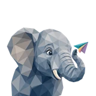

# 🐘 Ellie

## Profile

- Repository: [nocoo/ellie](https://github.com/nocoo/ellie)
- Website: No current website verified; navigation opens the repository.
- Website evidence: Not applicable
- Category: everyday
- Archived repository: No; [repository status evidence](../sources/repository-status-2026-09-06.json)
- English: A modern forum for thoughtful conversations, with a companion terminal client.
- Chinese: 为认真交流而做的现代论坛，也提供可以在终端里使用的客户端。
- Profile section: Recent Projects
- Profile revision: `9a7ad63e1e96428f9dcd12214bcdbd470b3b51c6`
- Repository revision inspected: `a53769b75c9220fc2ad02eb9cba5d8e342a6be3a`

## Current logo

- Type: Original project artwork, copied without modification
- Subject: Elephant portrait with colorful ornaments
- [Source](https://github.com/nocoo/ellie/blob/a53769b75c9220fc2ad02eb9cba5d8e342a6be3a/logo.png): `logo.png`
- [Preserved asset](../../public/logos/originals/ellie.png)
- Original dimensions: 2048 × 2048
- Original size: 4123134 bytes
- SHA-256: `03f8da981d89188fdbeeec38dcd9e32a693960d5b8af2020b48beaaa86844a13`
- Locally modified source: No
- Display derivatives: 32, 64, 160, and 1024 px WebP; contain-fit, transparent padding, no recoloring or cropping.

## Current palette

| Role | Value | Evidence |
| --- | --- | --- |
| primary | `#016698` | apps/web/src/app/tailwind.css --primary: 200 99% 30% |
| background | `#ffffff` | apps/web/src/app/tailwind.css --background: 0 0% 100% |
| accent | `#9f9bb1` | Preserved project artwork, sampled pixel |
| accent | `#f6b8a8` | Preserved project artwork, sampled pixel |
| accent | `#b3e3ef` | Preserved project artwork, sampled pixel |

Theme tokens take precedence. Additional colors are sampled from the preserved artwork. A transparent background means the source does not define an opaque background; the gallery's surrounding paper is not part of the project palette.

## Future family notes

Keep this asset as the phase-one baseline. A future family version should use a recognizable animal, one principal hue, and restrained multicolored geometric fragments.

Use head portraits for large animals and optionally full-body poses for small animals. Compare artwork, app icon, sidebar, and favicon sizes in both themes before adopting a replacement. No new logo is generated in phase one.
