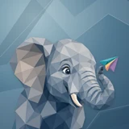

# 🐘 Ellie

## Profile

- Repository: [nocoo/ellie](https://github.com/nocoo/ellie)
- Website: No current website verified; navigation opens the repository.
- Website evidence: Not applicable
- Category: everyday
- Archived repository: No; [repository status evidence](../sources/repository-status-2026-09-06.json)
- English: A modern forum for thoughtful conversations, with a companion terminal client.
- Chinese: 为认真交流而做的现代论坛，也提供可以在终端里使用的客户端。
- Profile section: Recent Projects
- Profile revision: `9a7ad63e1e96428f9dcd12214bcdbd470b3b51c6`
- Repository revision inspected: `300b8540eac51ae21803a8d58ebffbe3d90efa24`

## Current logo

- Type: Original project artwork, copied without modification
- Subject: Mineral-gray elephant portrait with a curled trunk and one paper airplane
- [Source](https://github.com/nocoo/ellie/blob/300b8540eac51ae21803a8d58ebffbe3d90efa24/logo.png): `logo.png`
- [Preserved asset](../../public/logos/originals/ellie-family-2026-09-07-01-01.png)
- Original dimensions: 2048 × 2048
- Original size: 2690184 bytes
- SHA-256: `85b062e3d5546262bf3cbeef8f4a6815acdf96ddf1213251df539a85bfe9ab4d`
- Locally modified source: No
- Display derivatives: 32, 64, 160, and 1024 px WebP; contain-fit, transparent padding, no recoloring or cropping.

## Current palette

| Role | Value | Evidence |
| --- | --- | --- |
| primary | `#016698` | apps/web/src/app/tailwind.css --primary: 200 99% 30% |
| background | `#ffffff` | apps/web/src/app/tailwind.css --background: 0 0% 100% |
| accent | `#395970` | Native ellie 5f05992e1b8a, sampled sRGB pixel (1480, 1164); artwork/logo-family/ellie/2026-09-07-01/palette.json |
| accent | `#e9dac5` | Native ellie 5f05992e1b8a, sampled sRGB pixel (1234, 1345); artwork/logo-family/ellie/2026-09-07-01/palette.json |
| accent | `#248aa0` | Native ellie 5f05992e1b8a, sampled sRGB pixel (1762, 677); artwork/logo-family/ellie/2026-09-07-01/palette.json |

Theme tokens take precedence. Additional colors are sampled from the preserved artwork. A transparent background means the source does not define an opaque background; the gallery's surrounding paper is not part of the project palette.

## Refined identity

- Status: Adopted in the source project; updated 2026-09-07.
- Study `2026-09-07-01`, finishing `01`
- Refined subject: Mineral-gray elephant portrait with a curled trunk and one paper airplane
- Site path: `/logos/ellie`; [local gallery](https://index.dev.hexly.ai/logos/ellie)
- [Static review HTML](../../artwork/logo-family/ellie/2026-09-07-01/review.html)
- [Full process archive](https://github.com/nocoo/hexly.ai/tree/main/artwork/logo-family/ellie/2026-09-07-01)
- [Transparent foreground](../../public/logos/family/ellie/2026-09-07-01/01/transparent.png); SHA-256: `85b062e3d5546262bf3cbeef8f4a6815acdf96ddf1213251df539a85bfe9ab4d`
- [Square icon](../../public/logos/family/ellie/2026-09-07-01/01/icon.png), [rounded icon](../../public/logos/family/ellie/2026-09-07-01/01/rounded.png), [white version](../../public/logos/family/ellie/2026-09-07-01/01/white.png)
- [Untouched generation](../../public/logos/family/ellie/2026-09-07-01/01/raw.png), [exact prompt](../../public/logos/family/ellie/2026-09-07-01/01/prompt.txt), [public asset checksums](../../public/logos/family/ellie/2026-09-07-01/01/manifest.json)
- [Previous original](../../public/logos/originals/ellie.png), copied from [its immutable source](https://github.com/nocoo/ellie/blob/a53769b75c9220fc2ad02eb9cba5d8e342a6be3a/logo.png)
- Previous SHA-256: `03f8da981d89188fdbeeec38dcd9e32a693960d5b8af2020b48beaaa86844a13`
- Generation: gpt-image-2, native 2048 × 2048; transparent extraction and presentation are separate finishing steps.
- The finishing archive includes transparent, square, and rounded PNGs at 2048, 1024, 512, 256, 128, 64, 48, 32, 24, and 16 px.
- Application previews use the refined square icon without extra padding, backgrounds, or circular masks. Artwork previews and downloads use its own transparent foreground, independently of the preserved source logo above.

### Refined palette

| Role | Value | Evidence |
| --- | --- | --- |
| background | `#537b93` | Selected Ellie presentation, 2026-09-07-01/01; background.base in archived settings.json |
| primary | `#9dabb7` | Native ellie 5f05992e1b8a, sampled sRGB pixel (1096, 759); artwork/logo-family/ellie/2026-09-07-01/palette.json |
| accent | `#395970` | Native ellie 5f05992e1b8a, sampled sRGB pixel (1480, 1164); artwork/logo-family/ellie/2026-09-07-01/palette.json |
| accent | `#e9dac5` | Native ellie 5f05992e1b8a, sampled sRGB pixel (1234, 1345); artwork/logo-family/ellie/2026-09-07-01/palette.json |
| accent | `#248aa0` | Native ellie 5f05992e1b8a, sampled sRGB pixel (1762, 677); artwork/logo-family/ellie/2026-09-07-01/palette.json |
| accent | `#9379a2` | Native ellie 5f05992e1b8a, sampled sRGB pixel (1881, 852); artwork/logo-family/ellie/2026-09-07-01/palette.json |

### An inquisitive lift

The broad ear and cheek carry the portrait while the trunk curls close to the face. A small paper airplane balances the gesture; only the natural lower neck enters the frame edge.

宽大的耳朵和脸颊承担头像主体，象鼻在脸旁卷起，小纸飞机平衡动作。仅自然延续的颈部穿过底边。

### Mineral planes

Slate and blue-gray facets establish the elephant as one clear mass. Warm ivory anatomy stays opaque; the airplane concentrates the colorful folded panels.

岩蓝与蓝灰色切面把大象组织成清晰整体，象牙白部位保留不透明度，多彩折面集中于纸飞机。

### Listening folds

Unequal broad mineral panels meet along open diagonal seams. A deeper blue field, fine grain and two shallow shadows separate the ear and trunk.

不等宽的矿石折面沿开放斜缝相接，深蓝底色、细颗粒和两层浅阴影托起象耳与鼻子。

Small-size observation: Ear edges, eye, tusk, curled trunk and the complete airplane retain at least 148.5 px of rounded-edge clearance. Only the lower neck crosses the frame. Admin marks stay transparent; separately configured forum logos and favicon remain independent.

## Further refinements

Keep this asset as the phase-one baseline. A future family version should use a recognizable animal, one principal hue, and restrained multicolored geometric fragments.

Use head portraits for large animals and optionally full-body poses for small animals. Compare artwork, app icon, sidebar, and favicon sizes in both themes before adopting a replacement. Preserve this reviewed composition and its archived predecessors.
