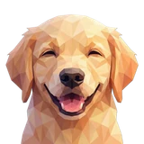

# 🔐 Neo

## Profile

- Repository: [nocoo/neo](https://github.com/nocoo/neo)
- Website: No current website verified; navigation opens the repository.
- Website evidence: Not applicable
- Category: everyday
- English: Your two-factor codes, together. Encrypted storage, easy imports, and offline access.
- Chinese: 把双重验证口令放在一起，支持加密存储、多格式导入与离线访问。
- Profile section: Recent Projects
- Profile revision: `9a7ad63e1e96428f9dcd12214bcdbd470b3b51c6`
- Repository revision inspected: `856e487050327aa471ff9761c9d111822f2b46db`

## Current logo

- Type: Original project artwork, copied without modification
- Subject: Golden retriever portrait
- [Source](https://github.com/nocoo/neo/blob/856e487050327aa471ff9761c9d111822f2b46db/logo.png): `logo.png`
- [Preserved asset](../../public/logos/originals/neo.png)
- Original dimensions: 2048 × 2048
- Original size: 4237355 bytes
- SHA-256: `2939c3edb084df9e8e0f823dc1433a87374e4432b6af9c94097c10d7dd36bb2d`
- Locally modified source: No
- Display derivatives: 32, 64, 160, and 1024 px WebP; contain-fit, transparent padding, no recoloring or cropping.

## Current palette

| Role | Value | Evidence |
| --- | --- | --- |
| primary | `#3c83f6` | app/globals.css imports @nocoo/basalt/styles: 217 91% 60% |
| background | `#eeeff2` | app/globals.css --background: 220 14% 94% |
| accent | `#ffdebc` | Preserved project artwork, sampled pixel |
| accent | `#b17157` | Preserved project artwork, sampled pixel |
| accent | `#f3be7f` | Preserved project artwork, sampled pixel |

Theme tokens take precedence. Additional colors are sampled from the preserved artwork. A transparent background means the source does not define an opaque background; the gallery's surrounding paper is not part of the project palette.

## Future family notes

Keep this asset as the phase-one baseline. A future family version should use a recognizable animal, one principal hue, and restrained multicolored geometric fragments.

Use head portraits for large animals and optionally full-body poses for small animals. Compare artwork, app icon, sidebar, and favicon sizes in both themes before adopting a replacement. No new logo is generated in phase one.
