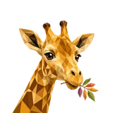

# 🦒 Giraffe

## Profile

- Repository: [nocoo/giraffe](https://github.com/nocoo/giraffe)
- Website: [https://giraffe.hexly.ai](https://giraffe.hexly.ai)
- Website evidence: GitHub repository homepage
- Category: tools
- English: A personal GitHub observatory for repositories, workflows, and encrypted snapshots.
- Chinese: 个人 GitHub 观察台，集中查看仓库、工作流与加密的访问令牌快照。
- Profile section: Recent Projects
- Profile revision: `9a7ad63e1e96428f9dcd12214bcdbd470b3b51c6`
- Repository revision inspected: `13083cd48ff37f4d47f1b5848d980eaa72fba80f`

## Current logo

- Type: Original project artwork, copied without modification
- Subject: Giraffe head with laurel leaves
- [Source](https://github.com/nocoo/giraffe/blob/13083cd48ff37f4d47f1b5848d980eaa72fba80f/logo.png): `logo.png`
- [Preserved asset](../../public/logos/originals/giraffe.png)
- Original dimensions: 1408 × 1408
- Original size: 1726680 bytes
- SHA-256: `169ba1ff6951014dd9fdedb750bc4d65d7099c250eb1f941570bfb3c509db0fe`
- Locally modified source: No
- Display derivatives: 32, 64, 160, and 1024 px WebP; contain-fit, transparent padding, no recoloring or cropping.

## Current palette

| Role | Value | Evidence |
| --- | --- | --- |
| primary | `#598128` | src/client/index.css --basalt-primary: 87 53% 33% |
| background | `#eeeff2` | @nocoo/basalt/styles tokens --basalt-background: 220 14% 94% |
| accent | `#779c35` | Preserved project artwork, sampled pixel |
| accent | `#faac1c` | Preserved project artwork, sampled pixel |
| accent | `#ca7102` | Preserved project artwork, sampled pixel |

Theme tokens take precedence. Additional colors are sampled from the preserved artwork. A transparent background means the source does not define an opaque background; the gallery's surrounding paper is not part of the project palette.

## Future family notes

Keep this asset as the phase-one baseline. A future family version should use a recognizable animal, one principal hue, and restrained multicolored geometric fragments.

Use head portraits for large animals and optionally full-body poses for small animals. Compare artwork, app icon, sidebar, and favicon sizes in both themes before adopting a replacement. No new logo is generated in phase one.
