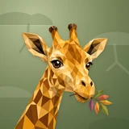

# 🦒 Giraffe

## Profile

- Repository: [nocoo/giraffe](https://github.com/nocoo/giraffe)
- Website: [https://giraffe.hexly.ai](https://giraffe.hexly.ai)
- Website evidence: GitHub repository homepage
- Category: tools
- Archived repository: No; [repository status evidence](../sources/repository-status-2026-09-06.json)
- English: A personal GitHub observatory for repositories, workflows, and encrypted snapshots.
- Chinese: 个人 GitHub 观察台，集中查看仓库、工作流与加密的访问令牌快照。
- Profile section: Recent Projects
- Profile revision: `9a7ad63e1e96428f9dcd12214bcdbd470b3b51c6`
- Repository revision inspected: `c71543478405f580e6dd36ebac18174f7ae6e474`

## Current logo

- Type: Original project artwork, copied without modification
- Subject: Honey-colored giraffe portrait nibbling one colorful acacia sprig
- [Source](https://github.com/nocoo/giraffe/blob/c71543478405f580e6dd36ebac18174f7ae6e474/logo.png): `logo.png`
- [Preserved asset](../../public/logos/originals/giraffe-family-2026-09-07-01-02.png)
- Original dimensions: 2048 × 2048
- Original size: 3073843 bytes
- SHA-256: `68144efac72c45b858868fe82c6321a3f23b7428581daec62372259c72d20339`
- Locally modified source: No
- Display derivatives: 32, 64, 160, and 1024 px WebP; contain-fit, transparent padding, no recoloring or cropping.

## Current palette

| Role | Value | Evidence |
| --- | --- | --- |
| primary | `#598128` | src/client/index.css --basalt-primary: 87 53% 33% |
| background | `#eeeff2` | @nocoo/basalt/styles tokens --basalt-background: 220 14% 94% |
| accent | `#884812` | Native giraffe 55739caf938b, sampled sRGB pixel (260, 1830); artwork/logo-family/giraffe/2026-09-07-01/palette.json |
| accent | `#f3d49e` | Native giraffe 55739caf938b, sampled sRGB pixel (957, 923); artwork/logo-family/giraffe/2026-09-07-01/palette.json |
| accent | `#828731` | Native giraffe 55739caf938b, sampled sRGB pixel (1649, 1388); artwork/logo-family/giraffe/2026-09-07-01/palette.json |

Theme tokens take precedence. Additional colors are sampled from the preserved artwork. A transparent background means the source does not define an opaque background; the gallery's surrounding paper is not part of the project palette.

## Refined identity

- Status: Adopted in the source project; updated 2026-09-07.
- Study `2026-09-07-01`, finishing `02`
- Refined subject: Honey-colored giraffe portrait nibbling one colorful acacia sprig
- Site path: `/logos/giraffe`; [local gallery](https://index.dev.hexly.ai/logos/giraffe)
- [Static review HTML](../../artwork/logo-family/giraffe/2026-09-07-01/review.html)
- [Full process archive](https://github.com/nocoo/hexly.ai/tree/main/artwork/logo-family/giraffe/2026-09-07-01)
- [Transparent foreground](../../public/logos/family/giraffe/2026-09-07-01/02/transparent.png); SHA-256: `68144efac72c45b858868fe82c6321a3f23b7428581daec62372259c72d20339`
- [Square icon](../../public/logos/family/giraffe/2026-09-07-01/02/icon.png), [rounded icon](../../public/logos/family/giraffe/2026-09-07-01/02/rounded.png), [white version](../../public/logos/family/giraffe/2026-09-07-01/02/white.png)
- [Untouched generation](../../public/logos/family/giraffe/2026-09-07-01/02/raw.png), [exact prompt](../../public/logos/family/giraffe/2026-09-07-01/02/prompt.txt), [public asset checksums](../../public/logos/family/giraffe/2026-09-07-01/02/manifest.json)
- [Previous original](../../public/logos/originals/giraffe.png), copied from [its immutable source](https://github.com/nocoo/giraffe/blob/13083cd48ff37f4d47f1b5848d980eaa72fba80f/logo.png)
- Previous SHA-256: `169ba1ff6951014dd9fdedb750bc4d65d7099c250eb1f941570bfb3c509db0fe`
- Generation: gpt-image-2, native 2048 × 2048; transparent extraction and presentation are separate finishing steps.
- The finishing archive includes transparent, square, and rounded PNGs at 2048, 1024, 512, 256, 128, 64, 48, 32, 24, and 16 px.
- Application previews use the refined square icon without extra padding, backgrounds, or circular masks. Artwork previews and downloads use its own transparent foreground, independently of the preserved source logo above.

### Refined palette

| Role | Value | Evidence |
| --- | --- | --- |
| background | `#79865b` | Selected Giraffe presentation, 2026-09-07-01/02; background.base in archived settings.json |
| primary | `#e6a328` | Native giraffe 55739caf938b, sampled sRGB pixel (1396, 1263); artwork/logo-family/giraffe/2026-09-07-01/palette.json |
| accent | `#884812` | Native giraffe 55739caf938b, sampled sRGB pixel (260, 1830); artwork/logo-family/giraffe/2026-09-07-01/palette.json |
| accent | `#f3d49e` | Native giraffe 55739caf938b, sampled sRGB pixel (957, 923); artwork/logo-family/giraffe/2026-09-07-01/palette.json |
| accent | `#828731` | Native giraffe 55739caf938b, sampled sRGB pixel (1649, 1388); artwork/logo-family/giraffe/2026-09-07-01/palette.json |
| accent | `#c76036` | Native giraffe 55739caf938b, sampled sRGB pixel (1648, 1477); artwork/logo-family/giraffe/2026-09-07-01/palette.json |

### The last tender leaf

A broad cheek, natural ear spread and a gently diagonal neck form one portrait. The mouth-held acacia sprig stays close; the lower neck continues through the viewfinder.

宽阔脸颊、自然展开的双耳与倾斜颈部构成统一头像。衔住的金合欢叶靠近嘴边，下方颈部自然延续到取景框外。

### Honey and chestnut

Ochre planes and broad chestnut patches preserve the giraffe’s species cues. One colored leaf sprig replaces the enclosing wreath and competing decorative fragments.

赭黄色面与宽阔栗棕斑纹保留物种特征。一枝多彩叶片取代外圈花环与分散的装饰碎片。

### Acacia canopy relief

Staggered flat-topped canopies and open branching stems sit in an olive field. Unequal spans add quiet structure around the ears and leaf gesture.

错落的平顶树冠与开放枝干压在橄榄色底纹上，不同跨度的形状在双耳与叶片周围提供安静的结构。

Small-size observation: Ossicones, both ears, face and every leaf keep at least 164.64 px of rounded-edge clearance. A one-pixel placement correction preserves the native extraction and closes the lower neck entry. The historical original is 1408 px; the new artwork is native 2048 px.

## Further refinements

Keep this asset as the phase-one baseline. A future family version should use a recognizable animal, one principal hue, and restrained multicolored geometric fragments.

Use head portraits for large animals and optionally full-body poses for small animals. Compare artwork, app icon, sidebar, and favicon sizes in both themes before adopting a replacement. Preserve this reviewed composition and its archived predecessors.
