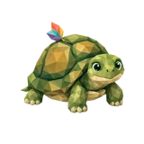
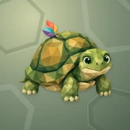

# 🐢 Backy

## Profile

- Repository: [nocoo/backy](https://github.com/nocoo/backy)
- Website: [https://backy.hexly.ai](https://backy.hexly.ai)
- Website evidence: GitHub repository homepage
- Category: tools
- Archived repository: No; [repository status evidence](../sources/repository-status-2026-09-06.json)
- English: A dependable home for AI-agent backups. Store, inspect, and restore with confidence.
- Chinese: 给 AI 智能体的备份服务，集中接收、存储、预览和恢复数据。
- Profile section: Recent Projects
- Profile revision: `9a7ad63e1e96428f9dcd12214bcdbd470b3b51c6`
- Repository revision inspected: `5b23349c94ac6778f2242a857386e8b01dac4f1c`

## Project goal

Collect application backups, inspect content and history by project, and retrieve original files.

集中接收应用备份，按项目查看内容、追踪记录，并取回原始文件。

- [中文 README](https://github.com/nocoo/backy/blob/main/README.md) · [English README](https://github.com/nocoo/backy/blob/main/docs/README.en.md)
- Verified: 2026-09-08; [source revision](https://github.com/nocoo/backy/tree/5b23349c94ac6778f2242a857386e8b01dac4f1c)
- Source files: [`package.json`](https://github.com/nocoo/backy/blob/5b23349c94ac6778f2242a857386e8b01dac4f1c/package.json), [`apps/web/package.json`](https://github.com/nocoo/backy/blob/5b23349c94ac6778f2242a857386e8b01dac4f1c/apps/web/package.json), [`apps/worker/package.json`](https://github.com/nocoo/backy/blob/5b23349c94ac6778f2242a857386e8b01dac4f1c/apps/worker/package.json), [`apps/cli/src/index.ts`](https://github.com/nocoo/backy/blob/5b23349c94ac6778f2242a857386e8b01dac4f1c/apps/cli/src/index.ts), [`apps/web/vite.config.ts`](https://github.com/nocoo/backy/blob/5b23349c94ac6778f2242a857386e8b01dac4f1c/apps/web/vite.config.ts), [`apps/worker/wrangler.toml`](https://github.com/nocoo/backy/blob/5b23349c94ac6778f2242a857386e8b01dac4f1c/apps/worker/wrangler.toml), [`apps/worker/src/index.ts`](https://github.com/nocoo/backy/blob/5b23349c94ac6778f2242a857386e8b01dac4f1c/apps/worker/src/index.ts), [`apps/worker/src/middleware/access-auth.ts`](https://github.com/nocoo/backy/blob/5b23349c94ac6778f2242a857386e8b01dac4f1c/apps/worker/src/middleware/access-auth.ts), [`apps/worker/src/middleware/is-localhost.ts`](https://github.com/nocoo/backy/blob/5b23349c94ac6778f2242a857386e8b01dac4f1c/apps/worker/src/middleware/is-localhost.ts), [`apps/worker/src/middleware/ctx.ts`](https://github.com/nocoo/backy/blob/5b23349c94ac6778f2242a857386e8b01dac4f1c/apps/worker/src/middleware/ctx.ts), [`packages/api/src/handlers/webhook.ts`](https://github.com/nocoo/backy/blob/5b23349c94ac6778f2242a857386e8b01dac4f1c/packages/api/src/handlers/webhook.ts), [`packages/api/src/handlers/restore.ts`](https://github.com/nocoo/backy/blob/5b23349c94ac6778f2242a857386e8b01dac4f1c/packages/api/src/handlers/restore.ts), [`packages/api/src/handlers/webhook-direct.ts`](https://github.com/nocoo/backy/blob/5b23349c94ac6778f2242a857386e8b01dac4f1c/packages/api/src/handlers/webhook-direct.ts), [`packages/api/src/handlers/backups.ts`](https://github.com/nocoo/backy/blob/5b23349c94ac6778f2242a857386e8b01dac4f1c/packages/api/src/handlers/backups.ts), [`packages/api/src/handlers/cron.ts`](https://github.com/nocoo/backy/blob/5b23349c94ac6778f2242a857386e8b01dac4f1c/packages/api/src/handlers/cron.ts), [`packages/api/src/handlers/gc.ts`](https://github.com/nocoo/backy/blob/5b23349c94ac6778f2242a857386e8b01dac4f1c/packages/api/src/handlers/gc.ts), [`packages/api/src/lib/direct-upload.ts`](https://github.com/nocoo/backy/blob/5b23349c94ac6778f2242a857386e8b01dac4f1c/packages/api/src/lib/direct-upload.ts), [`packages/api/src/lib/backup/extractors.ts`](https://github.com/nocoo/backy/blob/5b23349c94ac6778f2242a857386e8b01dac4f1c/packages/api/src/lib/backup/extractors.ts), [`packages/api/src/lib/db/schema.ts`](https://github.com/nocoo/backy/blob/5b23349c94ac6778f2242a857386e8b01dac4f1c/packages/api/src/lib/db/schema.ts), [`packages/api/src/lib/r2/s3-adapter.ts`](https://github.com/nocoo/backy/blob/5b23349c94ac6778f2242a857386e8b01dac4f1c/packages/api/src/lib/r2/s3-adapter.ts), [`apps/worker/migrations/0001_direct_uploads.sql`](https://github.com/nocoo/backy/blob/5b23349c94ac6778f2242a857386e8b01dac4f1c/apps/worker/migrations/0001_direct_uploads.sql), [`scripts/run-e2e.ts`](https://github.com/nocoo/backy/blob/5b23349c94ac6778f2242a857386e8b01dac4f1c/scripts/run-e2e.ts), [`scripts/run-e2e-bdd.ts`](https://github.com/nocoo/backy/blob/5b23349c94ac6778f2242a857386e8b01dac4f1c/scripts/run-e2e-bdd.ts), [`.github/workflows/release.yml`](https://github.com/nocoo/backy/blob/5b23349c94ac6778f2242a857386e8b01dac4f1c/.github/workflows/release.yml), [`LICENSE`](https://github.com/nocoo/backy/blob/5b23349c94ac6778f2242a857386e8b01dac4f1c/LICENSE)

### Tech stack

| Technology | Role | 用途 |
| --- | --- | --- |
| TypeScript | Shared types, API logic and scripts | 共享类型、API 逻辑与脚本 |
| Bun workspaces | Workspace dependencies and local tooling | 工作区依赖与本地工具 |
| Vite | Dashboard development and static builds | 管理界面开发与静态构建 |
| React | Backup management interface | 备份管理界面 |
| Hono | HTTP routes and middleware | HTTP 路由与中间件 |
| Cloudflare Workers | API, scheduled jobs and static assets | API、定时任务与静态资源 |
| Cloudflare D1 | Projects, backup metadata and logs | 项目、备份元数据与日志 |
| Cloudflare R2 | Backup files and direct uploads | 备份文件与直传 |
| AWS S3 SDK | Signed URLs and object copying | 签名 URL 与对象复制 |
| Cloudflare Access | Dashboard sign-in | 管理界面登录 |

## Current logo

- Type: Original vector identity commissioned and designed in hexly.ai; the source SVG is preserved byte-for-byte
- Subject: Small olive tortoise with one folded multicolored leaf on its shell
- [Source](https://github.com/nocoo/backy/blob/5b23349c94ac6778f2242a857386e8b01dac4f1c/logo.png): `logo.png`
- [Preserved asset](../../public/logos/originals/backy-family-2026-09-07-01-01.png)
- Original dimensions: 2048 × 2048
- Original size: 2447370 bytes
- SHA-256: `a89f2303bd3f791f240b514665325c8be7bce60f6a2338bc3efcad2248a6c7ef`
- Locally modified source: No
- Display derivatives: 32, 64, 160, and 1024 px WebP; contain-fit, transparent padding, no recoloring or cropping.

## Current palette

| Role | Value | Evidence |
| --- | --- | --- |
| primary | `#2e8553` | apps/web/src/index.css --primary: 146 49% 35% |
| background | `#eeeff2` | apps/web/src/index.css --background: 220 14% 94% |
| accent | `#344b2f` | Native backy 79f10e2d2a84, sampled sRGB pixel (551, 995); artwork/logo-family/backy/2026-09-07-01/palette.json |
| accent | `#d5b455` | Native backy 79f10e2d2a84, sampled sRGB pixel (926, 772); artwork/logo-family/backy/2026-09-07-01/palette.json |
| accent | `#d77656` | Native backy 79f10e2d2a84, sampled sRGB pixel (819, 435); artwork/logo-family/backy/2026-09-07-01/palette.json |

Theme tokens take precedence. Additional colors are sampled from the preserved artwork. A transparent background means the source does not define an opaque background; the gallery's surrounding paper is not part of the project palette.

## Hexly campaign brand archive

- Brand version: `1.0.0`; [public archive](https://hexly.ai/projects/backy#brand).
- [Light lockup](../../public/brands/backy/v1.0.0/lockup-light.png), [dark lockup](../../public/brands/backy/v1.0.0/lockup-dark.png), [favicon](../../public/brands/backy/v1.0.0/favicon.ico).
- [Complete usage and integration guide](../../public/brands/backy/v1.0.0/guide.md), [standalone specimens](../../public/brands/backy/v1.0.0/review.html), [all exports and SHA-256](../../public/brands/backy/v1.0.0/manifest.json).
- Source adoption: separate source-team handoff; no adoption commit is claimed.
- Official project identity and Hexly campaign interpretation are separate manifest roles. Existing artwork keeps its exact bytes, geometry and original colors. Heroes are authored wide/mobile compositions, with no new image-model calls. Hexly palettes and typography apply only to this archive and promotional materials, not product UI. Preserved imagery retains its recorded source rights; MIT covers authored support work and OFL covers the real font. See provenance.json and license.txt.

Small olive tortoise with one folded multicolored leaf on its shell.

### Identity keeps its colors

Preserve the exact project identity and the separately recorded Hexly artwork. Hexly paper, ink and terracotta belong to archive and campaign surfaces only; independent product palettes and themes stay their own.

项目原标与单独记录的 Hexly 主视觉均保持形状和原色。Hexly 纸色、墨色和陶土色只用于档案及宣发画布，各产品色板与主题独立保留。

### A complete composition

Preserve the complete subject and its original square margins. Resize uniformly; never trim the canvas to force detail. Keep external clear space of at least 1/8 of the mark canvas height around standalone marks and lockups. Wide and mobile Heroes are separate compositions of existing artwork, with no image-model call.

保留完整主体与原有方形留白，只做等比缩放，不裁图强凑细节。独立标志及字标组合四周，至少留出标志画布高度 1/8 的外部净空。宽幅与手机 Hero 分别排版，没有新图像模型调用。

### A mark, not a tile

Navigation 24px preferred, 16px minimum. Wordmark ≥63px wide; lockup ≥160px. Use transparent PNG/ICO at small sizes without a tile, extra red dot, shadow or rounded mask. Fine facets soften at 16px.

导航推荐 24px，最小 16px。字标宽度至少 63px，组合至少 160px。小尺寸使用透明 PNG/ICO，不加底板、红点、阴影或圆角遮罩；16px 时细小切面会柔化。

## Refined identity

- Status: Adopted in the source project; updated 2026-09-07.
- Study `2026-09-07-01`, finishing `01`
- Refined subject: Small olive tortoise with one folded multicolored leaf on its shell
- Site path: `/projects/backy#brand`; [local gallery](https://index.dev.hexly.ai/projects/backy#brand)
- [Static review HTML](../../artwork/logo-family/backy/2026-09-07-01/review.html)
- [Full process archive](https://github.com/nocoo/hexly.ai/tree/main/artwork/logo-family/backy/2026-09-07-01)
- [Transparent foreground](../../public/logos/family/backy/2026-09-07-01/01/transparent.png); SHA-256: `a89f2303bd3f791f240b514665325c8be7bce60f6a2338bc3efcad2248a6c7ef`
- [Square icon](../../public/logos/family/backy/2026-09-07-01/01/icon.png), [rounded icon](../../public/logos/family/backy/2026-09-07-01/01/rounded.png), [white version](../../public/logos/family/backy/2026-09-07-01/01/white.png)
- [Untouched generation](../../public/logos/family/backy/2026-09-07-01/01/raw.png), [exact prompt](../../public/logos/family/backy/2026-09-07-01/01/prompt.txt), [public asset checksums](../../public/logos/family/backy/2026-09-07-01/01/manifest.json)
- [Previous original](../../public/logos/originals/backy.png), copied from [its immutable source](https://github.com/nocoo/backy/blob/8bf91fc7dcad5abe51323bdcc1e39f0906faa55a/logo.png)
- Previous SHA-256: `297d5e88c91484612d1fc34aed41b01b872f1bd24fd92a8fcdd49d0eb7801ef0`
- Generation: gpt-image-2, native 2048 × 2048; transparent extraction and presentation are separate finishing steps.
- The finishing archive includes transparent, square, and rounded PNGs at 2048, 1024, 512, 256, 128, 64, 48, 32, 24, and 16 px.
- Application previews use the refined square icon without extra padding, backgrounds, or circular masks. Artwork previews and downloads use its own transparent foreground, independently of the preserved source logo above.

### Refined palette

| Role | Value | Evidence |
| --- | --- | --- |
| background | `#829178` | Selected Backy presentation, 2026-09-07-01/01; background.base in archived settings.json |
| primary | `#818a45` | Native backy 79f10e2d2a84, sampled sRGB pixel (869, 1165); artwork/logo-family/backy/2026-09-07-01/palette.json |
| accent | `#344b2f` | Native backy 79f10e2d2a84, sampled sRGB pixel (551, 995); artwork/logo-family/backy/2026-09-07-01/palette.json |
| accent | `#d5b455` | Native backy 79f10e2d2a84, sampled sRGB pixel (926, 772); artwork/logo-family/backy/2026-09-07-01/palette.json |
| accent | `#d77656` | Native backy 79f10e2d2a84, sampled sRGB pixel (819, 435); artwork/logo-family/backy/2026-09-07-01/palette.json |
| accent | `#518c99` | Native backy 79f10e2d2a84, sampled sRGB pixel (802, 474); artwork/logo-family/backy/2026-09-07-01/palette.json |

### A leaf along for the ride

A compact tortoise pauses during a slow step and turns toward the viewer. A domed shell, short neck and natural feet give it a clear whole-animal silhouette.

紧凑的小陆龟在缓慢迈步时停下，转头看向镜头。圆拱龟壳、短颈和自然脚掌形成清晰的全身轮廓。

### Olive scutes, one leaf

Broad olive and ochre facets describe the shell without noisy scales. One folded coral, teal and violet leaf rises above the shell as the only colorful accessory.

宽阔橄榄绿和赭黄色面描绘龟壳，避免琐碎鳞片。一片珊瑚、青与紫色的折叶从壳边升起，成为唯一的彩色装饰。

### Shell saddles

Unequal broad scute impressions cross a deep sage field. Interrupted seams and soft contact shadows echo the shell with room to breathe.

大小不一的宽阔盾片压纹铺过深鼠尾草色底纹，断开的接缝与浅接触阴影呼应龟壳，并保留充分留白。

Small-size observation: The complete animal and accessory have at least 275.5 px clearance from the actual rounded outline. Ten export sizes preserve one uniform placement. Small app/browser marks use the transparent foreground; fine facets and accessory details simplify at 16 px.

## Further refinements

Preserve the original vector geometry, real Hexly tokens, outlined font and single-point hierarchy. Versioned published exports are immutable; revise into a new brand version. This commissioned scalable identity is separate from the faceted image-study workflow.

Use the supplied transparent marks in app navigation and browser tabs, keeping presentation tiles separate. Preserve clear space and minimum sizes from the guide. Compare artwork, app icon, sidebar, and favicon sizes in both themes before adopting a replacement. The source team integrates the exact published files and records its own adoption revision.
