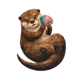
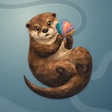

# 🦦 Otter

## Profile

- Repository: [nocoo/otter](https://github.com/nocoo/otter)
- Website: [https://otter.hexly.ai](https://otter.hexly.ai)
- Website evidence: GitHub repository homepage
- Category: tools
- Archived repository: No; [repository status evidence](../sources/repository-status-2026-09-06.json)
- English: Keep your Mac development setup safe with snapshots, diffs, and cloud backups.
- Chinese: 用快照、差异比较与云端备份，保存 Mac 开发环境的每一次变化。
- Profile section: Recent Projects
- Profile revision: `9a7ad63e1e96428f9dcd12214bcdbd470b3b51c6`
- Repository revision inspected: `0c87197fc9b67d74f9ed6ee70c7ea8c9c4567fe3`

## Current logo

- Type: Original project artwork, copied without modification
- Subject: Brown otter in a relaxed curl holding one colorful river shell
- [Source](https://github.com/nocoo/otter/blob/0c87197fc9b67d74f9ed6ee70c7ea8c9c4567fe3/logo.png): `logo.png`
- [Preserved asset](../../public/logos/originals/otter-family-2026-09-07-01-02.png)
- Original dimensions: 2048 × 2048
- Original size: 2941233 bytes
- SHA-256: `8902636945ce93cd1a6f39a8e545d6462f0b5dd09c3d4d16d66f037d8bf10933`
- Locally modified source: No
- Display derivatives: 32, 64, 160, and 1024 px WebP; contain-fit, transparent padding, no recoloring or cropping.

## Current palette

| Role | Value | Evidence |
| --- | --- | --- |
| primary | `#1b99a7` | packages/web/src/globals.css --primary: 186 72% 38% |
| background | `#eeeff2` | packages/web/src/globals.css --background: 220 14% 94% |
| accent | `#61462f` | Native otter eeca4aa68c5f, sampled sRGB pixel (850, 1091); artwork/logo-family/otter/2026-09-07-01/palette.json |
| accent | `#ead0a5` | Native otter eeca4aa68c5f, sampled sRGB pixel (863, 544); artwork/logo-family/otter/2026-09-07-01/palette.json |
| accent | `#409999` | Native otter eeca4aa68c5f, sampled sRGB pixel (1128, 424); artwork/logo-family/otter/2026-09-07-01/palette.json |

Theme tokens take precedence. Additional colors are sampled from the preserved artwork. A transparent background means the source does not define an opaque background; the gallery's surrounding paper is not part of the project palette.

## Refined identity

- Status: Adopted in the source project; updated 2026-09-07.
- Study `2026-09-07-01`, finishing `02`
- Refined subject: Brown otter in a relaxed curl holding one colorful river shell
- Site path: `/logos/otter`; [local gallery](https://index.dev.hexly.ai/logos/otter)
- [Static review HTML](../../artwork/logo-family/otter/2026-09-07-01/review.html)
- [Full process archive](https://github.com/nocoo/hexly.ai/tree/main/artwork/logo-family/otter/2026-09-07-01)
- [Transparent foreground](../../public/logos/family/otter/2026-09-07-01/02/transparent.png); SHA-256: `8902636945ce93cd1a6f39a8e545d6462f0b5dd09c3d4d16d66f037d8bf10933`
- [Square icon](../../public/logos/family/otter/2026-09-07-01/02/icon.png), [rounded icon](../../public/logos/family/otter/2026-09-07-01/02/rounded.png), [white version](../../public/logos/family/otter/2026-09-07-01/02/white.png)
- [Untouched generation](../../public/logos/family/otter/2026-09-07-01/02/raw.png), [exact prompt](../../public/logos/family/otter/2026-09-07-01/02/prompt.txt), [public asset checksums](../../public/logos/family/otter/2026-09-07-01/02/manifest.json)
- [Previous original](../../public/logos/originals/otter.png), copied from [its immutable source](https://github.com/nocoo/otter/blob/10f4b2d4d137a9afa79c61622afd68fa03fff80e/logo.png)
- Previous SHA-256: `c811a8f167c11b250bd19b5cd569477e109ece11777cbf6d04c80de4be8eed78`
- Generation: gpt-image-2, native 2048 × 2048; transparent extraction and presentation are separate finishing steps.
- The finishing archive includes transparent, square, and rounded PNGs at 2048, 1024, 512, 256, 128, 64, 48, 32, 24, and 16 px.
- Application previews use the refined square icon without extra padding, backgrounds, or circular masks. Artwork previews and downloads use its own transparent foreground, independently of the preserved source logo above.

### Refined palette

| Role | Value | Evidence |
| --- | --- | --- |
| background | `#648691` | Selected Otter presentation, 2026-09-07-01/02; background.base in archived settings.json |
| primary | `#a97542` | Native otter eeca4aa68c5f, sampled sRGB pixel (847, 273); artwork/logo-family/otter/2026-09-07-01/palette.json |
| accent | `#61462f` | Native otter eeca4aa68c5f, sampled sRGB pixel (850, 1091); artwork/logo-family/otter/2026-09-07-01/palette.json |
| accent | `#ead0a5` | Native otter eeca4aa68c5f, sampled sRGB pixel (863, 544); artwork/logo-family/otter/2026-09-07-01/palette.json |
| accent | `#409999` | Native otter eeca4aa68c5f, sampled sRGB pixel (1128, 424); artwork/logo-family/otter/2026-09-07-01/palette.json |
| accent | `#e99178` | Native otter eeca4aa68c5f, sampled sRGB pixel (1227, 348); artwork/logo-family/otter/2026-09-07-01/palette.json |

### A small river treasure

The otter pauses in a relaxed curl and holds a shell beside its muzzle. Small ears, cream whisker pads, natural paws and a tapering tail make the species clear.

水獭放松地蜷起身体，将贝壳捧在嘴边。小耳朵、奶油色须垫、自然爪子与渐细长尾让物种特征更加清晰。

### Brown carries the identity

Chestnut, umber and cream replace the competing body colors. A single fan-shaped shell carries turquoise, coral, violet and gold beside the face.

栗棕、深棕与奶油色取代相互争抢的身体色块。一枚扇形贝壳在脸旁集中呈现松石、珊瑚、紫与金色。

### Riverbank sweeps

Two broad offset eddies and a low bank sweep cross a blue-gray field. Open curves and fine grain give the warm animal a cooler, quiet setting.

两道宽阔错位的回旋和一条低岸曲线穿过蓝灰底色，开放曲线与细颗粒为暖色主体提供安静的冷色背景。

Small-size observation: The complete animal and accessory have at least 224.5 px clearance from the actual rounded outline. Ten export sizes preserve one uniform placement. Small app/browser marks use the transparent foreground; fine facets and accessory details simplify at 16 px.

## Further refinements

Keep this asset as the phase-one baseline. A future family version should use a recognizable animal, one principal hue, and restrained multicolored geometric fragments.

Use head portraits for large animals and optionally full-body poses for small animals. Compare artwork, app icon, sidebar, and favicon sizes in both themes before adopting a replacement. Preserve this reviewed composition and its archived predecessors.
