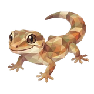

# 🦎 Gecko

## Profile

- Repository: [nocoo/gecko](https://github.com/nocoo/gecko)
- Website: [https://gecko.hexly.ai](https://gecko.hexly.ai)
- Website evidence: Owner-confirmed Railway deployment, 2026-09-12; public /api/live verified in docs/sources/status-targets-2026-09-12.json
- Category: everyday
- Archived repository: No; [repository status evidence](../sources/repository-status-2026-09-06.json)
- English: A little perspective on your screen time, with a Mac tracker and a synced dashboard.
- Chinese: 用 Mac 时间追踪器和同步仪表盘，看看自己的时间花在了哪里。
- Profile section: Recent Projects
- Profile revision: `9a7ad63e1e96428f9dcd12214bcdbd470b3b51c6`
- Repository revision inspected: `f259be7fe740ce260c9257e2870b57dec8d9e7b3`

## Project goal

Record app and window usage on a Mac, review daily activity in a synced web dashboard, and optionally generate an AI-assisted daily review.

记录 Mac 上的应用和窗口使用时间，在同步后的 Web 控制台回看每日活动，并按需生成 AI 每日回顾。

- [中文 README](https://github.com/nocoo/gecko/blob/main/README.md) · [English README](https://github.com/nocoo/gecko/blob/main/docs/README.en.md)
- Verified: 2026-09-08; [source revision](https://github.com/nocoo/gecko/tree/f259be7fe740ce260c9257e2870b57dec8d9e7b3)
- Source files: [`apps/mac-client/project.yml`](https://github.com/nocoo/gecko/blob/f259be7fe740ce260c9257e2870b57dec8d9e7b3/apps/mac-client/project.yml), [`apps/mac-client/Gecko/Sources/Services/TrackingEngine.swift`](https://github.com/nocoo/gecko/blob/f259be7fe740ce260c9257e2870b57dec8d9e7b3/apps/mac-client/Gecko/Sources/Services/TrackingEngine.swift), [`apps/mac-client/Gecko/Sources/Services/SettingsManager.swift`](https://github.com/nocoo/gecko/blob/f259be7fe740ce260c9257e2870b57dec8d9e7b3/apps/mac-client/Gecko/Sources/Services/SettingsManager.swift), [`apps/mac-client/Gecko/Sources/Services/BrowserURLFetcher.swift`](https://github.com/nocoo/gecko/blob/f259be7fe740ce260c9257e2870b57dec8d9e7b3/apps/mac-client/Gecko/Sources/Services/BrowserURLFetcher.swift), [`apps/mac-client/Gecko/Sources/Services/SyncService.swift`](https://github.com/nocoo/gecko/blob/f259be7fe740ce260c9257e2870b57dec8d9e7b3/apps/mac-client/Gecko/Sources/Services/SyncService.swift), [`apps/web-dashboard/package.json`](https://github.com/nocoo/gecko/blob/f259be7fe740ce260c9257e2870b57dec8d9e7b3/apps/web-dashboard/package.json), [`apps/web-dashboard/Dockerfile`](https://github.com/nocoo/gecko/blob/f259be7fe740ce260c9257e2870b57dec8d9e7b3/apps/web-dashboard/Dockerfile), [`apps/web-dashboard/src/lib/d1.ts`](https://github.com/nocoo/gecko/blob/f259be7fe740ce260c9257e2870b57dec8d9e7b3/apps/web-dashboard/src/lib/d1.ts), [`apps/web-dashboard/src/auth.ts`](https://github.com/nocoo/gecko/blob/f259be7fe740ce260c9257e2870b57dec8d9e7b3/apps/web-dashboard/src/auth.ts), [`apps/web-dashboard/src/services/analyze-core.ts`](https://github.com/nocoo/gecko/blob/f259be7fe740ce260c9257e2870b57dec8d9e7b3/apps/web-dashboard/src/services/analyze-core.ts), [`apps/web-dashboard/src/lib/auto-analyze.ts`](https://github.com/nocoo/gecko/blob/f259be7fe740ce260c9257e2870b57dec8d9e7b3/apps/web-dashboard/src/lib/auto-analyze.ts)

### Tech stack

| Technology | Role | 用途 |
| --- | --- | --- |
| Swift / SwiftUI | macOS tracking app | macOS 跟踪应用 |
| AppKit / AppleScript | Window and browser context | 窗口与浏览器信息 |
| SQLite / GRDB | Local session storage | 本地会话存储 |
| React / TypeScript | Activity dashboard | 活动控制台 |
| vinext / Vite | Web pages and Node.js server | Web 页面与 Node.js 服务 |
| Cloudflare D1 | Synced data over the REST API | 通过 REST API 存储同步数据 |
| NextAuth | Google sign-in | Google 登录 |
| AI SDK | Optional daily analysis | 可选的每日分析 |

## Current logo

- Type: Original project artwork, copied without modification
- Subject: Original sandstone-colored gecko with a complete curled tail and toes
- [Source](https://github.com/nocoo/gecko/blob/f259be7fe740ce260c9257e2870b57dec8d9e7b3/logo.png): `logo.png`
- [Preserved asset](../../public/logos/originals/gecko.png)
- Original dimensions: 2048 × 2048
- Original size: 2799098 bytes
- SHA-256: `8808c313490254f126fa050aee2af4d6d9496e20c007b15036a26d4c06e478d3`
- Locally modified source: No
- Display derivatives: 32, 64, 160, and 1024 px WebP; contain-fit, transparent padding, no recoloring or cropping.

## Current palette

| Role | Value | Evidence |
| --- | --- | --- |
| primary | `#2e8553` | apps/web-dashboard/src/app/globals.css --primary: 146 49% 35% |
| background | `#eef2ef` | apps/web-dashboard/src/app/globals.css --background: 140 14% 94% |
| accent | `#bd9f6d` | Native gecko 8808c3134902, sampled sRGB pixel (1645, 317); artwork/logo-family/gecko/2026-09-07-01/palette.json |
| accent | `#bd9f6d` | Native gecko 8808c3134902, sampled sRGB pixel (1645, 317); artwork/logo-family/gecko/2026-09-07-01/palette.json |
| accent | `#e4d4b0` | Native gecko 8808c3134902, sampled sRGB pixel (1338, 267); artwork/logo-family/gecko/2026-09-07-01/palette.json |

Theme tokens take precedence. Additional colors are sampled from the preserved artwork. A transparent background means the source does not define an opaque background; the gallery's surrounding paper is not part of the project palette.

## Refined identity

- Status: Adopted in the source project; updated 2026-09-07.
- Study `2026-09-07-01`, finishing `01`
- Refined subject: Original sandstone-colored gecko with a complete curled tail and toes
- Site path: `/logos/gecko`; [local gallery](https://index.dev.hexly.ai/logos/gecko)
- [Static review HTML](../../artwork/logo-family/gecko/2026-09-07-01/review.html)
- [Full process archive](https://github.com/nocoo/hexly.ai/tree/main/artwork/logo-family/gecko/2026-09-07-01)
- [Transparent foreground](../../public/logos/family/gecko/2026-09-07-01/01/transparent.png); SHA-256: `8808c313490254f126fa050aee2af4d6d9496e20c007b15036a26d4c06e478d3`
- [Square icon](../../public/logos/family/gecko/2026-09-07-01/01/icon.png), [rounded icon](../../public/logos/family/gecko/2026-09-07-01/01/rounded.png), [white version](../../public/logos/family/gecko/2026-09-07-01/01/white.png)
- [Untouched original](../../public/logos/family/gecko/2026-09-07-01/01/source.png), [presentation brief](../../public/logos/family/gecko/2026-09-07-01/01/brief.txt), [public asset checksums](../../public/logos/family/gecko/2026-09-07-01/01/manifest.json)
- [Previous original](../../public/logos/originals/gecko.png), copied from [its immutable source](https://github.com/nocoo/gecko/blob/db35d40b4c30e115914b591ac0475f2cc8961375/logo.png)
- Previous SHA-256: `8808c313490254f126fa050aee2af4d6d9496e20c007b15036a26d4c06e478d3`
- Original artwork retained byte-for-byte at native 2048 × 2048. Zero image-generation calls; only background, grain, and shadow layers were composed.
- The finishing archive includes transparent, square, and rounded PNGs at 2048, 1024, 512, 256, 128, 64, 48, 32, 24, and 16 px.
- Application previews use the refined square icon without extra padding, backgrounds, or circular masks. Artwork previews and downloads use its own transparent foreground, independently of the preserved source logo above.

### Refined palette

| Role | Value | Evidence |
| --- | --- | --- |
| background | `#926d60` | Selected Gecko presentation, 2026-09-07-01/01; background.base in archived settings.json |
| primary | `#c4a576` | Native gecko 8808c3134902, sampled sRGB pixel (1645, 318); artwork/logo-family/gecko/2026-09-07-01/palette.json |
| accent | `#bd9f6d` | Native gecko 8808c3134902, sampled sRGB pixel (1645, 317); artwork/logo-family/gecko/2026-09-07-01/palette.json |
| accent | `#bd9f6d` | Native gecko 8808c3134902, sampled sRGB pixel (1645, 317); artwork/logo-family/gecko/2026-09-07-01/palette.json |
| accent | `#e4d4b0` | Native gecko 8808c3134902, sampled sRGB pixel (1338, 267); artwork/logo-family/gecko/2026-09-07-01/palette.json |
| accent | `#bd9f6d` | Native gecko 8808c3134902, sampled sRGB pixel (1645, 317); artwork/logo-family/gecko/2026-09-07-01/palette.json |

### A familiar pause

The liked whole gecko keeps its exact native placement, broad face, curled tail and spread toes. The comparison intentionally shows the same animal.

喜爱的壁虎全身保留原有位置、宽脸、卷尾和展开的脚趾，前后对比有意展示同一个主体。

### Sandstone stays intact

Warm sandstone, clay, cream and quiet sage facets remain byte for byte unchanged. No redraw or new accessory is introduced.

温暖的砂岩、陶土、奶油与柔和鼠尾草色色面逐字节保留，没有重绘或添加新的装饰。

### Sandstone shelves

Staggered broad ledges and short rising seams sit on a warmer clay field. The low relief gives the gecko a distinct place within the family.

错落的宽阔层架和短竖缝铺在暖陶土色底纹上，用浅浮雕为壁虎形成独有的家族背景。

Small-size observation: The original 2048 px foreground and placement are retained exactly. Existing nearest rounded-outline clearance is 114.5 px with no clipped pixels. Fine facets and small sparks simplify at 16 px; app and browser marks use the transparent source.

## Further refinements

Keep this asset as the phase-one baseline. A future family version should use a recognizable animal, one principal hue, and restrained multicolored geometric fragments.

Use head portraits for large animals and optionally full-body poses for small animals. Compare artwork, app icon, sidebar, and favicon sizes in both themes before adopting a replacement. Preserve this reviewed composition and its archived predecessors.
