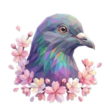
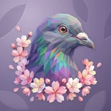

# 🕊️ Dove

## Profile

- Repository: [nocoo/dove](https://github.com/nocoo/dove)
- Website: [https://dove.hexly.ai](https://dove.hexly.ai)
- Website evidence: wrangler.toml routes
- Category: tools
- Archived repository: No; [repository status evidence](../sources/repository-status-2026-09-06.json)
- English: A self-hosted email relay with webhooks, reusable templates, and delivery insights.
- Chinese: 可自行托管的邮件中继，支持 Webhook、邮件模板与用量查看。
- Profile section: Recent Projects
- Profile revision: `9a7ad63e1e96428f9dcd12214bcdbd470b3b51c6`
- Repository revision inspected: `7454e3d93d8345e5aa09dc778240b65dbbed69d0`

## Current logo

- Type: Original project artwork, copied without modification
- Subject: Dove portrait with pink blossoms
- [Source](https://github.com/nocoo/dove/blob/7454e3d93d8345e5aa09dc778240b65dbbed69d0/logo.png): `logo.png`
- [Preserved asset](../../public/logos/originals/dove.png)
- Original dimensions: 2048 × 2048
- Original size: 4062349 bytes
- SHA-256: `25be5b3506f84b454b9e5a9c469a353955e41fc16123aa6bf7a28088d74bd1aa`
- Locally modified source: No
- Display derivatives: 32, 64, 160, and 1024 px WebP; contain-fit, transparent padding, no recoloring or cropping.

## Current palette

| Role | Value | Evidence |
| --- | --- | --- |
| primary | `#c65379` | src/client/styles/globals.css --primary: 340 50% 55% |
| background | `#f3edf0` | src/client/styles/globals.css --background: 330 20% 94% |
| accent | `#7f78a5` | Preserved project artwork, sampled pixel |
| accent | `#4c5778` | Preserved project artwork, sampled pixel |
| accent | `#fbcbc6` | Preserved project artwork, sampled pixel |

Theme tokens take precedence. Additional colors are sampled from the preserved artwork. A transparent background means the source does not define an opaque background; the gallery's surrounding paper is not part of the project palette.

## Refined identity

- Status: Adopted in the source project; updated 2026-09-07.
- Study `2026-09-07-03`, finishing `01`
- Refined subject: Original violet and teal faceted dove with pink blossoms
- Site path: `/logos/dove`; [local gallery](https://index.dev.hexly.ai/logos/dove)
- [Static review HTML](../../artwork/logo-family/dove/2026-09-07-03/review.html)
- [Full process archive](https://github.com/nocoo/hexly.ai/tree/main/artwork/logo-family/dove/2026-09-07-03)
- [Transparent foreground](../../public/logos/family/dove/2026-09-07-03/01/transparent.png); SHA-256: `25be5b3506f84b454b9e5a9c469a353955e41fc16123aa6bf7a28088d74bd1aa`
- [Square icon](../../public/logos/family/dove/2026-09-07-03/01/icon.png), [rounded icon](../../public/logos/family/dove/2026-09-07-03/01/rounded.png), [white version](../../public/logos/family/dove/2026-09-07-03/01/white.png)
- [Untouched original](../../public/logos/family/dove/2026-09-07-03/01/source.png), [presentation brief](../../public/logos/family/dove/2026-09-07-03/01/brief.txt), [public asset checksums](../../public/logos/family/dove/2026-09-07-03/01/manifest.json)
- [Previous original](../../public/logos/originals/dove.png), copied from [its immutable source](https://github.com/nocoo/dove/blob/2f7e96b0217a800f09c2685065024ae10c34918f/src/client/public/logo.png)
- Previous SHA-256: `25be5b3506f84b454b9e5a9c469a353955e41fc16123aa6bf7a28088d74bd1aa`
- Original artwork retained byte-for-byte at native 2048 × 2048. Zero image-generation calls; only background, grain, and shadow layers were composed.
- The finishing archive includes transparent, square, and rounded PNGs at 2048, 1024, 512, 256, 128, 64, 48, 32, 24, and 16 px.
- Application previews use the refined square icon without extra padding, backgrounds, or circular masks. Artwork previews and downloads use its own transparent foreground, independently of the preserved source logo above.

### Refined palette

| Role | Value | Evidence |
| --- | --- | --- |
| background | `#83759b` | Selected Dove presentation, finishing 01; background.base in archived settings.json |
| primary | `#8079a5` | Original dove 25be5b3506f8, sampled sRGB pixel (885, 372); palette.json |
| accent | `#4c5777` | Original dove 25be5b3506f8, sampled sRGB pixel (1237, 783); palette.json |
| accent | `#fbccc6` | Original dove 25be5b3506f8, sampled sRGB pixel (336, 482); palette.json |
| accent | `#65c8b6` | Original dove 25be5b3506f8, sampled sRGB pixel (1101, 1055); palette.json |
| accent | `#d4b7a9` | Original dove 25be5b3506f8, sampled sRGB pixel (1196, 474); palette.json |

### The original blossom portrait

The dove, shoulder curve, watchful eye, and surrounding blossom group retain their original layout. This pass does not use any superseded neck-extension study.

鸽子、肩部曲线、专注眼神与周围花枝均保留原来布局，不采用此前已撤回的延长颈部版本。

### One blossom group

Violet, blue, and mint facets remain the original bird; the existing pink blossoms form the signature accent group. All foreground pixels and detached petals are preserved.

紫、蓝和薄荷色碎片构成原来的鸟，既有粉色花枝是标志性的点缀组。所有前景像素与飘落花瓣均保留。

### Petals pressed into violet paper

Sparse elongated petals sit at the corners of a muted violet field. Fine grain, offset edge light, and a shallow shadow keep the real blossom group in front.

稀疏修长的花瓣纹位于柔和紫色底面的角落，细颗粒、偏移边光与浅阴影让真正的花枝点缀保持在视觉前方。

Small-size observation: The violet silhouette and pink blossom arc remain distinct at 32 px. At 16 px small petals and feather facets merge; use the transparent foreground for browser and sidebar marks.

## Further refinements

Keep this asset as the phase-one baseline. A future family version should use a recognizable animal, one principal hue, and restrained multicolored geometric fragments.

Use head portraits for large animals and optionally full-body poses for small animals. Compare artwork, app icon, sidebar, and favicon sizes in both themes before adopting a replacement. Preserve this reviewed composition and its archived predecessors.
