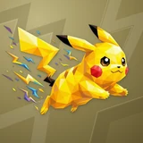

# ⚡ Pika

## Profile

- Repository: [nocoo/pika](https://github.com/nocoo/pika)
- Website: [https://pika.hexly.ai](https://pika.hexly.ai)
- Website evidence: packages/web-worker/wrangler.toml routes
- Category: ai
- Archived repository: No; [repository status evidence](../sources/repository-status-2026-09-06.json)
- English: Replay, search, and rediscover your AI coding conversations.
- Chinese: 回放、搜索和重新发现 AI 编程会话，让过去的思路更容易找回来。
- Profile section: Recent Projects
- Profile revision: `9a7ad63e1e96428f9dcd12214bcdbd470b3b51c6`
- Repository revision inspected: `bb9b497372809e5ca00eaef4b04e1aa51e4256a3`

## Current logo

- Type: Original project artwork, copied without modification
- Subject: Original yellow Pika with its complete lightning gesture
- [Source](https://github.com/nocoo/pika/blob/bb9b497372809e5ca00eaef4b04e1aa51e4256a3/logo.png): `logo.png`
- [Preserved asset](../../public/logos/originals/pika.png)
- Original dimensions: 2048 × 2048
- Original size: 2575312 bytes
- SHA-256: `2dc5121317e88001e8459d007419d5b9ca998a95f91bee4992b70bba96aacd2b`
- Locally modified source: No
- Display derivatives: 32, 64, 160, and 1024 px WebP; contain-fit, transparent padding, no recoloring or cropping.

## Current palette

| Role | Value | Evidence |
| --- | --- | --- |
| primary | `#c38e13` | packages/web/src/globals.css --primary: 42 82% 42% |
| background | `#eeeff2` | packages/web/src/globals.css --background: 220 14% 94% |
| accent | `#fdc904` | Native pika 2dc5121317e8, sampled sRGB pixel (1681, 1223); artwork/logo-family/pika/2026-09-07-01/palette.json |
| accent | `#fdc904` | Native pika 2dc5121317e8, sampled sRGB pixel (1681, 1223); artwork/logo-family/pika/2026-09-07-01/palette.json |
| accent | `#fdc904` | Native pika 2dc5121317e8, sampled sRGB pixel (1681, 1223); artwork/logo-family/pika/2026-09-07-01/palette.json |

Theme tokens take precedence. Additional colors are sampled from the preserved artwork. A transparent background means the source does not define an opaque background; the gallery's surrounding paper is not part of the project palette.

## Refined identity

- Status: Adopted in the source project; updated 2026-09-07.
- Study `2026-09-07-01`, finishing `01`
- Refined subject: Original yellow Pika with its complete lightning gesture
- Site path: `/logos/pika`; [local gallery](https://index.dev.hexly.ai/logos/pika)
- [Static review HTML](../../artwork/logo-family/pika/2026-09-07-01/review.html)
- [Full process archive](https://github.com/nocoo/hexly.ai/tree/main/artwork/logo-family/pika/2026-09-07-01)
- [Transparent foreground](../../public/logos/family/pika/2026-09-07-01/01/transparent.png); SHA-256: `2dc5121317e88001e8459d007419d5b9ca998a95f91bee4992b70bba96aacd2b`
- [Square icon](../../public/logos/family/pika/2026-09-07-01/01/icon.png), [rounded icon](../../public/logos/family/pika/2026-09-07-01/01/rounded.png), [white version](../../public/logos/family/pika/2026-09-07-01/01/white.png)
- [Untouched original](../../public/logos/family/pika/2026-09-07-01/01/source.png), [presentation brief](../../public/logos/family/pika/2026-09-07-01/01/brief.txt), [public asset checksums](../../public/logos/family/pika/2026-09-07-01/01/manifest.json)
- [Previous original](../../public/logos/originals/pika.png), copied from [its immutable source](https://github.com/nocoo/pika/blob/d9b12caf26a4715aca440d8a6fe1ed929adcadb3/logo.png)
- Previous SHA-256: `2dc5121317e88001e8459d007419d5b9ca998a95f91bee4992b70bba96aacd2b`
- Original artwork retained byte-for-byte at native 2048 × 2048. Zero image-generation calls; only background, grain, and shadow layers were composed.
- The finishing archive includes transparent, square, and rounded PNGs at 2048, 1024, 512, 256, 128, 64, 48, 32, 24, and 16 px.
- Application previews use the refined square icon without extra padding, backgrounds, or circular masks. Artwork previews and downloads use its own transparent foreground, independently of the preserved source logo above.

### Refined palette

| Role | Value | Evidence |
| --- | --- | --- |
| background | `#918451` | Selected Pika presentation, 2026-09-07-01/01; background.base in archived settings.json |
| primary | `#fdc904` | Native pika 2dc5121317e8, sampled sRGB pixel (1681, 1223); artwork/logo-family/pika/2026-09-07-01/palette.json |
| accent | `#fdc904` | Native pika 2dc5121317e8, sampled sRGB pixel (1681, 1223); artwork/logo-family/pika/2026-09-07-01/palette.json |
| accent | `#fdc904` | Native pika 2dc5121317e8, sampled sRGB pixel (1681, 1223); artwork/logo-family/pika/2026-09-07-01/palette.json |
| accent | `#fdc904` | Native pika 2dc5121317e8, sampled sRGB pixel (1681, 1223); artwork/logo-family/pika/2026-09-07-01/palette.json |
| accent | `#fdc904` | Native pika 2dc5121317e8, sampled sRGB pixel (1681, 1223); artwork/logo-family/pika/2026-09-07-01/palette.json |

### Keep the charge

The original forward leap, ears, tail and lightning fragments remain exactly where they were. No source pixels, placement or colors are changed.

原来的前跃动作、耳朵、尾巴和闪电碎片全部保留原位，主体像素、位置与颜色均未改变。

### Original yellow facets

Golden-yellow and lemon facets retain their native contrast and small colored sparks. This pass adds presentation layers without a generation request.

金黄与柠檬黄色面保持原有对比和小块彩色电光。本轮只添加展示层，没有调用生图模型。

### Charge steps

Large offset zigzag steps cut through a deeper olive-gold field. Their low tonal contrast supports the original lightning gesture.

大块错位折线阶梯穿过较深的橄榄金色底纹，用克制的明暗层次承托原有闪电动作。

Small-size observation: The original 2048 px foreground and placement are retained exactly. Existing nearest rounded-outline clearance is 26.5 px with no clipped pixels. Fine facets and small sparks simplify at 16 px; app and browser marks use the transparent source.

## Further refinements

Keep this asset as the phase-one baseline. A future family version should use a recognizable animal, one principal hue, and restrained multicolored geometric fragments.

Use head portraits for large animals and optionally full-body poses for small animals. Compare artwork, app icon, sidebar, and favicon sizes in both themes before adopting a replacement. Preserve this reviewed composition and its archived predecessors.
