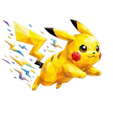

# ⚡ Pika

## Profile

- Repository: [nocoo/pika](https://github.com/nocoo/pika)
- Website: [https://pika.hexly.ai](https://pika.hexly.ai)
- Website evidence: packages/web-worker/wrangler.toml routes
- Category: ai
- English: Replay, search, and rediscover your AI coding conversations.
- Chinese: 回放、搜索和重新发现 AI 编程会话，让过去的思路更容易找回来。
- Profile section: Recent Projects
- Profile revision: `9a7ad63e1e96428f9dcd12214bcdbd470b3b51c6`
- Repository revision inspected: `d9b12caf26a4715aca440d8a6fe1ed929adcadb3`

## Current logo

- Type: Original project artwork, copied without modification
- Subject: Yellow electric mouse in motion
- [Source](https://github.com/nocoo/pika/blob/d9b12caf26a4715aca440d8a6fe1ed929adcadb3/logo.png): `logo.png`
- [Preserved asset](../../public/logos/originals/pika.png)
- Original dimensions: 2048 × 2048
- Original size: 2575312 bytes
- SHA-256: `2dc5121317e88001e8459d007419d5b9ca998a95f91bee4992b70bba96aacd2b`
- Locally modified source: No
- Display derivatives: 32, 64, 160, and 1024 px WebP; contain-fit, transparent padding, no recoloring or cropping.

## Current palette

| Role | Value | Evidence |
| --- | --- | --- |
| primary | `#c38e13` | packages/web/src/globals.css --primary: 42 82% 42% |
| background | `#eeeff2` | packages/web/src/globals.css --background: 220 14% 94% |
| accent | `#ffea02` | Preserved project artwork, sampled pixel |
| accent | `#ffab17` | Preserved project artwork, sampled pixel |
| accent | `#ffef66` | Preserved project artwork, sampled pixel |

Theme tokens take precedence. Additional colors are sampled from the preserved artwork. A transparent background means the source does not define an opaque background; the gallery's surrounding paper is not part of the project palette.

## Future family notes

Keep this asset as the phase-one baseline. A future family version should use a recognizable animal, one principal hue, and restrained multicolored geometric fragments.

Use head portraits for large animals and optionally full-body poses for small animals. Compare artwork, app icon, sidebar, and favicon sizes in both themes before adopting a replacement. No new logo is generated in phase one.
