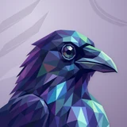

# 🐦‍⬛ Raven

## Profile

- Repository: [nocoo/raven](https://github.com/nocoo/raven)
- Website: No current website verified; navigation opens the repository.
- Website evidence: Not applicable
- Category: ai
- Archived repository: No; [repository status evidence](../sources/repository-status-2026-09-06.json)
- English: Connect GitHub Copilot to Anthropic- and OpenAI-compatible tools and track usage.
- Chinese: 为 GitHub Copilot 提供兼容 Anthropic 与 OpenAI 的接口，并查看使用情况。
- Profile section: Recent Projects
- Profile revision: `9a7ad63e1e96428f9dcd12214bcdbd470b3b51c6`
- Repository revision inspected: `c59fe3ad5a0aea2e849b2b9ee00be189091c9faf`

## Project goal

Connect compatible clients to GitHub Copilot and custom model upstreams through a local API proxy, with request analytics and live diagnostics.

通过本机 API 代理将兼容客户端接入 GitHub Copilot 与自定义模型上游，并查看调用统计和实时诊断信息。

- [中文 README](https://github.com/nocoo/raven/blob/main/README.md) · [English README](https://github.com/nocoo/raven/blob/main/docs/README.en.md)
- Verified: 2026-09-08; [source revision](https://github.com/nocoo/raven/tree/a668dbf4fa318429e34686f7bf86731ca1494fd4)
- Source files: [`package.json`](https://github.com/nocoo/raven/blob/a668dbf4fa318429e34686f7bf86731ca1494fd4/package.json), [`packages/proxy/package.json`](https://github.com/nocoo/raven/blob/a668dbf4fa318429e34686f7bf86731ca1494fd4/packages/proxy/package.json), [`packages/proxy/src/index.ts`](https://github.com/nocoo/raven/blob/a668dbf4fa318429e34686f7bf86731ca1494fd4/packages/proxy/src/index.ts), [`packages/proxy/src/app.ts`](https://github.com/nocoo/raven/blob/a668dbf4fa318429e34686f7bf86731ca1494fd4/packages/proxy/src/app.ts), [`packages/proxy/src/core/router.ts`](https://github.com/nocoo/raven/blob/a668dbf4fa318429e34686f7bf86731ca1494fd4/packages/proxy/src/core/router.ts), [`packages/proxy/src/composition/strategy-registry.ts`](https://github.com/nocoo/raven/blob/a668dbf4fa318429e34686f7bf86731ca1494fd4/packages/proxy/src/composition/strategy-registry.ts), [`packages/proxy/src/middleware.ts`](https://github.com/nocoo/raven/blob/a668dbf4fa318429e34686f7bf86731ca1494fd4/packages/proxy/src/middleware.ts), [`packages/proxy/src/lib/token.ts`](https://github.com/nocoo/raven/blob/a668dbf4fa318429e34686f7bf86731ca1494fd4/packages/proxy/src/lib/token.ts), [`packages/proxy/src/lib/app-dirs.ts`](https://github.com/nocoo/raven/blob/a668dbf4fa318429e34686f7bf86731ca1494fd4/packages/proxy/src/lib/app-dirs.ts), [`packages/proxy/src/db/providers.ts`](https://github.com/nocoo/raven/blob/a668dbf4fa318429e34686f7bf86731ca1494fd4/packages/proxy/src/db/providers.ts), [`packages/dashboard/package.json`](https://github.com/nocoo/raven/blob/a668dbf4fa318429e34686f7bf86731ca1494fd4/packages/dashboard/package.json), [`packages/dashboard/src/auth.ts`](https://github.com/nocoo/raven/blob/a668dbf4fa318429e34686f7bf86731ca1494fd4/packages/dashboard/src/auth.ts), [`packages/dashboard/src/lib/proxy.ts`](https://github.com/nocoo/raven/blob/a668dbf4fa318429e34686f7bf86731ca1494fd4/packages/dashboard/src/lib/proxy.ts), [`packages/dashboard/src/components/layout/sidebar.tsx`](https://github.com/nocoo/raven/blob/a668dbf4fa318429e34686f7bf86731ca1494fd4/packages/dashboard/src/components/layout/sidebar.tsx)

### Tech stack

| Technology | Role | 用途 |
| --- | --- | --- |
| Bun / TypeScript / Hono | Proxy runtime, HTTP routing and SSE | 代理运行环境、HTTP 路由与 SSE |
| SQLite | Request records, keys, settings and providers | 请求记录、密钥、设置与 provider |
| Next.js / React | Dashboard and server routes | Dashboard 与服务端接口 |
| Basalt / Tailwind CSS | Components and styling | 组件与样式 |
| SWR / Recharts | Data updates and analytics charts | 数据更新与统计图表 |
| NextAuth / Google OAuth | Optional dashboard login | 可选的 Dashboard 登录 |
| Zod / gpt-tokenizer | Validation and token estimates | 校验与 token 估算 |
| socks / Tavily | Optional outbound proxy and web search | 可选出站代理与网络搜索 |

## Current logo

- Type: Original vector identity commissioned and designed in hexly.ai; the source SVG is preserved byte-for-byte
- Subject: Purple-indigo raven portrait
- [Source](https://github.com/nocoo/raven/blob/c59fe3ad5a0aea2e849b2b9ee00be189091c9faf/logo.png): `logo.png`
- [Preserved asset](../../public/logos/originals/raven-family-2026-09-07-04-02.png)
- Original dimensions: 2048 × 2048
- Original size: 2327803 bytes
- SHA-256: `9b5f6ee551ad4e2e082b6f99ce690bcd782db67fc0d90fdfcf46f6e28af28319`
- Locally modified source: No
- Display derivatives: 32, 64, 160, and 1024 px WebP; contain-fit, transparent padding, no recoloring or cropping.

## Current palette

| Role | Value | Evidence |
| --- | --- | --- |
| primary | `#6341c8` | packages/dashboard/src/app/globals.css --basalt-primary: 255 55% 52% |
| background | `#eeeff2` | @nocoo/basalt/styles tokens --basalt-background: 220 14% 94% |
| accent | `#31356a` | Native raven 778f2af775a2, sampled sRGB pixel (729, 1056); artwork/logo-family/raven/2026-09-07-04/palette.json |
| accent | `#65408f` | Native raven 778f2af775a2, sampled sRGB pixel (223, 1203); artwork/logo-family/raven/2026-09-07-04/palette.json |
| accent | `#9bdfc6` | Native raven 778f2af775a2, sampled sRGB pixel (1324, 404); artwork/logo-family/raven/2026-09-07-04/palette.json |

Theme tokens take precedence. Additional colors are sampled from the preserved artwork. A transparent background means the source does not define an opaque background; the gallery's surrounding paper is not part of the project palette.

## Hexly campaign brand archive

- Brand version: `1.0.0`; [public archive](https://hexly.ai/projects/raven#brand).
- [Light lockup](../../public/brands/raven/v1.0.0/lockup-light.png), [dark lockup](../../public/brands/raven/v1.0.0/lockup-dark.png), [favicon](../../public/brands/raven/v1.0.0/favicon.ico).
- [Complete usage and integration guide](../../public/brands/raven/v1.0.0/guide.md), [standalone specimens](../../public/brands/raven/v1.0.0/review.html), [all exports and SHA-256](../../public/brands/raven/v1.0.0/manifest.json).
- Source adoption: separate source-team handoff; no adoption commit is claimed.
- Official project identity and Hexly campaign interpretation are separate manifest roles. Existing artwork keeps its exact bytes, geometry and original colors. Heroes are authored wide/mobile compositions, with no new image-model calls. Hexly palettes and typography apply only to this archive and promotional materials, not product UI. Preserved imagery retains its recorded source rights; MIT covers authored support work and OFL covers the real font. See provenance.json and license.txt.

Right-facing indigo raven with a faceted eye, violet feathers, and mint accents.

### Identity keeps its colors

Preserve the exact project identity and the separately recorded Hexly artwork. Hexly paper, ink and terracotta belong to archive and campaign surfaces only; independent product palettes and themes stay their own.

项目原标与单独记录的 Hexly 主视觉均保持形状和原色。Hexly 纸色、墨色和陶土色只用于档案及宣发画布，各产品色板与主题独立保留。

### A complete composition

Keep the existing portrait's natural frame entry. The full square is placed against the baseline; no anatomy is extended, trimmed or masked. Keep external clear space of at least 1/8 of the mark canvas height around standalone marks and lockups. Wide and mobile Heroes are separate compositions of existing artwork, with no image-model call.

保留原头像自然入框的边界，将完整方形画布贴齐基线；不补画、不截取解剖结构。独立标志及字标组合四周，至少留出标志画布高度 1/8 的外部净空。宽幅与手机 Hero 分别排版，没有新图像模型调用。

### A mark, not a tile

Navigation 24px preferred, 16px minimum. Wordmark ≥73px wide; lockup ≥160px. Use transparent PNG/ICO at small sizes without a tile, extra red dot, shadow or rounded mask. Fine facets soften at 16px.

导航推荐 24px，最小 16px。字标宽度至少 73px，组合至少 160px。小尺寸使用透明 PNG/ICO，不加底板、红点、阴影或圆角遮罩；16px 时细小切面会柔化。

## Refined identity

- Status: Adopted in the source project; updated 2026-09-07.
- Study `2026-09-07-04`, finishing `02`
- Refined subject: Right-facing indigo raven with a faceted eye, violet feathers, and mint accents
- Site path: `/projects/raven#brand`; [local gallery](https://index.dev.hexly.ai/projects/raven#brand)
- [Static review HTML](../../artwork/logo-family/raven/2026-09-07-04/review.html)
- [Full process archive](https://github.com/nocoo/hexly.ai/tree/main/artwork/logo-family/raven/2026-09-07-04)
- [Transparent foreground](../../public/logos/family/raven/2026-09-07-04/02/transparent.png); SHA-256: `9b5f6ee551ad4e2e082b6f99ce690bcd782db67fc0d90fdfcf46f6e28af28319`
- [Square icon](../../public/logos/family/raven/2026-09-07-04/02/icon.png), [rounded icon](../../public/logos/family/raven/2026-09-07-04/02/rounded.png), [white version](../../public/logos/family/raven/2026-09-07-04/02/white.png)
- [Untouched generation](../../public/logos/family/raven/2026-09-07-04/02/raw.png), [exact prompt](../../public/logos/family/raven/2026-09-07-04/02/prompt.txt), [public asset checksums](../../public/logos/family/raven/2026-09-07-04/02/manifest.json)
- [Previous original](../../public/logos/originals/raven.png), copied from [its immutable source](https://github.com/nocoo/raven/blob/2e082931954fc48131177c57138c6956b1cd67c9/logo.png)
- Previous SHA-256: `4de4df89c83e1fe24a02c6446e158793ccef0edfb7e4ee953a538edcf2004bf8`
- Generation: gpt-image-2, native 2048 × 2048; transparent extraction and presentation are separate finishing steps.
- The finishing archive includes transparent, square, and rounded PNGs at 2048, 1024, 512, 256, 128, 64, 48, 32, 24, and 16 px.
- Application previews use the refined square icon without extra padding, backgrounds, or circular masks. Artwork previews and downloads use its own transparent foreground, independently of the preserved source logo above.

### Refined palette

| Role | Value | Evidence |
| --- | --- | --- |
| background | `#b0a6c5` | Selected Raven presentation, 2026-09-07-04/02; background.base in archived settings.json |
| primary | `#31356a` | Native raven 778f2af775a2, sampled sRGB pixel (729, 1056); artwork/logo-family/raven/2026-09-07-04/palette.json |
| accent | `#65408f` | Native raven 778f2af775a2, sampled sRGB pixel (223, 1203); artwork/logo-family/raven/2026-09-07-04/palette.json |
| accent | `#9bdfc6` | Native raven 778f2af775a2, sampled sRGB pixel (1324, 404); artwork/logo-family/raven/2026-09-07-04/palette.json |
| accent | `#4fb6d0` | Native raven 778f2af775a2, sampled sRGB pixel (898, 1359); artwork/logo-family/raven/2026-09-07-04/palette.json |
| accent | `#101633` | Native raven 778f2af775a2, sampled sRGB pixel (1347, 792); artwork/logo-family/raven/2026-09-07-04/palette.json |

### A glance through the viewfinder

The eye and slightly parted beak retain their familiar angle. Restored rear feathers lead into a folded wing root at the lower-left edge, with no round neck stump.

眼睛与微张鸟喙保持熟悉角度，补全后脑羽毛并自然连接左下边缘的折叠翼根，消除圆形颈部截断。

### Indigo feather planes

Connected broad indigo and violet facets carry the portrait. The existing mint and cyan plumage remains restrained; the animal gains no extra prop or competing accent.

连贯的大块靛蓝与紫色切面构成头像，沿用克制的薄荷与青色羽毛，不增加道具或竞争点缀。

### Quill pennants

Staggered pointed feather impressions sit in a lavender field. Broad relief, fine grain, and shallow shadow support the dark bird without repeating another project’s pattern.

错落的尖羽压纹落在淡紫底面上，以宽阔浮纹、细颗粒与浅阴影衬托深色渡鸦，采用独立的项目纹理。

Small-size observation: At 32 px, the hooked beak, bright eye, and indigo silhouette remain the strongest cues. At 16 px the feather facets simplify into a dark profile with cool highlights.

## Further refinements

Preserve the original vector geometry, real Hexly tokens, outlined font and single-point hierarchy. Versioned published exports are immutable; revise into a new brand version. This commissioned scalable identity is separate from the faceted image-study workflow.

Use the supplied transparent marks in app navigation and browser tabs, keeping presentation tiles separate. Preserve clear space and minimum sizes from the guide. Compare artwork, app icon, sidebar, and favicon sizes in both themes before adopting a replacement. The source team integrates the exact published files and records its own adoption revision.
