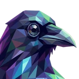

# 🐦‍⬛ Raven

## Profile

- Repository: [nocoo/raven](https://github.com/nocoo/raven)
- Website: No current website verified; navigation opens the repository.
- Website evidence: Not applicable
- Category: ai
- Archived repository: No; [repository status evidence](../sources/repository-status-2026-09-06.json)
- English: Connect GitHub Copilot to Anthropic- and OpenAI-compatible tools and track usage.
- Chinese: 为 GitHub Copilot 提供兼容 Anthropic 与 OpenAI 的接口，并查看使用情况。
- Profile section: Recent Projects
- Profile revision: `9a7ad63e1e96428f9dcd12214bcdbd470b3b51c6`
- Repository revision inspected: `2e082931954fc48131177c57138c6956b1cd67c9`

## Current logo

- Type: Original project artwork, copied without modification
- Subject: Purple-indigo raven portrait
- [Source](https://github.com/nocoo/raven/blob/2e082931954fc48131177c57138c6956b1cd67c9/logo.png): `logo.png`
- [Preserved asset](../../public/logos/originals/raven.png)
- Original dimensions: 2048 × 2048
- Original size: 3563221 bytes
- SHA-256: `4de4df89c83e1fe24a02c6446e158793ccef0edfb7e4ee953a538edcf2004bf8`
- Locally modified source: No
- Display derivatives: 32, 64, 160, and 1024 px WebP; contain-fit, transparent padding, no recoloring or cropping.

## Current palette

| Role | Value | Evidence |
| --- | --- | --- |
| primary | `#6341c8` | packages/dashboard/src/app/globals.css --basalt-primary: 255 55% 52% |
| background | `#eeeff2` | @nocoo/basalt/styles tokens --basalt-background: 220 14% 94% |
| accent | `#000020` | Preserved project artwork, sampled pixel |
| accent | `#2f2759` | Preserved project artwork, sampled pixel |
| accent | `#5b6496` | Preserved project artwork, sampled pixel |

Theme tokens take precedence. Additional colors are sampled from the preserved artwork. A transparent background means the source does not define an opaque background; the gallery's surrounding paper is not part of the project palette.

## Future family notes

Keep this asset as the phase-one baseline. A future family version should use a recognizable animal, one principal hue, and restrained multicolored geometric fragments.

Use head portraits for large animals and optionally full-body poses for small animals. Compare artwork, app icon, sidebar, and favicon sizes in both themes before adopting a replacement. No new logo is generated in phase one.
