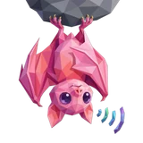
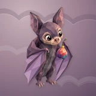

# 🦇 Bat

## Profile

- Repository: [nocoo/bat](https://github.com/nocoo/bat)
- Website: [https://bat.hexly.ai](https://bat.hexly.ai)
- Website evidence: CLAUDE.md Live-check
- Category: tools
- Archived repository: No; [repository status evidence](../sources/repository-status-2026-09-06.json)
- English: A lightweight watchtower for your servers, with a Rust probe and a clear dashboard.
- Chinese: 轻量的服务器观察台，用 Rust 探针采集状态，在仪表盘里集中查看。
- Profile section: Recent Projects
- Profile revision: `9a7ad63e1e96428f9dcd12214bcdbd470b3b51c6`
- Repository revision inspected: `46f5c95a6c134487130e2a6d9336ec5e8895a0f7`

## Current logo

- Type: Original project artwork, copied without modification
- Subject: Upright plum bat with folded wings and one colorful fig
- [Source](https://github.com/nocoo/bat/blob/46f5c95a6c134487130e2a6d9336ec5e8895a0f7/logo.png): `logo.png`
- [Preserved asset](../../public/logos/originals/bat-family-2026-09-07-01-02.png)
- Original dimensions: 2048 × 2048
- Original size: 2092682 bytes
- SHA-256: `882034b5b3e7511560a999422199cb486c80ee3fc00eb586d6584326fa4f1e1d`
- Locally modified source: No
- Display derivatives: 32, 64, 160, and 1024 px WebP; contain-fit, transparent padding, no recoloring or cropping.

## Current palette

| Role | Value | Evidence |
| --- | --- | --- |
| primary | `#df497b` | packages/ui/src/index.css --primary: 340 70% 58% |
| background | `#eeeff2` | packages/ui/src/index.css --background: 220 14% 94% |
| accent | `#a589a4` | Native bat 1935dbb8272e, sampled sRGB pixel (1495, 1347); artwork/logo-family/bat/2026-09-07-01/palette.json |
| accent | `#302935` | Native bat 1935dbb8272e, sampled sRGB pixel (981, 1196); artwork/logo-family/bat/2026-09-07-01/palette.json |
| accent | `#d78b8f` | Native bat 1935dbb8272e, sampled sRGB pixel (1226, 1136); artwork/logo-family/bat/2026-09-07-01/palette.json |

Theme tokens take precedence. Additional colors are sampled from the preserved artwork. A transparent background means the source does not define an opaque background; the gallery's surrounding paper is not part of the project palette.

## Refined identity

- Status: Adopted in the source project; updated 2026-09-07.
- Study `2026-09-07-01`, finishing `02`
- Refined subject: Upright plum bat with folded wings and one colorful fig
- Site path: `/logos/bat`; [local gallery](https://index.dev.hexly.ai/logos/bat)
- [Static review HTML](../../artwork/logo-family/bat/2026-09-07-01/review.html)
- [Full process archive](https://github.com/nocoo/hexly.ai/tree/main/artwork/logo-family/bat/2026-09-07-01)
- [Transparent foreground](../../public/logos/family/bat/2026-09-07-01/02/transparent.png); SHA-256: `882034b5b3e7511560a999422199cb486c80ee3fc00eb586d6584326fa4f1e1d`
- [Square icon](../../public/logos/family/bat/2026-09-07-01/02/icon.png), [rounded icon](../../public/logos/family/bat/2026-09-07-01/02/rounded.png), [white version](../../public/logos/family/bat/2026-09-07-01/02/white.png)
- [Untouched generation](../../public/logos/family/bat/2026-09-07-01/02/raw.png), [exact prompt](../../public/logos/family/bat/2026-09-07-01/02/prompt.txt), [public asset checksums](../../public/logos/family/bat/2026-09-07-01/02/manifest.json)
- [Previous original](../../public/logos/originals/bat.png), copied from [its immutable source](https://github.com/nocoo/bat/blob/99e48ef72afeaf178422c17875728128fe06615c/logo.png)
- Previous SHA-256: `24b80b738e8425f05eac0e83a9a78ece9d22c7390fc56a33d50c7fdc0a05ee62`
- Generation: gpt-image-2, native 2048 × 2048; transparent extraction and presentation are separate finishing steps.
- The finishing archive includes transparent, square, and rounded PNGs at 2048, 1024, 512, 256, 128, 64, 48, 32, 24, and 16 px.
- Application previews use the refined square icon without extra padding, backgrounds, or circular masks. Artwork previews and downloads use its own transparent foreground, independently of the preserved source logo above.

### Refined palette

| Role | Value | Evidence |
| --- | --- | --- |
| background | `#9a7e90` | Selected Bat presentation, 2026-09-07-01/02; background.base in archived settings.json |
| primary | `#72556f` | Native bat 1935dbb8272e, sampled sRGB pixel (1315, 1476); artwork/logo-family/bat/2026-09-07-01/palette.json |
| accent | `#a589a4` | Native bat 1935dbb8272e, sampled sRGB pixel (1495, 1347); artwork/logo-family/bat/2026-09-07-01/palette.json |
| accent | `#302935` | Native bat 1935dbb8272e, sampled sRGB pixel (981, 1196); artwork/logo-family/bat/2026-09-07-01/palette.json |
| accent | `#d78b8f` | Native bat 1935dbb8272e, sampled sRGB pixel (1226, 1136); artwork/logo-family/bat/2026-09-07-01/palette.json |
| accent | `#639ea2` | Native bat 1935dbb8272e, sampled sRGB pixel (1453, 1172); artwork/logo-family/bat/2026-09-07-01/palette.json |

### A pause before a bite

A friendly upright bat holds its wings close and pauses beside a fig. Complete ears and feet stay inside the frame; a small wing thumb supports the fruit.

温和的小蝙蝠正向站立、收拢翅膀，在无花果旁停顿。双耳和脚趾完整留在画面内，小翼拇指托住果实。

### Plum without menace

Broad mauve and charcoal planes describe the face, body and folded membranes. The bright fig forms one color group; its stem extends into nearby empty space.

宽阔灰紫与炭灰色面描绘脸部、身体和收拢的翼膜。鲜艳果实构成单一色彩组，果梗伸入旁边的留白。

### Dusk scallops

Unequal shallow scallops cross a deeper mauve field. Fine grain and offset folds give the wings separation while keeping the expression calm.

深灰紫底色上横穿不等宽的浅弧褶。细颗粒与错位折面分离翅膀轮廓，让表情保持平静。

Small-size observation: The complete animal and accessory have at least 145.5 px clearance from the actual rounded outline. Ten export sizes preserve one uniform placement. Small app/browser marks use the transparent foreground; fine facets and accessory details simplify at 16 px.

## Further refinements

Keep this asset as the phase-one baseline. A future family version should use a recognizable animal, one principal hue, and restrained multicolored geometric fragments.

Use head portraits for large animals and optionally full-body poses for small animals. Compare artwork, app icon, sidebar, and favicon sizes in both themes before adopting a replacement. Preserve this reviewed composition and its archived predecessors.
