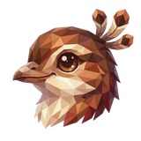

# 🎶 Lyre

## Profile

- Repository: [nocoo/lyre](https://github.com/nocoo/lyre)
- Website: [https://lyre.hexly.ai](https://lyre.hexly.ai)
- Website evidence: GitHub repository homepage
- Category: everyday
- English: Recordings, transcripts, and word-by-word playback, beautifully in sync.
- Chinese: 整理录音和转写文本，让逐字高亮跟着声音一起播放。
- Profile section: Recent Projects
- Profile revision: `9a7ad63e1e96428f9dcd12214bcdbd470b3b51c6`
- Repository revision inspected: `c2c5cf883fef4cf775c98eba6dce883c56653fe7`

## Current logo

- Type: Original project artwork, copied without modification
- Subject: Lyrebird portrait
- [Source](https://github.com/nocoo/lyre/blob/c2c5cf883fef4cf775c98eba6dce883c56653fe7/logo.png): `logo.png`
- [Preserved asset](../../public/logos/originals/lyre.png)
- Original dimensions: 2048 × 2048
- Original size: 3656299 bytes
- SHA-256: `1ba1c248228610d3e88e3428359391702f638cb44f1b42045c6a16861c2e581a`
- Locally modified source: No
- Display derivatives: 32, 64, 160, and 1024 px WebP; contain-fit, transparent padding, no recoloring or cropping.

## Current palette

| Role | Value | Evidence |
| --- | --- | --- |
| primary | `#883720` | apps/web/src/styles.css --basalt-primary: 13 62% 33% |
| background | `#eeeff2` | @nocoo/basalt/styles tokens --basalt-background: 220 14% 94% |
| accent | `#5d2f24` | Preserved project artwork, sampled pixel |
| accent | `#a45d3b` | Preserved project artwork, sampled pixel |
| accent | `#dfc39e` | Preserved project artwork, sampled pixel |

Theme tokens take precedence. Additional colors are sampled from the preserved artwork. A transparent background means the source does not define an opaque background; the gallery's surrounding paper is not part of the project palette.

## Future family notes

Keep this asset as the phase-one baseline. A future family version should use a recognizable animal, one principal hue, and restrained multicolored geometric fragments.

Use head portraits for large animals and optionally full-body poses for small animals. Compare artwork, app icon, sidebar, and favicon sizes in both themes before adopting a replacement. No new logo is generated in phase one.
