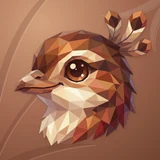

# 🎶 Lyre

## Profile

- Repository: [nocoo/lyre](https://github.com/nocoo/lyre)
- Website: [https://lyre.hexly.ai](https://lyre.hexly.ai)
- Website evidence: GitHub repository homepage
- Category: everyday
- Archived repository: No; [repository status evidence](../sources/repository-status-2026-09-06.json)
- English: Recordings, transcripts, and word-by-word playback, beautifully in sync.
- Chinese: 整理录音和转写文本，让逐字高亮跟着声音一起播放。
- Profile section: Recent Projects
- Profile revision: `9a7ad63e1e96428f9dcd12214bcdbd470b3b51c6`
- Repository revision inspected: `78b3a126f27a5adc53e4eaf4097b785ac7cb609e`

## Current logo

- Type: Original project artwork, copied without modification
- Subject: Lyrebird portrait
- [Source](https://github.com/nocoo/lyre/blob/78b3a126f27a5adc53e4eaf4097b785ac7cb609e/logo.png): `logo.png`
- [Preserved asset](../../public/logos/originals/lyre.png)
- Original dimensions: 2048 × 2048
- Original size: 3656299 bytes
- SHA-256: `1ba1c248228610d3e88e3428359391702f638cb44f1b42045c6a16861c2e581a`
- Locally modified source: No
- Display derivatives: 32, 64, 160, and 1024 px WebP; contain-fit, transparent padding, no recoloring or cropping.

## Current palette

| Role | Value | Evidence |
| --- | --- | --- |
| primary | `#883720` | apps/web/src/styles.css --basalt-primary: 13 62% 33% |
| background | `#eeeff2` | @nocoo/basalt/styles tokens --basalt-background: 220 14% 94% |
| accent | `#5d2f24` | Preserved project artwork, sampled pixel |
| accent | `#a45d3b` | Preserved project artwork, sampled pixel |
| accent | `#dfc39e` | Preserved project artwork, sampled pixel |

Theme tokens take precedence. Additional colors are sampled from the preserved artwork. A transparent background means the source does not define an opaque background; the gallery's surrounding paper is not part of the project palette.

## Refined identity

- Status: Adopted in the source project; updated 2026-09-07.
- Study `2026-09-07-03`, finishing `01`
- Refined subject: Original chestnut faceted lyrebird with a curled feather crest
- Site path: `/logos/lyre`; [local gallery](https://index.dev.hexly.ai/logos/lyre)
- [Static review HTML](../../artwork/logo-family/lyre/2026-09-07-03/review.html)
- [Full process archive](https://github.com/nocoo/hexly.ai/tree/main/artwork/logo-family/lyre/2026-09-07-03)
- [Transparent foreground](../../public/logos/family/lyre/2026-09-07-03/01/transparent.png); SHA-256: `1ba1c248228610d3e88e3428359391702f638cb44f1b42045c6a16861c2e581a`
- [Square icon](../../public/logos/family/lyre/2026-09-07-03/01/icon.png), [rounded icon](../../public/logos/family/lyre/2026-09-07-03/01/rounded.png), [white version](../../public/logos/family/lyre/2026-09-07-03/01/white.png)
- [Untouched original](../../public/logos/family/lyre/2026-09-07-03/01/source.png), [presentation brief](../../public/logos/family/lyre/2026-09-07-03/01/brief.txt), [public asset checksums](../../public/logos/family/lyre/2026-09-07-03/01/manifest.json)
- [Previous original](../../public/logos/originals/lyre.png), copied from [its immutable source](https://github.com/nocoo/lyre/blob/c2c5cf883fef4cf775c98eba6dce883c56653fe7/logo.png)
- Previous SHA-256: `1ba1c248228610d3e88e3428359391702f638cb44f1b42045c6a16861c2e581a`
- Original artwork retained byte-for-byte at native 2048 × 2048. Zero image-generation calls; only background, grain, and shadow layers were composed.
- The finishing archive includes transparent, square, and rounded PNGs at 2048, 1024, 512, 256, 128, 64, 48, 32, 24, and 16 px.
- Application previews use the refined square icon without extra padding, backgrounds, or circular masks. Artwork previews and downloads use its own transparent foreground, independently of the preserved source logo above.

### Refined palette

| Role | Value | Evidence |
| --- | --- | --- |
| background | `#a16850` | Selected Lyre presentation, finishing 01; background.base in archived settings.json |
| primary | `#a35d3b` | Original lyre 1ba1c2482286, sampled sRGB pixel (1408, 138); palette.json |
| accent | `#d7884d` | Original lyre 1ba1c2482286, sampled sRGB pixel (1161, 1515); palette.json |
| accent | `#dfc39e` | Original lyre 1ba1c2482286, sampled sRGB pixel (1225, 1199); palette.json |
| accent | `#5d2e24` | Original lyre 1ba1c2482286, sampled sRGB pixel (1414, 223); palette.json |
| accent | `#f2a965` | Original lyre 1ba1c2482286, sampled sRGB pixel (877, 548); palette.json |

### The original attentive turn

The portrait, beak, eye, curled crest, and native spacing remain the original artwork. This pass preserves the existing neck silhouette and adds no extension.

头像、鸟喙、眼神、卷曲羽冠与原有留白均沿用原图，保留现有颈部轮廓，没有补画或拉伸。

### Chestnut, cream, and copper

The existing warm facets and expressive feather crest carry the identity. Every original pixel is retained; no new rainbow accessory or model output is introduced.

暖色碎片与灵动的羽冠继续承担识别特征。所有原始像素均保留，不新增彩虹配饰，也不重新生图。

### A pressed feather fan

Unequal feather ribs open around a chestnut paper field. Small raised edges, fine grain, and a shallow shadow separate the bird from its warm setting.

疏密不一的扇羽纹围绕栗棕纸面展开，细亮边、微颗粒与浅阴影将鸟的轮廓从暖色底面中托出。

Small-size observation: The eye, beak, and warm silhouette remain legible at sidebar size. Individual crest facets simplify at 16 px; use the transparent original for browser and menu bar marks.

## Further refinements

Keep this asset as the phase-one baseline. A future family version should use a recognizable animal, one principal hue, and restrained multicolored geometric fragments.

Use head portraits for large animals and optionally full-body poses for small animals. Compare artwork, app icon, sidebar, and favicon sizes in both themes before adopting a replacement. Preserve this reviewed composition and its archived predecessors.
