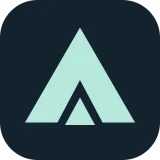
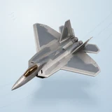

# ✈️ Dogfight

## Profile

- Repository: [nocoo/dogfight](https://github.com/nocoo/dogfight)
- Website: [https://dogfight.hexly.ai](https://dogfight.hexly.ai)
- Website evidence: GitHub repository homepage
- Category: games
- Archived repository: No; [repository status evidence](../sources/repository-status-2026-09-06.json)
- English: An arcade dogfight in the browser. Take an F-22 into a sky full of Su-35s.
- Chinese: 驾驶 F-22 迎战苏-35，在浏览器里体验街机风格的三维空战。
- Profile section: Games
- Profile revision: `9a7ad63e1e96428f9dcd12214bcdbd470b3b51c6`
- Repository revision inspected: `b5ab075a963a78516aaa351d6ca0178c64994729`

## Project goal

Fly an F-22 through a complete browser arcade mission using target locks, missiles, a cannon, and countermeasures.

在浏览器中驾驶 F-22，运用锁定、导弹、机炮和干扰完成一场街机空战。

- [中文 README](https://github.com/nocoo/dogfight/blob/main/README.md) · [English README](https://github.com/nocoo/dogfight/blob/main/docs/README.en.md)
- Verified: 2026-09-08; [source revision](https://github.com/nocoo/dogfight/tree/b5ab075a963a78516aaa351d6ca0178c64994729)
- Source files: [`package.json`](https://github.com/nocoo/dogfight/blob/b5ab075a963a78516aaa351d6ca0178c64994729/package.json), [`src/App.tsx`](https://github.com/nocoo/dogfight/blob/b5ab075a963a78516aaa351d6ca0178c64994729/src/App.tsx), [`src/game/simulation.ts`](https://github.com/nocoo/dogfight/blob/b5ab075a963a78516aaa351d6ca0178c64994729/src/game/simulation.ts), [`src/game/engine.ts`](https://github.com/nocoo/dogfight/blob/b5ab075a963a78516aaa351d6ca0178c64994729/src/game/engine.ts), [`src/game/aircraft.ts`](https://github.com/nocoo/dogfight/blob/b5ab075a963a78516aaa351d6ca0178c64994729/src/game/aircraft.ts), [`src/game/world.ts`](https://github.com/nocoo/dogfight/blob/b5ab075a963a78516aaa351d6ca0178c64994729/src/game/world.ts), [`src/game/clouds.ts`](https://github.com/nocoo/dogfight/blob/b5ab075a963a78516aaa351d6ca0178c64994729/src/game/clouds.ts), [`src/game/audio.ts`](https://github.com/nocoo/dogfight/blob/b5ab075a963a78516aaa351d6ca0178c64994729/src/game/audio.ts), [`scripts/browser-smoke.mjs`](https://github.com/nocoo/dogfight/blob/b5ab075a963a78516aaa351d6ca0178c64994729/scripts/browser-smoke.mjs), [`vite.config.ts`](https://github.com/nocoo/dogfight/blob/b5ab075a963a78516aaa351d6ca0178c64994729/vite.config.ts), [`wrangler.jsonc`](https://github.com/nocoo/dogfight/blob/b5ab075a963a78516aaa351d6ca0178c64994729/wrangler.jsonc), [`.github/workflows/ci.yml`](https://github.com/nocoo/dogfight/blob/b5ab075a963a78516aaa351d6ca0178c64994729/.github/workflows/ci.yml)

### Tech stack

| Technology | Role | 用途 |
| --- | --- | --- |
| TypeScript | Flight and combat simulation | 飞行与战斗模拟 |
| React | HUD, mission flow, and settings | HUD、任务流程与设置 |
| Three.js | Procedural aircraft and 3D environment | 程序化机体与三维环境 |
| WebGL | Browser 3D rendering | 浏览器三维渲染 |
| Web Audio | Synthesized engine, weapon, and alert sounds | 合成引擎、武器与警报音效 |
| localStorage | Highest winning score | 胜利最高分 |
| Vite | Development and static builds | 开发与静态构建 |
| Cloudflare Workers | Static game hosting | 游戏静态托管 |

## Current logo

- Type: Original vector identity commissioned and designed in hexly.ai; the source SVG is preserved byte-for-byte
- Subject: Titanium F-22 desk model caught in a banking turn
- [Source](https://github.com/nocoo/dogfight/blob/b5ab075a963a78516aaa351d6ca0178c64994729/logo.png): `logo.png`
- [Preserved asset](../../public/logos/originals/dogfight-family-2026-09-07-01-02.png)
- Original dimensions: 2048 × 2048
- Original size: 2743288 bytes
- SHA-256: `274611f248e476334769d4c4c670a1dbd0d20263fc1d210b665b2fb7b9867fc4`
- Locally modified source: No
- Display derivatives: 32, 64, 160, and 1024 px WebP; contain-fit, transparent padding, no recoloring or cropping.

## Current palette

| Role | Value | Evidence |
| --- | --- | --- |
| primary | `#c0e9dc` | src/styles.css --mint: #c0e9dc |
| background | `#101c27` | src/styles.css :root background: #101c27 |
| accent | `#878f95` | Native dogfight 0ef348789c21, sampled sRGB pixel (715, 700); artwork/logo-family/dogfight/2026-09-07-01/palette.json |
| accent | `#694d2c` | Native dogfight 0ef348789c21, sampled sRGB pixel (401, 1453); artwork/logo-family/dogfight/2026-09-07-01/palette.json |
| accent | `#bcbfbd` | Native dogfight 0ef348789c21, sampled sRGB pixel (1040, 956); artwork/logo-family/dogfight/2026-09-07-01/palette.json |

Theme tokens take precedence. Additional colors are sampled from the preserved artwork. A transparent background means the source does not define an opaque background; the gallery's surrounding paper is not part of the project palette.

## Hexly campaign brand archive

- Brand version: `1.0.0`; [public archive](https://hexly.ai/projects/dogfight#brand).
- [Light lockup](../../public/brands/dogfight/v1.0.0/lockup-light.png), [dark lockup](../../public/brands/dogfight/v1.0.0/lockup-dark.png), [favicon](../../public/brands/dogfight/v1.0.0/favicon.ico).
- [Complete usage and integration guide](../../public/brands/dogfight/v1.0.0/guide.md), [standalone specimens](../../public/brands/dogfight/v1.0.0/review.html), [all exports and SHA-256](../../public/brands/dogfight/v1.0.0/manifest.json).
- Source adoption: separate source-team handoff; no adoption commit is claimed.
- Official project identity and Hexly campaign interpretation are separate manifest roles. Existing artwork keeps its exact bytes, geometry and original colors. Heroes are authored wide/mobile compositions, with no new image-model calls. Hexly palettes and typography apply only to this archive and promotional materials, not product UI. Preserved imagery retains its recorded source rights; MIT covers authored support work and OFL covers the real font. See provenance.json and license.txt.

Titanium F-22 desk model caught in a banking turn.

### Identity keeps its colors

Preserve the exact project identity and the separately recorded Hexly artwork. Hexly paper, ink and terracotta belong to archive and campaign surfaces only; independent product palettes and themes stay their own.

项目原标与单独记录的 Hexly 主视觉均保持形状和原色。Hexly 纸色、墨色和陶土色只用于档案及宣发画布，各产品色板与主题独立保留。

### A complete composition

Preserve the complete subject and its original square margins. Resize uniformly; never trim the canvas to force detail. Keep external clear space of at least 1/8 of the mark canvas height around standalone marks and lockups. Wide and mobile Heroes are separate compositions of existing artwork, with no image-model call.

保留完整主体与原有方形留白，只做等比缩放，不裁图强凑细节。独立标志及字标组合四周，至少留出标志画布高度 1/8 的外部净空。宽幅与手机 Hero 分别排版，没有新图像模型调用。

### A mark, not a tile

Navigation 24px preferred, 16px minimum. Wordmark ≥88px wide; lockup ≥160px. Use transparent PNG/ICO at small sizes without a tile, extra red dot, shadow or rounded mask. Fine facets soften at 16px.

导航推荐 24px，最小 16px。字标宽度至少 88px，组合至少 160px。小尺寸使用透明 PNG/ICO，不加底板、红点、阴影或圆角遮罩；16px 时细小切面会柔化。

## Refined identity

- Status: Adopted in the source project; updated 2026-09-07.
- Study `2026-09-07-01`, finishing `02`
- Refined subject: Titanium F-22 desk model caught in a banking turn
- Site path: `/projects/dogfight#brand`; [local gallery](https://index.dev.hexly.ai/projects/dogfight#brand)
- [Static review HTML](../../artwork/logo-family/dogfight/2026-09-07-01/review.html)
- [Full process archive](https://github.com/nocoo/hexly.ai/tree/main/artwork/logo-family/dogfight/2026-09-07-01)
- [Transparent foreground](../../public/logos/family/dogfight/2026-09-07-01/02/transparent.png); SHA-256: `274611f248e476334769d4c4c670a1dbd0d20263fc1d210b665b2fb7b9867fc4`
- [Square icon](../../public/logos/family/dogfight/2026-09-07-01/02/icon.png), [rounded icon](../../public/logos/family/dogfight/2026-09-07-01/02/rounded.png), [white version](../../public/logos/family/dogfight/2026-09-07-01/02/white.png)
- [Untouched generation](../../public/logos/family/dogfight/2026-09-07-01/02/raw.png), [exact prompt](../../public/logos/family/dogfight/2026-09-07-01/02/prompt.txt), [public asset checksums](../../public/logos/family/dogfight/2026-09-07-01/02/manifest.json)
- [Previous original](../../public/logos/originals/dogfight.svg), copied from [its immutable source](https://github.com/nocoo/dogfight/blob/9ec76522713a527bc831f8fa37ec7a50967e24e4/public/favicon.svg)
- Previous SHA-256: `229e0e5757f8bddb9a9c2dce88b3a69b0e30640e6d4ecdf98c527d719f9d2080`
- Generation: gpt-image-2, native 2048 × 2048; transparent extraction and presentation are separate finishing steps.
- The finishing archive includes transparent, square, and rounded PNGs at 2048, 1024, 512, 256, 128, 64, 48, 32, 24, and 16 px.
- Application previews use the refined square icon without extra padding, backgrounds, or circular masks. Artwork previews and downloads use its own transparent foreground, independently of the preserved source logo above.

### Refined palette

| Role | Value | Evidence |
| --- | --- | --- |
| background | `#d0dfe9` | Adopted Dogfight presentation, 2026-09-07-01/02; background.base in archived settings.json |
| primary | `#878f95` | Native dogfight 0ef348789c21, sampled sRGB pixel (715, 700); artwork/logo-family/dogfight/2026-09-07-01/palette.json |
| accent | `#694d2c` | Native dogfight 0ef348789c21, sampled sRGB pixel (401, 1453); artwork/logo-family/dogfight/2026-09-07-01/palette.json |
| accent | `#bcbfbd` | Native dogfight 0ef348789c21, sampled sRGB pixel (1040, 956); artwork/logo-family/dogfight/2026-09-07-01/palette.json |

### A turn held in metal

A broad-winged F-22 collectible banks diagonally toward the viewer. A gentle elevated product camera preserves the nose, both tail fins and the complete wing silhouette.

宽翼 F-22 模型斜向观者转弯。略俯视的产品镜头完整保留机鼻、双尾翼和两侧机翼。

### Titanium and amber

Satin titanium and blue-gray panel faces define a real die-cast object. The amber canopy is the single warm material accent; there are no detached trails or effects.

缎面钛灰与蓝灰机身面板表现压铸模型，琥珀座舱是唯一暖色点缀，不添加脱离主体的尾迹。

### Banking vectors

Three swept flight lanes and short altitude ticks crossing a pale blue atmospheric field. The field, grain and contact shadow are independent of transparent app marks.

浅蓝纸面上的弯转航线与高度短刻度，呼应空战游戏。 底色、颗粒与接触阴影均独立于透明应用标记。

Small-size observation: At 128/64 px, the broad wings and amber canopy remain clear. At 32/24/16 px, the compact silhouette and dominant colors carry recognition; fine material detail, printed marks and background lines naturally merge.

## Further refinements

Preserve the original vector geometry, real Hexly tokens, outlined font and single-point hierarchy. Versioned published exports are immutable; revise into a new brand version. This commissioned scalable identity is separate from the faceted image-study workflow.

Use the supplied transparent marks in app navigation and browser tabs, keeping presentation tiles separate. Preserve clear space and minimum sizes from the guide. Compare artwork, app icon, sidebar, and favicon sizes in both themes before adopting a replacement. The source team integrates the exact published files and records its own adoption revision.
