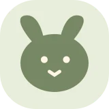
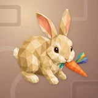

# 🧸 Gaga

## Profile

- Repository: [nocoo/gaga](https://github.com/nocoo/gaga)
- Website: [https://gaga.hexly.ai](https://gaga.hexly.ai)
- Website evidence: GitHub repository homepage
- Category: games
- Archived repository: No; [repository status evidence](../sources/repository-status-2026-09-06.json)
- English: A tiny 3D playroom where Taotao can explore, wander, and discover toys.
- Chinese: 给陶陶的小小三维玩具房，自由走动，探索喜欢的玩具。
- Profile section: Games
- Profile revision: `9a7ad63e1e96428f9dcd12214bcdbd470b3b51c6`
- Repository revision inspected: `76260f08329784eead9b30912c7692b8ea0d3d56`

## Current logo

- Type: Original project artwork, copied without modification
- Subject: Naturally crouched biscuit-colored rabbit with one colorful carrot
- [Source](https://github.com/nocoo/gaga/blob/76260f08329784eead9b30912c7692b8ea0d3d56/logo.png): `logo.png`
- [Preserved asset](../../public/logos/originals/gaga-family-2026-09-07-01-01.png)
- Original dimensions: 2048 × 2048
- Original size: 2357751 bytes
- SHA-256: `3bbfa196509e08de9c0d0b1ac18e944e3414b7082e70740898a2a09f6ed8f076`
- Locally modified source: No
- Display derivatives: 32, 64, 160, and 1024 px WebP; contain-fit, transparent padding, no recoloring or cropping.

## Current palette

| Role | Value | Evidence |
| --- | --- | --- |
| primary | `#4c5342` | src/style.css :root color: #4c5342 |
| background | `#f3f0e8` | src/style.css :root background: #f3f0e8 |
| accent | `#ecd3a5` | Native gaga cfe8aeeef77b, sampled sRGB pixel (244, 1120); artwork/logo-family/gaga/2026-09-07-01/palette.json |
| accent | `#997040` | Native gaga cfe8aeeef77b, sampled sRGB pixel (582, 1759); artwork/logo-family/gaga/2026-09-07-01/palette.json |
| accent | `#ed7520` | Native gaga cfe8aeeef77b, sampled sRGB pixel (1867, 1632); artwork/logo-family/gaga/2026-09-07-01/palette.json |

Theme tokens take precedence. Additional colors are sampled from the preserved artwork. A transparent background means the source does not define an opaque background; the gallery's surrounding paper is not part of the project palette.

## Refined identity

- Status: Adopted in the source project; updated 2026-09-07.
- Study `2026-09-07-01`, finishing `01`
- Refined subject: Naturally crouched biscuit-colored rabbit with one colorful carrot
- Site path: `/logos/gaga`; [local gallery](https://index.dev.hexly.ai/logos/gaga)
- [Static review HTML](../../artwork/logo-family/gaga/2026-09-07-01/review.html)
- [Full process archive](https://github.com/nocoo/hexly.ai/tree/main/artwork/logo-family/gaga/2026-09-07-01)
- [Transparent foreground](../../public/logos/family/gaga/2026-09-07-01/01/transparent.png); SHA-256: `3bbfa196509e08de9c0d0b1ac18e944e3414b7082e70740898a2a09f6ed8f076`
- [Square icon](../../public/logos/family/gaga/2026-09-07-01/01/icon.png), [rounded icon](../../public/logos/family/gaga/2026-09-07-01/01/rounded.png), [white version](../../public/logos/family/gaga/2026-09-07-01/01/white.png)
- [Untouched generation](../../public/logos/family/gaga/2026-09-07-01/01/raw.png), [exact prompt](../../public/logos/family/gaga/2026-09-07-01/01/prompt.txt), [public asset checksums](../../public/logos/family/gaga/2026-09-07-01/01/manifest.json)
- [Previous original](../../public/logos/originals/gaga.svg), copied from [its immutable source](https://github.com/nocoo/gaga/blob/b960a12ce78a579ac9e99c4b985aaf85d5b8c8aa/public/favicon.svg)
- Previous SHA-256: `abfcdf4a83a692c90f0e3f9b40380fb3f3a701923291c7a45a71778386146995`
- Generation: gpt-image-2, native 2048 × 2048; transparent extraction and presentation are separate finishing steps.
- The finishing archive includes transparent, square, and rounded PNGs at 2048, 1024, 512, 256, 128, 64, 48, 32, 24, and 16 px.
- Application previews use the refined square icon without extra padding, backgrounds, or circular masks. Artwork previews and downloads use its own transparent foreground, independently of the preserved source logo above.

### Refined palette

| Role | Value | Evidence |
| --- | --- | --- |
| background | `#b38c77` | Selected Gaga presentation, 2026-09-07-01/01; background.base in archived settings.json |
| primary | `#c39c65` | Native gaga cfe8aeeef77b, sampled sRGB pixel (1306, 1590); artwork/logo-family/gaga/2026-09-07-01/palette.json |
| accent | `#ecd3a5` | Native gaga cfe8aeeef77b, sampled sRGB pixel (244, 1120); artwork/logo-family/gaga/2026-09-07-01/palette.json |
| accent | `#997040` | Native gaga cfe8aeeef77b, sampled sRGB pixel (582, 1759); artwork/logo-family/gaga/2026-09-07-01/palette.json |
| accent | `#ed7520` | Native gaga cfe8aeeef77b, sampled sRGB pixel (1867, 1632); artwork/logo-family/gaga/2026-09-07-01/palette.json |
| accent | `#418e8c` | Native gaga cfe8aeeef77b, sampled sRGB pixel (1727, 1215); artwork/logo-family/gaga/2026-09-07-01/palette.json |

### A small discovery

A rabbit pauses in a natural crouch beside a carrot. The whole animal includes its ears, haunches, short forepaws and small tail; the face carries the moment.

小兔在胡萝卜旁自然蹲伏，完整呈现耳朵、后腿轮廓、短前爪和小尾巴，用脸部表情捕捉这一刻。

### Biscuit and cream

Large warm tan and cream facets keep the body soft and readable. One carrot and its colorful leaves form a single accent group beside the muzzle.

大块暖褐与奶油色切面让身体柔和易读，一根胡萝卜及其彩色叶片在嘴边构成单一兴趣点。

### Playroom folds

Offset rounded paper folds sit on a warm clay field. Their gentle corners and broad openings give the rabbit a tactile, quiet setting.

错位的圆角纸面铺在暖陶土色底色上，柔和转角和宽阔开口营造安静的触感背景。

Small-size observation: The complete animal and accessory have at least 183.5 px clearance from the actual rounded outline. Ten export sizes preserve one uniform placement. Small app/browser marks use the transparent foreground; fine facets and accessory details simplify at 16 px.

## Further refinements

Keep this asset as the phase-one baseline. A future family version should use a recognizable animal, one principal hue, and restrained multicolored geometric fragments.

Use head portraits for large animals and optionally full-body poses for small animals. Compare artwork, app icon, sidebar, and favicon sizes in both themes before adopting a replacement. Preserve this reviewed composition and its archived predecessors.
