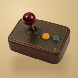

# 🤠 Pew Game

## Profile

- Repository: [nocoo/pew-game](https://github.com/nocoo/pew-game)
- Website: [https://pew.hexly.ai](https://pew.hexly.ai)
- Website evidence: nocoo/nocoo README.md Games section
- Category: games
- Archived repository: No; [repository status evidence](../sources/repository-status-2026-09-06.json)
- English: A pixel-art prairie shooter with twin-stick action and a high-score leaderboard.
- Chinese: 像素风格的草原双摇杆射击游戏，闯关、闪避，再挑战排行榜。
- Profile section: Games
- Profile revision: `9a7ad63e1e96428f9dcd12214bcdbd470b3b51c6`
- Repository revision inspected: `ee68b2dead3e5e698b2427d6a949e8e57c69d520`

## Project goal

Play a keyboard-controlled pixel shooter in the browser, survive enemy waves with power-ups, and submit scores to a shared leaderboard.

在浏览器中用键盘游玩像素射击，收集道具、抵挡敌人波次，并将成绩提交到共享排行榜。

- [中文 README](https://github.com/nocoo/pew-game/blob/main/README.md) · [English README](https://github.com/nocoo/pew-game/blob/main/docs/README.en.md)
- Verified: 2026-09-08; [source revision](https://github.com/nocoo/pew-game/tree/71b4b8165874e1986f993706c6830cc60a8107bf)
- Source files: [`package.json`](https://github.com/nocoo/pew-game/blob/71b4b8165874e1986f993706c6830cc60a8107bf/package.json), [`src/game/engine.ts`](https://github.com/nocoo/pew-game/blob/71b4b8165874e1986f993706c6830cc60a8107bf/src/game/engine.ts), [`src/game/input.ts`](https://github.com/nocoo/pew-game/blob/71b4b8165874e1986f993706c6830cc60a8107bf/src/game/input.ts), [`src/game/player.ts`](https://github.com/nocoo/pew-game/blob/71b4b8165874e1986f993706c6830cc60a8107bf/src/game/player.ts), [`src/game/powerup.ts`](https://github.com/nocoo/pew-game/blob/71b4b8165874e1986f993706c6830cc60a8107bf/src/game/powerup.ts), [`src/lib/db.ts`](https://github.com/nocoo/pew-game/blob/71b4b8165874e1986f993706c6830cc60a8107bf/src/lib/db.ts), [`src/lib/anticheat.ts`](https://github.com/nocoo/pew-game/blob/71b4b8165874e1986f993706c6830cc60a8107bf/src/lib/anticheat.ts), [`src/app/api/scores/route.ts`](https://github.com/nocoo/pew-game/blob/71b4b8165874e1986f993706c6830cc60a8107bf/src/app/api/scores/route.ts)

### Tech stack

| Technology | Role | 用途 |
| --- | --- | --- |
| TypeScript | Game engine and rules | 游戏引擎与规则 |
| Canvas 2D | Pixel rendering | 像素画面绘制 |
| Next.js | Game page and score APIs | 游戏页面与成绩 API |
| React | Game HUD and leaderboard | 游戏状态界面与排行榜 |
| SQLite | Persistent scores | 成绩持久化 |
| better-sqlite3 | Server database access | 服务端数据库访问 |
| Tailwind CSS | Page and overlay styles | 页面与叠层样式 |

## Current logo

- Type: Original project artwork, copied without modification
- Subject: Walnut and brass prairie arcade joystick
- [Source](https://github.com/nocoo/pew-game/blob/ee68b2dead3e5e698b2427d6a949e8e57c69d520/logo.png): `logo.png`
- [Preserved asset](../../public/logos/originals/pew-game-family-2026-09-07-01-02.png)
- Original dimensions: 2048 × 2048
- Original size: 3907401 bytes
- SHA-256: `18602c76eb1a445731b7baba7ec81175f6f81084977d1d7ad6168e6702238b90`
- Locally modified source: No
- Display derivatives: 32, 64, 160, and 1024 px WebP; contain-fit, transparent padding, no recoloring or cropping.

## Current palette

| Role | Value | Evidence |
| --- | --- | --- |
| primary | `#583b2c` | Native pew-game ab0299e6617c, sampled sRGB pixel (850, 1360); artwork/logo-family/pew-game/2026-09-07-01/palette.json |
| background | `#111111` | src/app/globals.css --background: #111111 |
| accent | `#651b19` | Native pew-game ab0299e6617c, sampled sRGB pixel (818, 344); artwork/logo-family/pew-game/2026-09-07-01/palette.json |
| accent | `#836b42` | Native pew-game ab0299e6617c, sampled sRGB pixel (1328, 1038); artwork/logo-family/pew-game/2026-09-07-01/palette.json |
| accent | `#da9438` | Native pew-game ab0299e6617c, sampled sRGB pixel (1253, 928); artwork/logo-family/pew-game/2026-09-07-01/palette.json |
| accent | `#506866` | Native pew-game ab0299e6617c, sampled sRGB pixel (1640, 1020); artwork/logo-family/pew-game/2026-09-07-01/palette.json |

Theme tokens take precedence. Additional colors are sampled from the preserved artwork. A transparent background means the source does not define an opaque background; the gallery's surrounding paper is not part of the project palette.

## Refined identity

- Status: Adopted in the source project; updated 2026-09-07.
- Study `2026-09-07-01`, finishing `02`
- Refined subject: Walnut and brass prairie arcade joystick
- Site path: `/logos/pew-game`; [local gallery](https://index.dev.hexly.ai/logos/pew-game)
- [Static review HTML](../../artwork/logo-family/pew-game/2026-09-07-01/review.html)
- [Full process archive](https://github.com/nocoo/hexly.ai/tree/main/artwork/logo-family/pew-game/2026-09-07-01)
- [Transparent foreground](../../public/logos/family/pew-game/2026-09-07-01/02/transparent.png); SHA-256: `18602c76eb1a445731b7baba7ec81175f6f81084977d1d7ad6168e6702238b90`
- [Square icon](../../public/logos/family/pew-game/2026-09-07-01/02/icon.png), [rounded icon](../../public/logos/family/pew-game/2026-09-07-01/02/rounded.png), [white version](../../public/logos/family/pew-game/2026-09-07-01/02/white.png)
- [Untouched generation](../../public/logos/family/pew-game/2026-09-07-01/02/raw.png), [exact prompt](../../public/logos/family/pew-game/2026-09-07-01/02/prompt.txt), [public asset checksums](../../public/logos/family/pew-game/2026-09-07-01/02/manifest.json)
- [Previous original](../../public/logos/emoji/pew-game.png), copied from [its immutable source](https://github.com/nocoo/nocoo/blob/9a7ad63e1e96428f9dcd12214bcdbd470b3b51c6/README.md)
- Previous SHA-256: `6ffd6aa8a203834dd8972fa0e8e2a520a2bdaf75f0519a585f6124212cfe4193`
- Generation: gpt-image-2, native 2048 × 2048; transparent extraction and presentation are separate finishing steps.
- The finishing archive includes transparent, square, and rounded PNGs at 2048, 1024, 512, 256, 128, 64, 48, 32, 24, and 16 px.
- Application previews use the refined square icon without extra padding, backgrounds, or circular masks. Artwork previews and downloads use its own transparent foreground, independently of the preserved source logo above.

### Refined palette

| Role | Value | Evidence |
| --- | --- | --- |
| background | `#d6bb8a` | Adopted Pew Game presentation, 2026-09-07-01/02; background.base in archived settings.json |
| primary | `#583b2c` | Native pew-game ab0299e6617c, sampled sRGB pixel (850, 1360); artwork/logo-family/pew-game/2026-09-07-01/palette.json |
| accent | `#651b19` | Native pew-game ab0299e6617c, sampled sRGB pixel (818, 344); artwork/logo-family/pew-game/2026-09-07-01/palette.json |
| accent | `#836b42` | Native pew-game ab0299e6617c, sampled sRGB pixel (1328, 1038); artwork/logo-family/pew-game/2026-09-07-01/palette.json |
| accent | `#da9438` | Native pew-game ab0299e6617c, sampled sRGB pixel (1253, 928); artwork/logo-family/pew-game/2026-09-07-01/palette.json |
| accent | `#506866` | Native pew-game ab0299e6617c, sampled sRGB pixel (1640, 1020); artwork/logo-family/pew-game/2026-09-07-01/palette.json |

### A tactile move

A short ball-top joystick leans from a compact walnut arcade box. Its two close buttons and thick housing form one complete, comfortably inset assembly.

短球头摇杆从紧凑的胡桃木街机盒伸出，两颗按钮与厚实机箱组成完整、留足余量的主体。

### Walnut, brass and oxblood

Real wood grain and engraved aged brass give the prairie shooter a handmade arcade identity. The deep-red joystick leads, supported by one close ochre-and-teal button group.

木纹与刻线旧黄铜为西部射击游戏建立手作街机形象。深红摇杆是视觉中心，赭黄与青色按钮紧邻成组。

### Prairie suntracks

A low rising sun with short prairie grass cuts and concentric joystick-like arcs in warm sand paper. The field, grain and contact shadow are independent of transparent app marks.

沙色纸面上的低日弧线、草叶切线与摇杆圆弧呼应西部草原。 底色、颗粒与接触阴影均独立于透明应用标记。

Small-size observation: At 128/64 px, the red joystick, two buttons and wood block remain clear. At 32/24/16 px, the compact silhouette and dominant colors carry recognition; fine material detail, printed marks and background lines naturally merge.

## Further refinements

This is an owner-directed physical material or architectural identity. Preserve its physical materials, complete silhouette, selected camera and distinct tonal presentation. The animal-series drawing and accessory rules do not apply.

Keep the complete object uniformly inset from the actual rounded outline, with backgrounds, projected shadows and any external emission separate from the transparent foreground. Compare artwork, app icon, sidebar, and favicon sizes in both themes before adopting a replacement. Preserve this reviewed composition and its archived predecessors.
