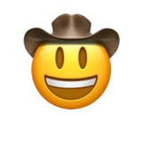

# 🤠 Pew Game

## Profile

- Repository: [nocoo/pew-game](https://github.com/nocoo/pew-game)
- Website: [https://pew.hexly.ai](https://pew.hexly.ai)
- Website evidence: nocoo/nocoo README.md Games section
- Category: games
- English: A pixel-art prairie shooter with twin-stick action and a high-score leaderboard.
- Chinese: 像素风格的草原双摇杆射击游戏，闯关、闪避，再挑战排行榜。
- Profile section: Games
- Profile revision: `9a7ad63e1e96428f9dcd12214bcdbd470b3b51c6`
- Repository revision inspected: `6617783cfe86efe490d32a5d8528efa9dd95f920`

## Current logo

- Type: Existing GitHub-profile emoji rendered as a portable PNG; no independent project logo was found
- Subject: Existing profile emoji
- [Source](https://github.com/nocoo/nocoo/blob/9a7ad63e1e96428f9dcd12214bcdbd470b3b51c6/README.md): `nocoo/nocoo README.md — existing project emoji`
- [Preserved asset](../../public/logos/emoji/pew-game.png)
- Original dimensions: 1024 × 1024
- Original size: 462436 bytes
- SHA-256: `6ffd6aa8a203834dd8972fa0e8e2a520a2bdaf75f0519a585f6124212cfe4193`
- Locally modified source: No
- Display derivatives: 32, 64, 160, and 1024 px WebP; contain-fit, transparent padding, no recoloring or cropping.

## Current palette

| Role | Value | Evidence |
| --- | --- | --- |
| primary | `#755942` | Existing profile emoji glyph, dominant colored pixels |
| background | `#111111` | src/app/globals.css --background: #111111 |
| accent | `#986605` | Existing profile emoji glyph, sampled pixel |
| accent | `#ffdb47` | Existing profile emoji glyph, sampled pixel |
| accent | `#e27c0b` | Existing profile emoji glyph, sampled pixel |

Theme tokens take precedence. Additional colors are sampled from the preserved artwork. A transparent background means the source does not define an opaque background; the gallery's surrounding paper is not part of the project palette.

## Future family notes

Keep this asset as the phase-one baseline. A future family version should use a recognizable animal, one principal hue, and restrained multicolored geometric fragments.

Use head portraits for large animals and optionally full-body poses for small animals. Compare artwork, app icon, sidebar, and favicon sizes in both themes before adopting a replacement. No new logo is generated in phase one.
