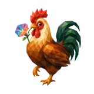
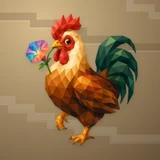

# 🐔 Rooster

## Profile

- Repository: [nocoo/rooster](https://github.com/nocoo/rooster)
- Website: No current website verified; navigation opens the repository.
- Website evidence: Not applicable
- Category: ai
- Archived repository: No; [repository status evidence](../sources/repository-status-2026-09-06.json)
- English: A web control panel for Hermes Agent, from conversations to models and profiles.
- Chinese: Hermes Agent 的网页控制台，管理对话、会话、模型与配置。
- Profile section: Recent Projects
- Profile revision: `9a7ad63e1e96428f9dcd12214bcdbd470b3b51c6`
- Repository revision inspected: `8907933c080ed86c6cbe15d9af5cdb0be86919d3`

## Project goal

Chat with a locally configured Hermes Agent in a browser, inspect streamed replies and tool activity, and keep searchable session history on your machine.

通过浏览器与本机配置的 Hermes Agent 对话，查看流式回复和工具执行过程，并在本地保存可搜索的会话记录。

- [中文 README](https://github.com/nocoo/rooster/blob/main/README.md) · [English README](https://github.com/nocoo/rooster/blob/main/docs/README.en.md)
- Verified: 2026-09-08; [source revision](https://github.com/nocoo/rooster/tree/8907933c080ed86c6cbe15d9af5cdb0be86919d3)
- Source files: [`package.json`](https://github.com/nocoo/rooster/blob/8907933c080ed86c6cbe15d9af5cdb0be86919d3/package.json), [`packages/client/package.json`](https://github.com/nocoo/rooster/blob/8907933c080ed86c6cbe15d9af5cdb0be86919d3/packages/client/package.json), [`packages/server/package.json`](https://github.com/nocoo/rooster/blob/8907933c080ed86c6cbe15d9af5cdb0be86919d3/packages/server/package.json), [`packages/server/src/server.ts`](https://github.com/nocoo/rooster/blob/8907933c080ed86c6cbe15d9af5cdb0be86919d3/packages/server/src/server.ts), [`packages/server/src/routes/sessions.ts`](https://github.com/nocoo/rooster/blob/8907933c080ed86c6cbe15d9af5cdb0be86919d3/packages/server/src/routes/sessions.ts), [`packages/server/src/routes/bridge.ts`](https://github.com/nocoo/rooster/blob/8907933c080ed86c6cbe15d9af5cdb0be86919d3/packages/server/src/routes/bridge.ts), [`packages/server/src/services/hermes/agent-bridge.ts`](https://github.com/nocoo/rooster/blob/8907933c080ed86c6cbe15d9af5cdb0be86919d3/packages/server/src/services/hermes/agent-bridge.ts), [`packages/client/src/state/chat.ts`](https://github.com/nocoo/rooster/blob/8907933c080ed86c6cbe15d9af5cdb0be86919d3/packages/client/src/state/chat.ts), [`packages/client/src/pages/admin/Profiles.tsx`](https://github.com/nocoo/rooster/blob/8907933c080ed86c6cbe15d9af5cdb0be86919d3/packages/client/src/pages/admin/Profiles.tsx), [`packages/client/src/pages/admin/Settings.tsx`](https://github.com/nocoo/rooster/blob/8907933c080ed86c6cbe15d9af5cdb0be86919d3/packages/client/src/pages/admin/Settings.tsx), [`scripts/start-bridge.sh`](https://github.com/nocoo/rooster/blob/8907933c080ed86c6cbe15d9af5cdb0be86919d3/scripts/start-bridge.sh)

### Tech stack

| Technology | Role | 用途 |
| --- | --- | --- |
| TypeScript / Node.js | Application server | 应用服务端 |
| Preact / Signals | Chat interface and state | 对话界面与状态管理 |
| Vite / Primer CSS | Frontend build and styling | 前端构建与样式 |
| Hono | HTTP API | HTTP 接口 |
| Socket.IO | Streaming chat events | 流式对话事件 |
| SQLite | Local session and message storage | 本地会话与消息存储 |

## Current logo

- Type: Original vector identity commissioned and designed in hexly.ai; the source SVG is preserved byte-for-byte
- Subject: Copper rooster lifting one foot beside a multicolored morning glory
- [Source](https://github.com/nocoo/rooster/blob/8907933c080ed86c6cbe15d9af5cdb0be86919d3/logo.png): `logo.png`
- [Preserved asset](../../public/logos/originals/rooster-family-2026-09-07-01-02.png)
- Original dimensions: 2048 × 2048
- Original size: 2780156 bytes
- SHA-256: `26d77c01c7c8505d0b762f57782be514c9ce3986360a923e7e4655662085859f`
- Locally modified source: No
- Display derivatives: 32, 64, 160, and 1024 px WebP; contain-fit, transparent padding, no recoloring or cropping.

## Current palette

| Role | Value | Evidence |
| --- | --- | --- |
| primary | `#ba7522` | Native rooster eec0319d4326, sampled sRGB pixel (1102, 731); artwork/logo-family/rooster/2026-09-07-01/palette.json |
| background | `transparent` | Existing profile emoji glyph, transparent background |
| accent | `#f0cf8d` | Native rooster eec0319d4326, sampled sRGB pixel (862, 459); artwork/logo-family/rooster/2026-09-07-01/palette.json |
| accent | `#274e3c` | Native rooster eec0319d4326, sampled sRGB pixel (1325, 656); artwork/logo-family/rooster/2026-09-07-01/palette.json |
| accent | `#dc777d` | Native rooster eec0319d4326, sampled sRGB pixel (551, 521); artwork/logo-family/rooster/2026-09-07-01/palette.json |

Theme tokens take precedence. Additional colors are sampled from the preserved artwork. A transparent background means the source does not define an opaque background; the gallery's surrounding paper is not part of the project palette.

## Hexly campaign brand archive

- Brand version: `1.0.0`; [public archive](https://hexly.ai/projects/rooster#brand).
- [Light lockup](../../public/brands/rooster/v1.0.0/lockup-light.png), [dark lockup](../../public/brands/rooster/v1.0.0/lockup-dark.png), [favicon](../../public/brands/rooster/v1.0.0/favicon.ico).
- [Complete usage and integration guide](../../public/brands/rooster/v1.0.0/guide.md), [standalone specimens](../../public/brands/rooster/v1.0.0/review.html), [all exports and SHA-256](../../public/brands/rooster/v1.0.0/manifest.json).
- Source adoption: separate source-team handoff; no adoption commit is claimed.
- Official project identity and Hexly campaign interpretation are separate manifest roles. Existing artwork keeps its exact bytes, geometry and original colors. Heroes are authored wide/mobile compositions, with no new image-model calls. Hexly palettes and typography apply only to this archive and promotional materials, not product UI. Preserved imagery retains its recorded source rights; MIT covers authored support work and OFL covers the real font. See provenance.json and license.txt.

Copper rooster lifting one foot beside a multicolored morning glory.

### Identity keeps its colors

Preserve the exact project identity and the separately recorded Hexly artwork. Hexly paper, ink and terracotta belong to archive and campaign surfaces only; independent product palettes and themes stay their own.

项目原标与单独记录的 Hexly 主视觉均保持形状和原色。Hexly 纸色、墨色和陶土色只用于档案及宣发画布，各产品色板与主题独立保留。

### A complete composition

Preserve the complete subject and its original square margins. Resize uniformly; never trim the canvas to force detail. Keep external clear space of at least 1/8 of the mark canvas height around standalone marks and lockups. Wide and mobile Heroes are separate compositions of existing artwork, with no image-model call.

保留完整主体与原有方形留白，只做等比缩放，不裁图强凑细节。独立标志及字标组合四周，至少留出标志画布高度 1/8 的外部净空。宽幅与手机 Hero 分别排版，没有新图像模型调用。

### A mark, not a tile

Navigation 24px preferred, 16px minimum. Wordmark ≥94px wide; lockup ≥160px. Use transparent PNG/ICO at small sizes without a tile, extra red dot, shadow or rounded mask. Fine facets soften at 16px.

导航推荐 24px，最小 16px。字标宽度至少 94px，组合至少 160px。小尺寸使用透明 PNG/ICO，不加底板、红点、阴影或圆角遮罩；16px 时细小切面会柔化。

## Refined identity

- Status: Adopted in the source project; updated 2026-09-07.
- Study `2026-09-07-01`, finishing `02`
- Refined subject: Copper rooster lifting one foot beside a multicolored morning glory
- Site path: `/projects/rooster#brand`; [local gallery](https://index.dev.hexly.ai/projects/rooster#brand)
- [Static review HTML](../../artwork/logo-family/rooster/2026-09-07-01/review.html)
- [Full process archive](https://github.com/nocoo/hexly.ai/tree/main/artwork/logo-family/rooster/2026-09-07-01)
- [Transparent foreground](../../public/logos/family/rooster/2026-09-07-01/02/transparent.png); SHA-256: `26d77c01c7c8505d0b762f57782be514c9ce3986360a923e7e4655662085859f`
- [Square icon](../../public/logos/family/rooster/2026-09-07-01/02/icon.png), [rounded icon](../../public/logos/family/rooster/2026-09-07-01/02/rounded.png), [white version](../../public/logos/family/rooster/2026-09-07-01/02/white.png)
- [Untouched generation](../../public/logos/family/rooster/2026-09-07-01/02/raw.png), [exact prompt](../../public/logos/family/rooster/2026-09-07-01/02/prompt.txt), [public asset checksums](../../public/logos/family/rooster/2026-09-07-01/02/manifest.json)
- [Previous original](../../public/logos/emoji/rooster.png), copied from [its immutable source](https://github.com/nocoo/nocoo/blob/9a7ad63e1e96428f9dcd12214bcdbd470b3b51c6/README.md)
- Previous SHA-256: `c622a972c61173d90608b6bdffd59b97ca69ceb82ccb4da59cabd8e58f0db918`
- Generation: gpt-image-2, native 2048 × 2048; transparent extraction and presentation are separate finishing steps.
- The finishing archive includes transparent, square, and rounded PNGs at 2048, 1024, 512, 256, 128, 64, 48, 32, 24, and 16 px.
- Application previews use the refined square icon without extra padding, backgrounds, or circular masks. Artwork previews and downloads use its own transparent foreground, independently of the preserved source logo above.

### Refined palette

| Role | Value | Evidence |
| --- | --- | --- |
| background | `#9c8460` | Selected Rooster presentation, 2026-09-07-01/02; background.base in archived settings.json |
| primary | `#ba7522` | Native rooster eec0319d4326, sampled sRGB pixel (1102, 731); artwork/logo-family/rooster/2026-09-07-01/palette.json |
| accent | `#f0cf8d` | Native rooster eec0319d4326, sampled sRGB pixel (862, 459); artwork/logo-family/rooster/2026-09-07-01/palette.json |
| accent | `#274e3c` | Native rooster eec0319d4326, sampled sRGB pixel (1325, 656); artwork/logo-family/rooster/2026-09-07-01/palette.json |
| accent | `#dc777d` | Native rooster eec0319d4326, sampled sRGB pixel (551, 521); artwork/logo-family/rooster/2026-09-07-01/palette.json |
| accent | `#786a9f` | Native rooster eec0319d4326, sampled sRGB pixel (403, 500); artwork/logo-family/rooster/2026-09-07-01/palette.json |

### The first morning step

A rooster pauses halfway through a step and turns toward a morning-glory flower. Its comb, full tail and toes form one complete, compact animal.

公鸡迈步途中停下，转向一朵牵牛花。鸡冠、完整尾羽与脚趾构成紧凑而完整的主体。

### Copper at dawn

Copper and ochre planes lead, with a natural red comb and deep green tail. One faceted flower carries the small multicolored interest point.

铜金与赭黄色面成为主调，配自然红色鸡冠和深绿尾羽。唯一的多彩兴趣点集中在一朵切面花上。

### Dawn terraces

Low stepped paper terraces cross a warm ochre field. Their different heights give a quiet sunrise rhythm without creating a literal landscape.

低矮的阶梯纸面横穿温暖赭色底纹，不等高的层次带来日出般的节奏，保持图标界面的简洁。

Small-size observation: The complete animal and accessory have at least 172.5 px clearance from the actual rounded outline. Ten export sizes preserve one uniform placement. Small app/browser marks use the transparent foreground; fine facets and accessory details simplify at 16 px.

## Further refinements

Preserve the original vector geometry, real Hexly tokens, outlined font and single-point hierarchy. Versioned published exports are immutable; revise into a new brand version. This commissioned scalable identity is separate from the faceted image-study workflow.

Use the supplied transparent marks in app navigation and browser tabs, keeping presentation tiles separate. Preserve clear space and minimum sizes from the guide. Compare artwork, app icon, sidebar, and favicon sizes in both themes before adopting a replacement. The source team integrates the exact published files and records its own adoption revision.
