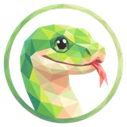

# 🐍 Snaky

## Profile

- Repository: [nocoo/snaky](https://github.com/nocoo/snaky)
- Website: No current website verified; navigation opens the repository.
- Website evidence: Not applicable
- Category: tools
- Archived repository: No; [repository status evidence](../sources/repository-status-2026-09-06.json)
- English: Know where your traffic goes. Inspect VPN routes, exit IPs, latency, and proxy rules.
- Chinese: 弄清网络流量去了哪里，检查 VPN 路由、出口 IP、延迟与分流规则。
- Profile section: Recent Projects
- Profile revision: `9a7ad63e1e96428f9dcd12214bcdbd470b3b51c6`
- Repository revision inspected: `a930a0e4883ee23e0eef0e7287d0efd06080533b`

## Current logo

- Type: Original project artwork, copied without modification
- Subject: Green snake portrait in a circular frame
- [Source](https://github.com/nocoo/snaky/blob/a930a0e4883ee23e0eef0e7287d0efd06080533b/logo.png): `logo.png`
- [Preserved asset](../../public/logos/originals/snaky.png)
- Original dimensions: 2048 × 2048
- Original size: 3128322 bytes
- SHA-256: `ab232e170e4c4d8da05a0b0851c5e6082adc679aede2481a3a99897956bb2e4b`
- Locally modified source: No
- Display derivatives: 32, 64, 160, and 1024 px WebP; contain-fit, transparent padding, no recoloring or cropping.

## Current palette

| Role | Value | Evidence |
| --- | --- | --- |
| primary | `#e2ecae` | Preserved project artwork, dominant colored pixels |
| background | `transparent` | Preserved project artwork, transparent background |
| accent | `#65ac59` | Preserved project artwork, sampled pixel |
| accent | `#c4ea49` | Preserved project artwork, sampled pixel |
| accent | `#e1af8b` | Preserved project artwork, sampled pixel |

Theme tokens take precedence. Additional colors are sampled from the preserved artwork. A transparent background means the source does not define an opaque background; the gallery's surrounding paper is not part of the project palette.

## Future family notes

Keep this asset as the phase-one baseline. A future family version should use a recognizable animal, one principal hue, and restrained multicolored geometric fragments.

Use head portraits for large animals and optionally full-body poses for small animals. Compare artwork, app icon, sidebar, and favicon sizes in both themes before adopting a replacement. No new logo is generated in phase one.
