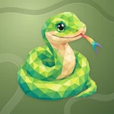

# 🐍 Snaky

## Profile

- Repository: [nocoo/snaky](https://github.com/nocoo/snaky)
- Website: No current website verified; navigation opens the repository.
- Website evidence: Not applicable
- Category: tools
- Archived repository: No; [repository status evidence](../sources/repository-status-2026-09-06.json)
- English: Know where your traffic goes. Inspect VPN routes, exit IPs, latency, and proxy rules.
- Chinese: 弄清网络流量去了哪里，检查 VPN 路由、出口 IP、延迟与分流规则。
- Profile section: Recent Projects
- Profile revision: `9a7ad63e1e96428f9dcd12214bcdbd470b3b51c6`
- Repository revision inspected: `5cd0790336d006f65555816fe29869d6e60ed376`

## Current logo

- Type: Original project artwork, copied without modification
- Subject: Green snake in a natural coil with one multicolored forked tongue
- [Source](https://github.com/nocoo/snaky/blob/5cd0790336d006f65555816fe29869d6e60ed376/logo.png): `logo.png`
- [Preserved asset](../../public/logos/originals/snaky-family-2026-09-07-01-01.png)
- Original dimensions: 2048 × 2048
- Original size: 2958177 bytes
- SHA-256: `4b2ea7f80bf081cad292c81c95e576b8ec66c6c2ece04c3d90374f971d299630`
- Locally modified source: No
- Display derivatives: 32, 64, 160, and 1024 px WebP; contain-fit, transparent padding, no recoloring or cropping.

## Current palette

| Role | Value | Evidence |
| --- | --- | --- |
| primary | `#8bbc3f` | Native snaky 2283c4fb8964, sampled sRGB pixel (342, 1252); artwork/logo-family/snaky/2026-09-07-01/palette.json |
| background | `transparent` | Preserved project artwork, transparent background |
| accent | `#c6dc5b` | Native snaky 2283c4fb8964, sampled sRGB pixel (1573, 407); artwork/logo-family/snaky/2026-09-07-01/palette.json |
| accent | `#e6c88f` | Native snaky 2283c4fb8964, sampled sRGB pixel (796, 562); artwork/logo-family/snaky/2026-09-07-01/palette.json |
| accent | `#d96e6b` | Native snaky 2283c4fb8964, sampled sRGB pixel (1483, 606); artwork/logo-family/snaky/2026-09-07-01/palette.json |

Theme tokens take precedence. Additional colors are sampled from the preserved artwork. A transparent background means the source does not define an opaque background; the gallery's surrounding paper is not part of the project palette.

## Refined identity

- Status: Adopted in the source project; updated 2026-09-07.
- Study `2026-09-07-01`, finishing `01`
- Refined subject: Green snake in a natural coil with one multicolored forked tongue
- Site path: `/logos/snaky`; [local gallery](https://index.dev.hexly.ai/logos/snaky)
- [Static review HTML](../../artwork/logo-family/snaky/2026-09-07-01/review.html)
- [Full process archive](https://github.com/nocoo/hexly.ai/tree/main/artwork/logo-family/snaky/2026-09-07-01)
- [Transparent foreground](../../public/logos/family/snaky/2026-09-07-01/01/transparent.png); SHA-256: `4b2ea7f80bf081cad292c81c95e576b8ec66c6c2ece04c3d90374f971d299630`
- [Square icon](../../public/logos/family/snaky/2026-09-07-01/01/icon.png), [rounded icon](../../public/logos/family/snaky/2026-09-07-01/01/rounded.png), [white version](../../public/logos/family/snaky/2026-09-07-01/01/white.png)
- [Untouched generation](../../public/logos/family/snaky/2026-09-07-01/01/raw.png), [exact prompt](../../public/logos/family/snaky/2026-09-07-01/01/prompt.txt), [public asset checksums](../../public/logos/family/snaky/2026-09-07-01/01/manifest.json)
- [Previous original](../../public/logos/originals/snaky.png), copied from [its immutable source](https://github.com/nocoo/snaky/blob/a930a0e4883ee23e0eef0e7287d0efd06080533b/logo.png)
- Previous SHA-256: `ab232e170e4c4d8da05a0b0851c5e6082adc679aede2481a3a99897956bb2e4b`
- Generation: gpt-image-2, native 2048 × 2048; transparent extraction and presentation are separate finishing steps.
- The finishing archive includes transparent, square, and rounded PNGs at 2048, 1024, 512, 256, 128, 64, 48, 32, 24, and 16 px.
- Application previews use the refined square icon without extra padding, backgrounds, or circular masks. Artwork previews and downloads use its own transparent foreground, independently of the preserved source logo above.

### Refined palette

| Role | Value | Evidence |
| --- | --- | --- |
| background | `#778e57` | Selected Snaky presentation, 2026-09-07-01/01; background.base in archived settings.json |
| primary | `#8bbc3f` | Native snaky 2283c4fb8964, sampled sRGB pixel (342, 1252); artwork/logo-family/snaky/2026-09-07-01/palette.json |
| accent | `#c6dc5b` | Native snaky 2283c4fb8964, sampled sRGB pixel (1573, 407); artwork/logo-family/snaky/2026-09-07-01/palette.json |
| accent | `#e6c88f` | Native snaky 2283c4fb8964, sampled sRGB pixel (796, 562); artwork/logo-family/snaky/2026-09-07-01/palette.json |
| accent | `#d96e6b` | Native snaky 2283c4fb8964, sampled sRGB pixel (1483, 606); artwork/logo-family/snaky/2026-09-07-01/palette.json |
| accent | `#8779b3` | Native snaky 2283c4fb8964, sampled sRGB pixel (1811, 784); artwork/logo-family/snaky/2026-09-07-01/palette.json |

### The coil becomes the frame

The liked green face returns above a natural compact coil. The old circular ring is gone; the tapering tail and tongue remain complete.

保留喜爱的绿色脸部形象，以自然紧凑的盘坐承托。旧圆环被移除，尾尖和舌头保持完整。

### Leaf green and cream

Connected chartreuse, leaf-green and teal facets describe the body. A cream belly clarifies the coil, while one rainbow tongue adds a single outward gesture.

相连的黄绿、嫩绿与青色色面描绘身体，奶油色腹部让盘绕关系更清晰，一条彩色舌头向外伸展。

### Meadow bends

Open S-shaped relief bends travel around a moss-green field. Broad, uneven paths support the coil without enclosing it in another ring.

开放的 S 形浮雕弯折穿过苔绿色底纹，宽阔而不等距的路径呼应盘绕动作，保留开放留白。

Small-size observation: The complete animal and accessory have at least 198.5 px clearance from the actual rounded outline. Ten export sizes preserve one uniform placement. Small app/browser marks use the transparent foreground; fine facets and accessory details simplify at 16 px.

## Further refinements

Keep this asset as the phase-one baseline. A future family version should use a recognizable animal, one principal hue, and restrained multicolored geometric fragments.

Use head portraits for large animals and optionally full-body poses for small animals. Compare artwork, app icon, sidebar, and favicon sizes in both themes before adopting a replacement. Preserve this reviewed composition and its archived predecessors.
