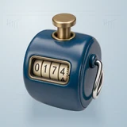

# ✍️ signoff.now

## Profile

- Repository: [nocoo/signoff.now](https://github.com/nocoo/signoff.now)
- Website: [https://signoff.hexly.ai](https://signoff.hexly.ai)
- Website evidence: wrangler.toml routes
- Category: tools
- Archived repository: No; [repository status evidence](../sources/repository-status-2026-09-06.json)
- English: Developer and Git activity analytics
- Chinese: 开发者与 Git 活动分析
- Profile section: Recent Projects
- Profile revision: `e102f9b5d9730d8ead4c55b718d0acab30600398`
- Repository revision inspected: `51b679fba85d1a0cc81641e41f377ad77f867dd0`

## Current logo

- Type: Original project artwork, copied without modification
- Subject: Petrol enamel mechanical tally counter
- [Source](https://github.com/nocoo/signoff.now/blob/51b679fba85d1a0cc81641e41f377ad77f867dd0/logo.png): `logo.png`
- [Preserved asset](../../public/logos/originals/signoff-now-family-2026-09-07-01-01.png)
- Original dimensions: 2048 × 2048
- Original size: 3963278 bytes
- SHA-256: `942a3ceb0bb6c1243bd2b7876262ef163797131700fb72fc0fca90811ef7e1c4`
- Locally modified source: No
- Display derivatives: 32, 64, 160, and 1024 px WebP; contain-fit, transparent padding, no recoloring or cropping.

## Current palette

| Role | Value | Evidence |
| --- | --- | --- |
| primary | `#00a4f0` | apps/web/src/index.css --primary: 199 100% 47% |
| background | `#edf0f2` | apps/web/src/index.css --background: 210 16% 94% |
| accent | `#2d506f` | Native signoff-now 34cda46e7010, sampled sRGB pixel (1244, 644); artwork/logo-family/signoff-now/2026-09-07-01/palette.json |
| accent | `#9a825a` | Native signoff-now 34cda46e7010, sampled sRGB pixel (1015, 95); artwork/logo-family/signoff-now/2026-09-07-01/palette.json |
| accent | `#d8cdb1` | Native signoff-now 34cda46e7010, sampled sRGB pixel (664, 1002); artwork/logo-family/signoff-now/2026-09-07-01/palette.json |

Theme tokens take precedence. Additional colors are sampled from the preserved artwork. A transparent background means the source does not define an opaque background; the gallery's surrounding paper is not part of the project palette.

## Refined identity

- Status: Adopted in the source project; updated 2026-09-07.
- Study `2026-09-07-01`, finishing `01`
- Refined subject: Petrol enamel mechanical tally counter
- Site path: `/logos/signoff-now`; [local gallery](https://index.dev.hexly.ai/logos/signoff-now)
- [Static review HTML](../../artwork/logo-family/signoff-now/2026-09-07-01/review.html)
- [Full process archive](https://github.com/nocoo/hexly.ai/tree/main/artwork/logo-family/signoff-now/2026-09-07-01)
- [Transparent foreground](../../public/logos/family/signoff-now/2026-09-07-01/01/transparent.png); SHA-256: `942a3ceb0bb6c1243bd2b7876262ef163797131700fb72fc0fca90811ef7e1c4`
- [Square icon](../../public/logos/family/signoff-now/2026-09-07-01/01/icon.png), [rounded icon](../../public/logos/family/signoff-now/2026-09-07-01/01/rounded.png), [white version](../../public/logos/family/signoff-now/2026-09-07-01/01/white.png)
- [Untouched generation](../../public/logos/family/signoff-now/2026-09-07-01/01/raw.png), [exact prompt](../../public/logos/family/signoff-now/2026-09-07-01/01/prompt.txt), [public asset checksums](../../public/logos/family/signoff-now/2026-09-07-01/01/manifest.json)
- [Previous original](../../public/logos/emoji/signoff-now.png), copied from [its immutable source](https://github.com/nocoo/nocoo/blob/9a7ad63e1e96428f9dcd12214bcdbd470b3b51c6/README.md)
- Previous SHA-256: `8337fbbe8569d7cc869b0e9e7c5dabae4f370963ccc2adc1621ef529f6639cb0`
- Generation: gpt-image-2, native 2048 × 2048; transparent extraction and presentation are separate finishing steps.
- The finishing archive includes transparent, square, and rounded PNGs at 2048, 1024, 512, 256, 128, 64, 48, 32, 24, and 16 px.
- Application previews use the refined square icon without extra padding, backgrounds, or circular masks. Artwork previews and downloads use its own transparent foreground, independently of the preserved source logo above.

### Refined palette

| Role | Value | Evidence |
| --- | --- | --- |
| background | `#c4d2da` | Adopted signoff.now presentation, 2026-09-07-01/01; background.base in archived settings.json |
| primary | `#2d506f` | Native signoff-now 34cda46e7010, sampled sRGB pixel (1244, 644); artwork/logo-family/signoff-now/2026-09-07-01/palette.json |
| accent | `#9a825a` | Native signoff-now 34cda46e7010, sampled sRGB pixel (1015, 95); artwork/logo-family/signoff-now/2026-09-07-01/palette.json |
| accent | `#d8cdb1` | Native signoff-now 34cda46e7010, sampled sRGB pixel (664, 1002); artwork/logo-family/signoff-now/2026-09-07-01/palette.json |

### A contribution counted

The returning brass plunger and slightly turning number wheel capture a count in progress. The blue counter remains the main mass; its silver finger loop stays close.

黄铜按钮回弹，数字轮刚刚转动，定格一次活动记录。蓝色计数器是主体，银色指环紧靠机身。

### Enamel and moving digits

Petrol enamel, brushed brass and opaque ivory digit drums describe a physical counting instrument. This represents developer and Git activity analytics.

深蓝珐琅、拉丝黄铜与不透明象牙色数字轮构成真实计数工具，呼应开发者与 Git 活动分析。

### Activity ledgers

Stepped tally bars, grouped count strokes and sparse ledger baselines on blue-gray paper. The field, grain and contact shadow are independent of transparent app marks.

蓝灰纸面上的分组计数线、阶梯图和稀疏账本基线。 底色、颗粒与接触阴影均独立于透明应用标记。

Small-size observation: At 128/64 px, the counter body, plunger and digit window remain clear. At 32/24/16 px, the compact silhouette and dominant colors carry recognition; fine material detail, printed marks and background lines naturally merge.

## Further refinements

This is an owner-directed physical material or architectural identity. Preserve its physical materials, complete silhouette, selected camera and distinct tonal presentation. The animal-series drawing and accessory rules do not apply.

Keep the complete object uniformly inset from the actual rounded outline, with backgrounds, projected shadows and any external emission separate from the transparent foreground. Compare artwork, app icon, sidebar, and favicon sizes in both themes before adopting a replacement. Preserve this reviewed composition and its archived predecessors.
