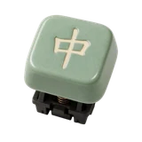

# 🌊 Flow

## Profile

- Repository: [nocoo/flow](https://github.com/nocoo/flow)
- Website: No current website verified; navigation opens the repository.
- Website evidence: Not applicable
- Category: everyday
- Archived repository: No; [repository status evidence](../sources/repository-status-2026-09-06.json)
- English: A Chinese pinyin input engine that brings language models into everyday typing.
- Chinese: 把大语言模型带进日常输入的中文拼音引擎，支持智能分词与预测。
- Profile section: Recent Projects
- Profile revision: `9a7ad63e1e96428f9dcd12214bcdbd470b3b51c6`
- Repository revision inspected: `f4a9e9464d64184b793240adff182e08c04997e1`

## Project goal

Explore language-model Chinese pinyin conversion, text polishing, and chat in a browser using configurable OpenAI-compatible model services.

在浏览器中使用可配置的 OpenAI 兼容模型服务，试验中文拼音转换、文本润色和对话。

- [中文 README](https://github.com/nocoo/flow/blob/main/README.md) · [English README](https://github.com/nocoo/flow/blob/main/docs/README.en.md)
- Verified: 2026-09-08; [source revision](https://github.com/nocoo/flow/tree/f4a9e9464d64184b793240adff182e08c04997e1)
- Source files: [`package.json`](https://github.com/nocoo/flow/blob/f4a9e9464d64184b793240adff182e08c04997e1/package.json), [`apps/api/package.json`](https://github.com/nocoo/flow/blob/f4a9e9464d64184b793240adff182e08c04997e1/apps/api/package.json), [`apps/api/src/index.ts`](https://github.com/nocoo/flow/blob/f4a9e9464d64184b793240adff182e08c04997e1/apps/api/src/index.ts), [`apps/api/src/pinyin-segmenter.ts`](https://github.com/nocoo/flow/blob/f4a9e9464d64184b793240adff182e08c04997e1/apps/api/src/pinyin-segmenter.ts), [`apps/api/src/provider.ts`](https://github.com/nocoo/flow/blob/f4a9e9464d64184b793240adff182e08c04997e1/apps/api/src/provider.ts), [`apps/api/src/db.ts`](https://github.com/nocoo/flow/blob/f4a9e9464d64184b793240adff182e08c04997e1/apps/api/src/db.ts), [`apps/api/src/routes/settings.ts`](https://github.com/nocoo/flow/blob/f4a9e9464d64184b793240adff182e08c04997e1/apps/api/src/routes/settings.ts), [`apps/web/package.json`](https://github.com/nocoo/flow/blob/f4a9e9464d64184b793240adff182e08c04997e1/apps/web/package.json), [`apps/web/src/lib/api.ts`](https://github.com/nocoo/flow/blob/f4a9e9464d64184b793240adff182e08c04997e1/apps/web/src/lib/api.ts), [`apps/web/src/App.tsx`](https://github.com/nocoo/flow/blob/f4a9e9464d64184b793240adff182e08c04997e1/apps/web/src/App.tsx), [`apps/web/src/components/streaming-card.tsx`](https://github.com/nocoo/flow/blob/f4a9e9464d64184b793240adff182e08c04997e1/apps/web/src/components/streaming-card.tsx), [`apps/web/src/hooks/use-streaming-predict.ts`](https://github.com/nocoo/flow/blob/f4a9e9464d64184b793240adff182e08c04997e1/apps/web/src/hooks/use-streaming-predict.ts)

### Tech stack

| Technology | Role | 用途 |
| --- | --- | --- |
| TypeScript / Bun | API runtime and workspaces | API 运行时与工作区 |
| Hono | Chat, pinyin, polishing and settings endpoints | 对话、拼音、润色与设置接口 |
| AI SDK / OpenAI Compatible | Streaming model calls | 模型流式调用 |
| React / Vite | Browser interface and frontend builds | 浏览器界面与前端构建 |
| Tailwind CSS / Radix UI | UI styles and components | 界面样式与组件 |
| bun:sqlite | Local provider configuration | 本地模型服务配置 |
| Vitest | Segmenter and utility tests | 分词器与工具函数测试 |

## Current logo

- Type: Original vector identity commissioned and designed in hexly.ai; the source SVG is preserved byte-for-byte
- Subject: Celadon mechanical keycap with a Chinese character
- [Source](https://github.com/nocoo/flow/blob/f4a9e9464d64184b793240adff182e08c04997e1/logo.png): `logo.png`
- [Preserved asset](../../public/logos/originals/flow-family-2026-09-07-01-01.png)
- Original dimensions: 2048 × 2048
- Original size: 3201869 bytes
- SHA-256: `d08f2ee2cb2c322b54dbd9677180e210756c2cc8094784c6fb86e435d43afe23`
- Locally modified source: No
- Display derivatives: 32, 64, 160, and 1024 px WebP; contain-fit, transparent padding, no recoloring or cropping.

## Current palette

| Role | Value | Evidence |
| --- | --- | --- |
| primary | `#171717` | apps/web/src/index.css --primary: oklch(0.205 0 0) |
| background | `#ffffff` | apps/web/src/index.css --background: oklch(1 0 0) |
| accent | `#8ba48c` | Native flow 386f4e61218e, sampled sRGB pixel (1045, 500); artwork/logo-family/flow/2026-09-07-01/palette.json |
| accent | `#e2d7b7` | Native flow 386f4e61218e, sampled sRGB pixel (1188, 731); artwork/logo-family/flow/2026-09-07-01/palette.json |
| accent | `#2c2d27` | Native flow 386f4e61218e, sampled sRGB pixel (1187, 1560); artwork/logo-family/flow/2026-09-07-01/palette.json |
| accent | `#866540` | Native flow 386f4e61218e, sampled sRGB pixel (954, 1482); artwork/logo-family/flow/2026-09-07-01/palette.json |

Theme tokens take precedence. Additional colors are sampled from the preserved artwork. A transparent background means the source does not define an opaque background; the gallery's surrounding paper is not part of the project palette.

## Hexly campaign brand archive

- Brand version: `1.0.0`; [public archive](https://hexly.ai/projects/flow#brand).
- [Light lockup](../../public/brands/flow/v1.0.0/lockup-light.png), [dark lockup](../../public/brands/flow/v1.0.0/lockup-dark.png), [favicon](../../public/brands/flow/v1.0.0/favicon.ico).
- [Complete usage and integration guide](../../public/brands/flow/v1.0.0/guide.md), [standalone specimens](../../public/brands/flow/v1.0.0/review.html), [all exports and SHA-256](../../public/brands/flow/v1.0.0/manifest.json).
- Source adoption: separate source-team handoff; no adoption commit is claimed.
- Official project identity and Hexly campaign interpretation are separate manifest roles. Existing artwork keeps its exact bytes, geometry and original colors. Heroes are authored wide/mobile compositions, with no new image-model calls. Hexly palettes and typography apply only to this archive and promotional materials, not product UI. Preserved imagery retains its recorded source rights; MIT covers authored support work and OFL covers the real font. See provenance.json and license.txt.

Celadon mechanical keycap with a Chinese character.

### Identity keeps its colors

Preserve the exact project identity and the separately recorded Hexly artwork. Hexly paper, ink and terracotta belong to archive and campaign surfaces only; independent product palettes and themes stay their own.

项目原标与单独记录的 Hexly 主视觉均保持形状和原色。Hexly 纸色、墨色和陶土色只用于档案及宣发画布，各产品色板与主题独立保留。

### A complete composition

Preserve the complete subject and its original square margins. Resize uniformly; never trim the canvas to force detail. Keep external clear space of at least 1/8 of the mark canvas height around standalone marks and lockups. Wide and mobile Heroes are separate compositions of existing artwork, with no image-model call.

保留完整主体与原有方形留白，只做等比缩放，不裁图强凑细节。独立标志及字标组合四周，至少留出标志画布高度 1/8 的外部净空。宽幅与手机 Hero 分别排版，没有新图像模型调用。

### A mark, not a tile

Navigation 24px preferred, 16px minimum. Wordmark ≥56px wide; lockup ≥160px. Use transparent PNG/ICO at small sizes without a tile, extra red dot, shadow or rounded mask. Fine facets soften at 16px.

导航推荐 24px，最小 16px。字标宽度至少 56px，组合至少 160px。小尺寸使用透明 PNG/ICO，不加底板、红点、阴影或圆角遮罩；16px 时细小切面会柔化。

## Refined identity

- Status: Adopted in the source project; updated 2026-09-07.
- Study `2026-09-07-01`, finishing `01`
- Refined subject: Celadon mechanical keycap with a Chinese character
- Site path: `/projects/flow#brand`; [local gallery](https://index.dev.hexly.ai/projects/flow#brand)
- [Static review HTML](../../artwork/logo-family/flow/2026-09-07-01/review.html)
- [Full process archive](https://github.com/nocoo/hexly.ai/tree/main/artwork/logo-family/flow/2026-09-07-01)
- [Transparent foreground](../../public/logos/family/flow/2026-09-07-01/01/transparent.png); SHA-256: `d08f2ee2cb2c322b54dbd9677180e210756c2cc8094784c6fb86e435d43afe23`
- [Square icon](../../public/logos/family/flow/2026-09-07-01/01/icon.png), [rounded icon](../../public/logos/family/flow/2026-09-07-01/01/rounded.png), [white version](../../public/logos/family/flow/2026-09-07-01/01/white.png)
- [Untouched generation](../../public/logos/family/flow/2026-09-07-01/01/raw.png), [exact prompt](../../public/logos/family/flow/2026-09-07-01/01/prompt.txt), [public asset checksums](../../public/logos/family/flow/2026-09-07-01/01/manifest.json)
- [Previous original](../../public/logos/originals/flow.svg), copied from [its immutable source](https://github.com/nocoo/flow/blob/9c225d805a09ab5fdbe4fa65486821057231fdcd/apps/web/public/favicon.svg)
- Previous SHA-256: `a03a03e3e685fdf4d87541f9e7e83ffdc910018d3782d67847d740fadeea7d6f`
- Generation: gpt-image-2, native 2048 × 2048; transparent extraction and presentation are separate finishing steps.
- The finishing archive includes transparent, square, and rounded PNGs at 2048, 1024, 512, 256, 128, 64, 48, 32, 24, and 16 px.
- Application previews use the refined square icon without extra padding, backgrounds, or circular masks. Artwork previews and downloads use its own transparent foreground, independently of the preserved source logo above.

### Refined palette

| Role | Value | Evidence |
| --- | --- | --- |
| background | `#c4d8cf` | Adopted Flow presentation, 2026-09-07-01/01; background.base in archived settings.json |
| primary | `#8ba48c` | Native flow 386f4e61218e, sampled sRGB pixel (1045, 500); artwork/logo-family/flow/2026-09-07-01/palette.json |
| accent | `#e2d7b7` | Native flow 386f4e61218e, sampled sRGB pixel (1188, 731); artwork/logo-family/flow/2026-09-07-01/palette.json |
| accent | `#2c2d27` | Native flow 386f4e61218e, sampled sRGB pixel (1187, 1560); artwork/logo-family/flow/2026-09-07-01/palette.json |
| accent | `#866540` | Native flow 386f4e61218e, sampled sRGB pixel (954, 1482); artwork/logo-family/flow/2026-09-07-01/palette.json |

### The key rebounds

A single substantial keycap sits just above its compact mechanical switch. The elevated product view keeps 中 readable while revealing the switch foot and copper spring.

一颗厚实键帽位于紧凑机械轴体上方。斜上方镜头同时保留中字符号、轴体底座和铜色弹簧。

### Celadon ceramic

Restrained glaze reflections and softly mottled celadon establish the physical ceramic. The ivory glyph remains opaque and the switch contributes a quiet dark base.

克制釉面反光与细腻青瓷色差表现真实陶瓷；象牙色汉字保持不透明，深色轴体形成稳定底座。

### Pinyin key rhythm

Staggered rounded key outlines with a small sequence of rising and falling tone strokes in celadon paper. The field, grain and contact shadow are independent of transparent app marks.

青瓷色纸面上的错位圆角键位与起伏声调短线。 底色、颗粒与接触阴影均独立于透明应用标记。

Small-size observation: At 128/64 px, the celadon key and ivory 中 remain clear. At 32/24/16 px, the compact silhouette and dominant colors carry recognition; fine material detail, printed marks and background lines naturally merge.

## Further refinements

Preserve the original vector geometry, real Hexly tokens, outlined font and single-point hierarchy. Versioned published exports are immutable; revise into a new brand version. This commissioned scalable identity is separate from the faceted image-study workflow.

Use the supplied transparent marks in app navigation and browser tabs, keeping presentation tiles separate. Preserve clear space and minimum sizes from the guide. Compare artwork, app icon, sidebar, and favicon sizes in both themes before adopting a replacement. The source team integrates the exact published files and records its own adoption revision.
