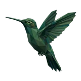

# 🔔 Codo

## Profile

- Repository: [nocoo/codo](https://github.com/nocoo/codo)
- Website: No current website verified; navigation opens the repository.
- Website evidence: Not applicable
- Category: tools
- Archived repository: No; [repository status evidence](../sources/repository-status-2026-09-06.json)
- English: A quiet macOS notification bridge between your AI agents and your desktop.
- Chinese: 连接 AI 智能体与桌面的 macOS 通知桥梁，支持菜单栏服务和命令行。
- Profile section: Recent Projects
- Profile revision: `9a7ad63e1e96428f9dcd12214bcdbd470b3b51c6`
- Repository revision inspected: `c4d8982d8c91c44ccd85d3a13e824c0cc9ccc80a`

## Project goal

Deliver local script and Claude Code events as Mac desktop banners, keep project and session history, and optionally summarize notifications with an AI Guardian.

将本地脚本和 Claude Code 事件显示为 Mac 桌面横幅，保存项目与会话记录，并按需使用 AI Guardian 整理通知。

- [中文 README](https://github.com/nocoo/codo/blob/main/README.md) · [English README](https://github.com/nocoo/codo/blob/main/docs/README.en.md)
- Verified: 2026-09-08; [source revision](https://github.com/nocoo/codo/tree/c4d8982d8c91c44ccd85d3a13e824c0cc9ccc80a)
- Source files: [`Package.swift`](https://github.com/nocoo/codo/blob/c4d8982d8c91c44ccd85d3a13e824c0cc9ccc80a/Package.swift), [`cli/codo.ts`](https://github.com/nocoo/codo/blob/c4d8982d8c91c44ccd85d3a13e824c0cc9ccc80a/cli/codo.ts), [`guardian/package.json`](https://github.com/nocoo/codo/blob/c4d8982d8c91c44ccd85d3a13e824c0cc9ccc80a/guardian/package.json), [`guardian/classifier.ts`](https://github.com/nocoo/codo/blob/c4d8982d8c91c44ccd85d3a13e824c0cc9ccc80a/guardian/classifier.ts), [`guardian/llm.ts`](https://github.com/nocoo/codo/blob/c4d8982d8c91c44ccd85d3a13e824c0cc9ccc80a/guardian/llm.ts), [`Sources/Codo/AppDelegate.swift`](https://github.com/nocoo/codo/blob/c4d8982d8c91c44ccd85d3a13e824c0cc9ccc80a/Sources/Codo/AppDelegate.swift), [`Sources/Codo/BannerProvider.swift`](https://github.com/nocoo/codo/blob/c4d8982d8c91c44ccd85d3a13e824c0cc9ccc80a/Sources/Codo/BannerProvider.swift), [`Sources/Codo/GuardianPathResolver.swift`](https://github.com/nocoo/codo/blob/c4d8982d8c91c44ccd85d3a13e824c0cc9ccc80a/Sources/Codo/GuardianPathResolver.swift), [`Sources/CodoCore/EventStore.swift`](https://github.com/nocoo/codo/blob/c4d8982d8c91c44ccd85d3a13e824c0cc9ccc80a/Sources/CodoCore/EventStore.swift), [`Sources/CodoCore/GuardianSettings.swift`](https://github.com/nocoo/codo/blob/c4d8982d8c91c44ccd85d3a13e824c0cc9ccc80a/Sources/CodoCore/GuardianSettings.swift), [`hooks/claude-hook.sh`](https://github.com/nocoo/codo/blob/c4d8982d8c91c44ccd85d3a13e824c0cc9ccc80a/hooks/claude-hook.sh), [`scripts/build.sh`](https://github.com/nocoo/codo/blob/c4d8982d8c91c44ccd85d3a13e824c0cc9ccc80a/scripts/build.sh), [`scripts/install.sh`](https://github.com/nocoo/codo/blob/c4d8982d8c91c44ccd85d3a13e824c0cc9ccc80a/scripts/install.sh)

### Tech stack

| Technology | Role | 用途 |
| --- | --- | --- |
| Swift / SwiftUI | Menu bar app and Dashboard | 菜单栏应用与控制台 |
| AppKit | Custom desktop banners | 桌面自绘横幅 |
| TypeScript / Bun | CLI and Guardian process | 命令行与 Guardian 进程 |
| Unix sockets | Local event delivery | 本地事件传输 |
| SQLite / Keychain | Event storage and API keys | 事件存储与 API key |
| Anthropic / OpenAI SDKs | Optional notification summaries | 可选的通知摘要 |

## Current logo

- Type: Original vector identity commissioned and designed in hexly.ai; the source SVG is preserved byte-for-byte
- Subject: Vivid faceted hummingbird hovering at one coral bell flower
- [Source](https://github.com/nocoo/codo/blob/c4d8982d8c91c44ccd85d3a13e824c0cc9ccc80a/logo.png): `logo.png`
- [Preserved asset](../../public/logos/originals/codo-family-2026-09-07-01-01.png)
- Original dimensions: 2048 × 2048
- Original size: 1902979 bytes
- SHA-256: `67456a5040ec217dd179bdc54f81f9c71ea44908ea7b25a2e9064e386b2607cf`
- Locally modified source: No
- Display derivatives: 32, 64, 160, and 1024 px WebP; contain-fit, transparent padding, no recoloring or cropping.

## Current palette

| Role | Value | Evidence |
| --- | --- | --- |
| primary | `#349078` | Native codo 76ffd623644d, sampled sRGB pixel (828, 1414); artwork/logo-family/codo/2026-09-07-01/palette.json |
| background | `transparent` | Preserved project artwork, transparent background |
| accent | `#247185` | Native codo 76ffd623644d, sampled sRGB pixel (663, 1350); artwork/logo-family/codo/2026-09-07-01/palette.json |
| accent | `#764395` | Native codo 76ffd623644d, sampled sRGB pixel (645, 1616); artwork/logo-family/codo/2026-09-07-01/palette.json |
| accent | `#e8675e` | Native codo 76ffd623644d, sampled sRGB pixel (1773, 846); artwork/logo-family/codo/2026-09-07-01/palette.json |

Theme tokens take precedence. Additional colors are sampled from the preserved artwork. A transparent background means the source does not define an opaque background; the gallery's surrounding paper is not part of the project palette.

## Hexly campaign brand archive

- Brand version: `1.0.0`; [public archive](https://hexly.ai/projects/codo#brand).
- [Light lockup](../../public/brands/codo/v1.0.0/lockup-light.png), [dark lockup](../../public/brands/codo/v1.0.0/lockup-dark.png), [favicon](../../public/brands/codo/v1.0.0/favicon.ico).
- [Complete usage and integration guide](../../public/brands/codo/v1.0.0/guide.md), [standalone specimens](../../public/brands/codo/v1.0.0/review.html), [all exports and SHA-256](../../public/brands/codo/v1.0.0/manifest.json).
- Source adoption: separate source-team handoff; no adoption commit is claimed.
- Official project identity and Hexly campaign interpretation are separate manifest roles. Existing artwork keeps its exact bytes, geometry and original colors. Heroes are authored wide/mobile compositions, with no new image-model calls. Hexly palettes and typography apply only to this archive and promotional materials, not product UI. Preserved imagery retains its recorded source rights; MIT covers authored support work and OFL covers the real font. See provenance.json and license.txt.

Vivid faceted hummingbird hovering at one coral bell flower.

### Identity keeps its colors

Preserve the exact project identity and the separately recorded Hexly artwork. Hexly paper, ink and terracotta belong to archive and campaign surfaces only; independent product palettes and themes stay their own.

项目原标与单独记录的 Hexly 主视觉均保持形状和原色。Hexly 纸色、墨色和陶土色只用于档案及宣发画布，各产品色板与主题独立保留。

### A complete composition

Preserve the complete subject and its original square margins. Resize uniformly; never trim the canvas to force detail. Keep external clear space of at least 1/8 of the mark canvas height around standalone marks and lockups. Wide and mobile Heroes are separate compositions of existing artwork, with no image-model call.

保留完整主体与原有方形留白，只做等比缩放，不裁图强凑细节。独立标志及字标组合四周，至少留出标志画布高度 1/8 的外部净空。宽幅与手机 Hero 分别排版，没有新图像模型调用。

### A mark, not a tile

Navigation 24px preferred, 16px minimum. Wordmark ≥63px wide; lockup ≥160px. Use transparent PNG/ICO at small sizes without a tile, extra red dot, shadow or rounded mask. Fine facets soften at 16px.

导航推荐 24px，最小 16px。字标宽度至少 63px，组合至少 160px。小尺寸使用透明 PNG/ICO，不加底板、红点、阴影或圆角遮罩；16px 时细小切面会柔化。

## Refined identity

- Status: Adopted in the source project; updated 2026-09-07.
- Study `2026-09-07-01`, finishing `01`
- Refined subject: Vivid faceted hummingbird hovering at one coral bell flower
- Site path: `/projects/codo#brand`; [local gallery](https://index.dev.hexly.ai/projects/codo#brand)
- [Static review HTML](../../artwork/logo-family/codo/2026-09-07-01/review.html)
- [Full process archive](https://github.com/nocoo/hexly.ai/tree/main/artwork/logo-family/codo/2026-09-07-01)
- [Transparent foreground](../../public/logos/family/codo/2026-09-07-01/01/transparent.png); SHA-256: `67456a5040ec217dd179bdc54f81f9c71ea44908ea7b25a2e9064e386b2607cf`
- [Square icon](../../public/logos/family/codo/2026-09-07-01/01/icon.png), [rounded icon](../../public/logos/family/codo/2026-09-07-01/01/rounded.png), [white version](../../public/logos/family/codo/2026-09-07-01/01/white.png)
- [Untouched generation](../../public/logos/family/codo/2026-09-07-01/01/raw.png), [exact prompt](../../public/logos/family/codo/2026-09-07-01/01/prompt.txt), [public asset checksums](../../public/logos/family/codo/2026-09-07-01/01/manifest.json)
- [Previous original](../../public/logos/originals/codo.png), copied from [its immutable source](https://github.com/nocoo/codo/blob/66df73c4141f3e01a89fd6693f574d1d75fc5e4a/logo.png)
- Previous SHA-256: `d078deff35f8dfc10b8b7192ab3ec8f6603de460ae1a3d3d632731281e62bc74`
- Generation: gpt-image-2, native 2048 × 2048; transparent extraction and presentation are separate finishing steps.
- The finishing archive includes transparent, square, and rounded PNGs at 2048, 1024, 512, 256, 128, 64, 48, 32, 24, and 16 px.
- Application previews use the refined square icon without extra padding, backgrounds, or circular masks. Artwork previews and downloads use its own transparent foreground, independently of the preserved source logo above.

### Refined palette

| Role | Value | Evidence |
| --- | --- | --- |
| background | `#5f8988` | Selected Codo presentation, 2026-09-07-01/01; background.base in archived settings.json |
| primary | `#349078` | Native codo 76ffd623644d, sampled sRGB pixel (828, 1414); artwork/logo-family/codo/2026-09-07-01/palette.json |
| accent | `#247185` | Native codo 76ffd623644d, sampled sRGB pixel (663, 1350); artwork/logo-family/codo/2026-09-07-01/palette.json |
| accent | `#764395` | Native codo 76ffd623644d, sampled sRGB pixel (645, 1616); artwork/logo-family/codo/2026-09-07-01/palette.json |
| accent | `#e8675e` | Native codo 76ffd623644d, sampled sRGB pixel (1773, 846); artwork/logo-family/codo/2026-09-07-01/palette.json |
| accent | `#ddb048` | Native codo 76ffd623644d, sampled sRGB pixel (1121, 1132); artwork/logo-family/codo/2026-09-07-01/palette.json |

### A hover caught in time

A complete hummingbird pauses with its beak at one bell flower. Both wings, the tail and small feet remain visible with generous corner clearance.

完整的小蜂鸟将鸟喙停在一朵钟形花旁，双翼、尾羽和小脚都清晰可见，并为圆角留足空间。

### Emerald, then a flash of color

The owner requested vivid colors: emerald and teal lead, with violet wings, coral and gold on the breast, and one flower beside the beak. Connected facets keep the bird readable.

依照本轮鲜明色彩的要求，以翡翠绿和青色为主，配紫色翼面、珊瑚与金色胸羽及一朵小花。相连切面维持蜂鸟的清晰轮廓。

### Petal pockets

Large unequal petal impressions curl through a muted teal field. Soft grain and a shallow shadow keep the richly colored wings distinct.

大小不一的花瓣压纹弯过柔和青色底纹，细颗粒与浅阴影让丰富翼色保持分明。

Small-size observation: The complete animal and accessory have at least 149.94 px clearance from the actual rounded outline. Ten export sizes preserve one uniform placement. Small app/browser marks use the transparent foreground; fine facets and accessory details simplify at 16 px.

## Further refinements

Preserve the original vector geometry, real Hexly tokens, outlined font and single-point hierarchy. Versioned published exports are immutable; revise into a new brand version. This commissioned scalable identity is separate from the faceted image-study workflow.

Use the supplied transparent marks in app navigation and browser tabs, keeping presentation tiles separate. Preserve clear space and minimum sizes from the guide. Compare artwork, app icon, sidebar, and favicon sizes in both themes before adopting a replacement. The source team integrates the exact published files and records its own adoption revision.
