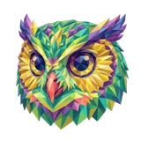

# 🦉 Owl

## Profile

- Repository: [nocoo/owl](https://github.com/nocoo/owl)
- Website: No current website verified; navigation opens the repository.
- Website evidence: Not applicable
- Category: tools
- Archived repository: No; [repository status evidence](../sources/repository-status-2026-09-06.json)
- English: A macOS menu bar lookout that spots unusual patterns in your system logs.
- Chinese: 守在 macOS 菜单栏里的观察员，从系统日志中发现异常信号。
- Profile section: Recent Projects
- Profile revision: `9a7ad63e1e96428f9dcd12214bcdbd470b3b51c6`
- Repository revision inspected: `73c292ea59ed8ccaf8dfd1e6d1d57f80e8be7ed3`

## Current logo

- Type: Original project artwork, copied without modification
- Subject: Multicolored owl portrait
- [Source](https://github.com/nocoo/owl/blob/73c292ea59ed8ccaf8dfd1e6d1d57f80e8be7ed3/owl.png): `owl.png`
- [Preserved asset](../../public/logos/originals/owl.png)
- Original dimensions: 2048 × 2048
- Original size: 4831043 bytes
- SHA-256: `f579214edd8876dacaa55d27c35c3598d3f809e651e4d3537d6d228823b5f413`
- Locally modified source: No
- Display derivatives: 32, 64, 160, and 1024 px WebP; contain-fit, transparent padding, no recoloring or cropping.

## Current palette

| Role | Value | Evidence |
| --- | --- | --- |
| primary | `#1c6972` | Preserved project artwork, dominant colored pixels |
| background | `transparent` | Preserved project artwork, transparent background |
| accent | `#e3ab46` | Preserved project artwork, sampled pixel |
| accent | `#65418d` | Preserved project artwork, sampled pixel |
| accent | `#b18630` | Preserved project artwork, sampled pixel |

Theme tokens take precedence. Additional colors are sampled from the preserved artwork. A transparent background means the source does not define an opaque background; the gallery's surrounding paper is not part of the project palette.

## Future family notes

Keep this asset as the phase-one baseline. A future family version should use a recognizable animal, one principal hue, and restrained multicolored geometric fragments.

Use head portraits for large animals and optionally full-body poses for small animals. Compare artwork, app icon, sidebar, and favicon sizes in both themes before adopting a replacement. No new logo is generated in phase one.
