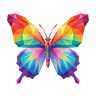

# 🦋 Xray

## Profile

- Repository: [nocoo/xray](https://github.com/nocoo/xray)
- Website: [https://xray.hexly.ai](https://xray.hexly.ai)
- Website evidence: GitHub repository homepage
- Category: everyday
- Archived repository: No; [repository status evidence](../sources/repository-status-2026-09-06.json)
- English: A closer look at your Twitter / X activity, with analytics and AI-powered reports.
- Chinese: 深入查看 Twitter / X 动态，用数据分析与 AI 报告理解自己的内容。
- Profile section: Recent Projects
- Profile revision: `9a7ad63e1e96428f9dcd12214bcdbd470b3b51c6`
- Repository revision inspected: `16175dc87ef406e8cf3343ab8808b60e8f53cc8a`

## Project goal

Collect X / Twitter and custom-source content into watchlists, then read, translate, and save links from one timeline.

将 X / Twitter 与自定义来源的内容按关注列表收集，在同一时间线中阅读、翻译和保存链接。

- [中文 README](https://github.com/nocoo/xray/blob/main/README.md) · [English README](https://github.com/nocoo/xray/blob/main/docs/README.en.md)
- Verified: 2026-09-08; [source revision](https://github.com/nocoo/xray/tree/f0864583697a734b7279087b9a1de8d3a1a18bff)
- Source files: [`package.json`](https://github.com/nocoo/xray/blob/f0864583697a734b7279087b9a1de8d3a1a18bff/package.json), [`packages/ui/package.json`](https://github.com/nocoo/xray/blob/f0864583697a734b7279087b9a1de8d3a1a18bff/packages/ui/package.json), [`packages/worker/package.json`](https://github.com/nocoo/xray/blob/f0864583697a734b7279087b9a1de8d3a1a18bff/packages/worker/package.json), [`packages/worker/wrangler.toml`](https://github.com/nocoo/xray/blob/f0864583697a734b7279087b9a1de8d3a1a18bff/packages/worker/wrangler.toml), [`packages/worker/src/index.ts`](https://github.com/nocoo/xray/blob/f0864583697a734b7279087b9a1de8d3a1a18bff/packages/worker/src/index.ts), [`packages/worker/src/routes/ingest-push.ts`](https://github.com/nocoo/xray/blob/f0864583697a734b7279087b9a1de8d3a1a18bff/packages/worker/src/routes/ingest-push.ts), [`packages/worker/src/lib/ai-client.ts`](https://github.com/nocoo/xray/blob/f0864583697a734b7279087b9a1de8d3a1a18bff/packages/worker/src/lib/ai-client.ts), [`scripts/refresh-watchlists.ts`](https://github.com/nocoo/xray/blob/f0864583697a734b7279087b9a1de8d3a1a18bff/scripts/refresh-watchlists.ts)

### Tech stack

| Technology | Role | 用途 |
| --- | --- | --- |
| TypeScript | UI, API, and collection scripts | 界面、API 与采集脚本 |
| React | Reading interface | 阅读界面 |
| Vite | Web development and bundling | Web 开发与构建 |
| Hono | HTTP API | HTTP API |
| Cloudflare Workers | Application and ingest hosting | 应用与内容接入托管 |
| Cloudflare D1 | Watchlists, content, and settings | 关注列表、内容与设置存储 |
| Cloudflare Access | Browser authentication | 浏览器登录 |

## Current logo

- Type: Original project artwork, copied without modification
- Subject: Original multicolored butterfly with complete spread wings
- [Source](https://github.com/nocoo/xray/blob/16175dc87ef406e8cf3343ab8808b60e8f53cc8a/logo.png): `logo.png`
- [Preserved asset](../../public/logos/originals/xray.png)
- Original dimensions: 2048 × 2048
- Original size: 3318716 bytes
- SHA-256: `912d89234012d2bd1ef3623aeff8824efc274fdb77d8317200784bb1f02cd023`
- Locally modified source: No
- Display derivatives: 32, 64, 160, and 1024 px WebP; contain-fit, transparent padding, no recoloring or cropping.

## Current palette

| Role | Value | Evidence |
| --- | --- | --- |
| primary | `#3653e2` | packages/ui/src/index.css --primary: 230 75% 55% |
| background | `#eeeff2` | packages/ui/src/index.css --background: 220 14% 94% |
| accent | `#f6bc36` | Native xray 912d89234012, sampled sRGB pixel (1371, 523); artwork/logo-family/xray/2026-09-07-01/palette.json |
| accent | `#961b54` | Native xray 912d89234012, sampled sRGB pixel (176, 366); artwork/logo-family/xray/2026-09-07-01/palette.json |
| accent | `#991c56` | Native xray 912d89234012, sampled sRGB pixel (178, 364); artwork/logo-family/xray/2026-09-07-01/palette.json |

Theme tokens take precedence. Additional colors are sampled from the preserved artwork. A transparent background means the source does not define an opaque background; the gallery's surrounding paper is not part of the project palette.

## Refined identity

- Status: Adopted in the source project; updated 2026-09-07.
- Study `2026-09-07-01`, finishing `01`
- Refined subject: Original multicolored butterfly with complete spread wings
- Site path: `/logos/xray`; [local gallery](https://index.dev.hexly.ai/logos/xray)
- [Static review HTML](../../artwork/logo-family/xray/2026-09-07-01/review.html)
- [Full process archive](https://github.com/nocoo/hexly.ai/tree/main/artwork/logo-family/xray/2026-09-07-01)
- [Transparent foreground](../../public/logos/family/xray/2026-09-07-01/01/transparent.png); SHA-256: `912d89234012d2bd1ef3623aeff8824efc274fdb77d8317200784bb1f02cd023`
- [Square icon](../../public/logos/family/xray/2026-09-07-01/01/icon.png), [rounded icon](../../public/logos/family/xray/2026-09-07-01/01/rounded.png), [white version](../../public/logos/family/xray/2026-09-07-01/01/white.png)
- [Untouched original](../../public/logos/family/xray/2026-09-07-01/01/source.png), [presentation brief](../../public/logos/family/xray/2026-09-07-01/01/brief.txt), [public asset checksums](../../public/logos/family/xray/2026-09-07-01/01/manifest.json)
- [Previous original](../../public/logos/originals/xray.png), copied from [its immutable source](https://github.com/nocoo/xray/blob/c6653da2d564576c9fe85346477d2830ebeabdc0/packages/worker/static/logo.png)
- Previous SHA-256: `912d89234012d2bd1ef3623aeff8824efc274fdb77d8317200784bb1f02cd023`
- Original artwork retained byte-for-byte at native 2048 × 2048. Zero image-generation calls; only background, grain, and shadow layers were composed.
- The finishing archive includes transparent, square, and rounded PNGs at 2048, 1024, 512, 256, 128, 64, 48, 32, 24, and 16 px.
- Application previews use the refined square icon without extra padding, backgrounds, or circular masks. Artwork previews and downloads use its own transparent foreground, independently of the preserved source logo above.

### Refined palette

| Role | Value | Evidence |
| --- | --- | --- |
| background | `#756584` | Selected Xray presentation, 2026-09-07-01/01; background.base in archived settings.json |
| primary | `#f24d31` | Native xray 912d89234012, sampled sRGB pixel (424, 344); artwork/logo-family/xray/2026-09-07-01/palette.json |
| accent | `#f6bc36` | Native xray 912d89234012, sampled sRGB pixel (1371, 523); artwork/logo-family/xray/2026-09-07-01/palette.json |
| accent | `#961b54` | Native xray 912d89234012, sampled sRGB pixel (176, 366); artwork/logo-family/xray/2026-09-07-01/palette.json |
| accent | `#991c56` | Native xray 912d89234012, sampled sRGB pixel (178, 364); artwork/logo-family/xray/2026-09-07-01/palette.json |

### Wings kept whole

The owner-selected butterfly keeps its exact native position, silhouette and colorful wing pattern. Both sides of the comparison use the same foreground.

保留原来蝴蝶的位置、轮廓与多彩翼纹。前后对比使用完全相同的透明主体。

### The original carries the color

Coral, gold, turquoise and violet facets remain untouched. This is a presentation pass with zero image-generation requests.

珊瑚、金黄、松石与紫色色面全部保留。本轮只完善展示，没有调用生图模型。

### Wing-vein panels

Unequal, open wing-vein panels meet on a muted plum field. The broad seams and soft contact shadow let the vivid butterfly stay in front.

不等宽的开放翼脉面板铺在柔和梅紫底色上，宽阔接缝与浅接触阴影托起鲜艳的蝴蝶。

Small-size observation: The original 2048 px foreground and placement are retained exactly. Existing nearest rounded-outline clearance is 124.61 px with no clipped pixels. Fine facets and small sparks simplify at 16 px; app and browser marks use the transparent source.

## Further refinements

Keep this asset as the phase-one baseline. A future family version should use a recognizable animal, one principal hue, and restrained multicolored geometric fragments.

Use head portraits for large animals and optionally full-body poses for small animals. Compare artwork, app icon, sidebar, and favicon sizes in both themes before adopting a replacement. Preserve this reviewed composition and its archived predecessors.
