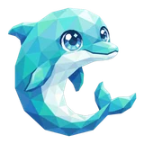

# 🐬 R2Shot

## Profile

- Repository: [nocoo/r2shot](https://github.com/nocoo/r2shot)
- Website: No current website verified; navigation opens the repository.
- Website evidence: Not applicable
- Category: tools
- English: Capture a screenshot, upload it to R2, and have a shareable link on your clipboard.
- Chinese: 截图、上传到 R2，再把可分享的链接放进剪贴板，一次完成。
- Profile section: Recent Projects
- Profile revision: `9a7ad63e1e96428f9dcd12214bcdbd470b3b51c6`
- Repository revision inspected: `761799416deb2a977eee92b2392746e16f6bc644`

## Current logo

- Type: Original project artwork, copied without modification
- Subject: Blue dolphin
- [Source](https://github.com/nocoo/r2shot/blob/761799416deb2a977eee92b2392746e16f6bc644/logo.png): `logo.png`
- [Preserved asset](../../public/logos/originals/r2shot.png)
- Original dimensions: 920 × 920
- Original size: 668704 bytes
- SHA-256: `17e2f07d03a8de29731fbb9fc0e91ea3182de24a46b2b3af79a8b73e4ac94ec1`
- Locally modified source: No
- Display derivatives: 32, 64, 160, and 1024 px WebP; contain-fit, transparent padding, no recoloring or cropping.

## Current palette

| Role | Value | Evidence |
| --- | --- | --- |
| primary | `#24c4bd` | src/shared/index.css --color-primary: #24c4bd |
| background | `#ffffff` | src/shared/index.css --color-background: #ffffff |
| accent | `#dbffff` | Preserved project artwork, sampled pixel |
| accent | `#3fc2cf` | Preserved project artwork, sampled pixel |
| accent | `#198cba` | Preserved project artwork, sampled pixel |

Theme tokens take precedence. Additional colors are sampled from the preserved artwork. A transparent background means the source does not define an opaque background; the gallery's surrounding paper is not part of the project palette.

## Future family notes

Keep this asset as the phase-one baseline. A future family version should use a recognizable animal, one principal hue, and restrained multicolored geometric fragments.

Use head portraits for large animals and optionally full-body poses for small animals. Compare artwork, app icon, sidebar, and favicon sizes in both themes before adopting a replacement. No new logo is generated in phase one.
