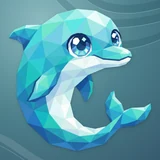

# 🐬 R2Shot

## Profile

- Repository: [nocoo/r2shot](https://github.com/nocoo/r2shot)
- Website: [https://chromewebstore.google.com/detail/r2shot/chhcpjnlcbomogddjockcpjjpiijogha](https://chromewebstore.google.com/detail/r2shot/chhcpjnlcbomogddjockcpjjpiijogha)
- Website evidence: Chrome Web Store link in repository README.md at d69714a2332066c9c7b1792f919607a4b776eade
- Category: tools
- Archived repository: No; [repository status evidence](../sources/repository-status-2026-09-06.json)
- English: Capture a screenshot, upload it to R2, and have a shareable link on your clipboard.
- Chinese: 截图、上传到 R2，再把可分享的链接放进剪贴板，一次完成。
- Profile section: Recent Projects
- Profile revision: `9a7ad63e1e96428f9dcd12214bcdbd470b3b51c6`
- Repository revision inspected: `d69714a2332066c9c7b1792f919607a4b776eade`

## Current logo

- Type: Original project artwork, copied without modification
- Subject: Blue dolphin
- [Source](https://github.com/nocoo/r2shot/blob/d69714a2332066c9c7b1792f919607a4b776eade/logo.png): `logo.png`
- [Preserved asset](../../public/logos/originals/r2shot.png)
- Original dimensions: 920 × 920
- Original size: 668704 bytes
- SHA-256: `17e2f07d03a8de29731fbb9fc0e91ea3182de24a46b2b3af79a8b73e4ac94ec1`
- Locally modified source: No
- Display derivatives: 32, 64, 160, and 1024 px WebP; contain-fit, transparent padding, no recoloring or cropping.

## Current palette

| Role | Value | Evidence |
| --- | --- | --- |
| primary | `#24c4bd` | src/shared/index.css --color-primary: #24c4bd |
| background | `#ffffff` | src/shared/index.css --color-background: #ffffff |
| accent | `#dbffff` | Preserved project artwork, sampled pixel |
| accent | `#3fc2cf` | Preserved project artwork, sampled pixel |
| accent | `#198cba` | Preserved project artwork, sampled pixel |

Theme tokens take precedence. Additional colors are sampled from the preserved artwork. A transparent background means the source does not define an opaque background; the gallery's surrounding paper is not part of the project palette.

## Refined identity

- Status: Adopted in the source project; updated 2026-09-07.
- Study `2026-09-07-01`, finishing `01`
- Refined subject: Original blue faceted dolphin with a curled tail
- Site path: `/logos/r2shot`; [local gallery](https://index.dev.hexly.ai/logos/r2shot)
- [Static review HTML](../../artwork/logo-family/r2shot/2026-09-07-01/review.html)
- [Full process archive](https://github.com/nocoo/hexly.ai/tree/main/artwork/logo-family/r2shot/2026-09-07-01)
- [Transparent foreground](../../public/logos/family/r2shot/2026-09-07-01/01/transparent.png); SHA-256: `17e2f07d03a8de29731fbb9fc0e91ea3182de24a46b2b3af79a8b73e4ac94ec1`
- [Square icon](../../public/logos/family/r2shot/2026-09-07-01/01/icon.png), [rounded icon](../../public/logos/family/r2shot/2026-09-07-01/01/rounded.png), [white version](../../public/logos/family/r2shot/2026-09-07-01/01/white.png)
- [Untouched original](../../public/logos/family/r2shot/2026-09-07-01/01/source.png), [presentation brief](../../public/logos/family/r2shot/2026-09-07-01/01/brief.txt), [public asset checksums](../../public/logos/family/r2shot/2026-09-07-01/01/manifest.json)
- [Previous original](../../public/logos/originals/r2shot.png), copied from [its immutable source](https://github.com/nocoo/r2shot/blob/761799416deb2a977eee92b2392746e16f6bc644/logo.png)
- Previous SHA-256: `17e2f07d03a8de29731fbb9fc0e91ea3182de24a46b2b3af79a8b73e4ac94ec1`
- Original artwork retained byte-for-byte at native 920 × 920. Zero image-generation calls; only background, grain, and shadow layers were composed.
- The finishing archive includes transparent, square, and rounded PNGs at 2048, 1024, 512, 256, 128, 64, 48, 32, 24, and 16 px. Sizes above 920 px are explicitly recorded upscales; the native transparent master is unchanged.
- Application previews use the refined square icon without extra padding, backgrounds, or circular masks. Artwork previews and downloads use its own transparent foreground, independently of the preserved source logo above.

### Refined palette

| Role | Value | Evidence |
| --- | --- | --- |
| background | `#4d818c` | Selected R2Shot presentation, finishing 01; background.base in archived settings.json |
| primary | `#3fc2d0` | Original r2shot 17e2f07d03a8, sampled sRGB pixel (568, 298); palette.json |
| accent | `#198eba` | Original r2shot 17e2f07d03a8, sampled sRGB pixel (217, 676); palette.json |
| accent | `#dbffff` | Original r2shot 17e2f07d03a8, sampled sRGB pixel (494, 280); palette.json |
| accent | `#143361` | Original r2shot 17e2f07d03a8, sampled sRGB pixel (653, 181); palette.json |
| accent | `#2ebad5` | Original r2shot 17e2f07d03a8, sampled sRGB pixel (854, 632); palette.json |

### The same playful turn

The dolphin, curled tail, camera, and original margins are retained exactly. Its complete silhouette stays inside the rounded tile; no crop or artificial extension was added.

海豚、卷曲尾鳍、视角和原有边距全部保留。完整轮廓位于圆角之内，没有裁切或补画。

### Every original facet

Cyan, turquoise, blue, and pale belly planes remain the original transparent artwork. The bright eyes and sweeping tail keep their existing gesture; no new decoration or model generation was needed.

青色、蓝色和浅色腹部均沿用原来的透明图像。明亮眼神与回卷尾鳍保留原有动作，没有新增装饰，也没有重新生图。

### A quiet teal wake

Oblique wave crests follow the empty upper-right field. A deep teal gradient, fine grain, and shallow contact shadows give the retained flat artwork a tactile setting.

斜向水波穿过右上方的留白，搭配深青渐变、细微颗粒和轻浅接触阴影，为原来的平面主体加上纸面质感。

Small-size observation: The curled blue silhouette and pale face stay recognizable at toolbar size. At 16 px, individual facets and eye highlights simplify; use the transparent foreground there. Native source: 920 px; 1024/2048 px exports are upscales.

## Further refinements

Keep this asset as the phase-one baseline. A future family version should use a recognizable animal, one principal hue, and restrained multicolored geometric fragments.

Use head portraits for large animals and optionally full-body poses for small animals. Compare artwork, app icon, sidebar, and favicon sizes in both themes before adopting a replacement. Preserve this reviewed composition and its archived predecessors.
