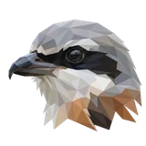
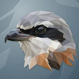

# 🪶 Shrike

## Profile

- Repository: [nocoo/shrike](https://github.com/nocoo/shrike)
- Website: No current website verified; navigation opens the repository.
- Website evidence: Not applicable
- Category: tools
- Archived repository: No; [repository status evidence](../sources/repository-status-2026-09-06.json)
- English: A small macOS menu bar app that keeps your files in sync with Google Drive.
- Chinese: 轻巧的 macOS 菜单栏工具，把文件和文件夹同步到 Google Drive。
- Profile section: Recent Projects
- Profile revision: `9a7ad63e1e96428f9dcd12214bcdbd470b3b51c6`
- Repository revision inspected: `0fec187fc22742664925897400d0c1a62b2478bb`

## Current logo

- Type: Original project artwork, copied without modification
- Subject: Shrike portrait
- [Source](https://github.com/nocoo/shrike/blob/0fec187fc22742664925897400d0c1a62b2478bb/logo.png): `logo.png`
- [Preserved asset](../../public/logos/originals/shrike.png)
- Original dimensions: 2048 × 2048
- Original size: 3750012 bytes
- SHA-256: `97692ebf5b7811eb48005f814a5688bc05d582533adab440636295370a60befa`
- Locally modified source: No
- Display derivatives: 32, 64, 160, and 1024 px WebP; contain-fit, transparent padding, no recoloring or cropping.

## Current palette

| Role | Value | Evidence |
| --- | --- | --- |
| primary | `#86502c` | src/app/globals.css --primary: oklch(0.486 0.088 52.8) |
| background | `#fffbf9` | src/app/globals.css --background: oklch(0.99 0.005 53) |
| accent | `#a0a2a6` | Preserved project artwork, sampled pixel |
| accent | `#1a1918` | Preserved project artwork, sampled pixel |
| accent | `#c5c7ce` | Preserved project artwork, sampled pixel |

Theme tokens take precedence. Additional colors are sampled from the preserved artwork. A transparent background means the source does not define an opaque background; the gallery's surrounding paper is not part of the project palette.

## Refined identity

- Status: Adopted in the source project; updated 2026-09-07.
- Study `2026-09-07-01`, finishing `01`
- Refined subject: Original grey faceted shrike with a dark eye mask
- Site path: `/logos/shrike`; [local gallery](https://index.dev.hexly.ai/logos/shrike)
- [Static review HTML](../../artwork/logo-family/shrike/2026-09-07-01/review.html)
- [Full process archive](https://github.com/nocoo/hexly.ai/tree/main/artwork/logo-family/shrike/2026-09-07-01)
- [Transparent foreground](../../public/logos/family/shrike/2026-09-07-01/01/transparent.png); SHA-256: `97692ebf5b7811eb48005f814a5688bc05d582533adab440636295370a60befa`
- [Square icon](../../public/logos/family/shrike/2026-09-07-01/01/icon.png), [rounded icon](../../public/logos/family/shrike/2026-09-07-01/01/rounded.png), [white version](../../public/logos/family/shrike/2026-09-07-01/01/white.png)
- [Untouched original](../../public/logos/family/shrike/2026-09-07-01/01/source.png), [presentation brief](../../public/logos/family/shrike/2026-09-07-01/01/brief.txt), [public asset checksums](../../public/logos/family/shrike/2026-09-07-01/01/manifest.json)
- [Previous original](../../public/logos/originals/shrike.png), copied from [its immutable source](https://github.com/nocoo/shrike/blob/9ca43106ca79f35f7b0ad77198b82150a2307b44/logo.png)
- Previous SHA-256: `97692ebf5b7811eb48005f814a5688bc05d582533adab440636295370a60befa`
- Original artwork retained byte-for-byte at native 2048 × 2048. Zero image-generation calls; only background, grain, and shadow layers were composed.
- The finishing archive includes transparent, square, and rounded PNGs at 2048, 1024, 512, 256, 128, 64, 48, 32, 24, and 16 px.
- Application previews use the refined square icon without extra padding, backgrounds, or circular masks. Artwork previews and downloads use its own transparent foreground, independently of the preserved source logo above.

### Refined palette

| Role | Value | Evidence |
| --- | --- | --- |
| background | `#718591` | Selected Shrike presentation, finishing 01; background.base in archived settings.json |
| primary | `#a0a1a6` | Original shrike 97692ebf5b78, sampled sRGB pixel (1363, 324); palette.json |
| accent | `#c4c7ce` | Original shrike 97692ebf5b78, sampled sRGB pixel (1081, 284); palette.json |
| accent | `#1a1a18` | Original shrike 97692ebf5b78, sampled sRGB pixel (1091, 636); palette.json |
| accent | `#b7936f` | Original shrike 97692ebf5b78, sampled sRGB pixel (1197, 1367); palette.json |
| accent | `#576475` | Original shrike 97692ebf5b78, sampled sRGB pixel (322, 801); palette.json |

### Keep the watchful profile

The original head, hooked beak, eye mask, shoulders, and canvas are preserved exactly. The existing compact silhouette stays the source of every foreground size.

头部、钩状鸟喙、眼罩、肩羽和画布全部原样保留，现有紧凑轮廓是所有透明尺寸的唯一来源。

### Silver facets, dark mask

The silver crown, charcoal eye band, blue-grey beak, and warm shoulder facets are untouched. No new ornament or image-generation call is needed for this retained identity.

银灰头顶、炭黑眼带、蓝灰鸟喙与暖色肩羽均未修改。这次沿用既有形象，不增加装饰或调用生图。

### Angular paper folds

Oversized angular pleats enter a slate field from opposite corners. Narrow edge highlights and a low shadow give the grey bird separation without adding a scene.

大幅折翼纹从对角进入石板色底面，细边高光和轻浅阴影让灰色主体清晰浮现，保持图标简洁。

Small-size observation: The beak and dark eye band carry the mark at small sizes. Menu bar template icons keep their existing monochrome silhouette; app, toolbar, and browser derivatives retain their distinct roles.

## Further refinements

Keep this asset as the phase-one baseline. A future family version should use a recognizable animal, one principal hue, and restrained multicolored geometric fragments.

Use head portraits for large animals and optionally full-body poses for small animals. Compare artwork, app icon, sidebar, and favicon sizes in both themes before adopting a replacement. Preserve this reviewed composition and its archived predecessors.
