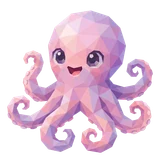
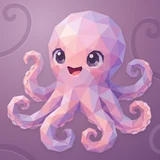

# 🐙 Hooky

## Profile

- Repository: [nocoo/hooky](https://github.com/nocoo/hooky)
- Website: [https://chromewebstore.google.com/detail/hooky/almccnkbhfhckimediabjimflnbfbeeo](https://chromewebstore.google.com/detail/hooky/almccnkbhfhckimediabjimflnbfbeeo)
- Website evidence: Chrome Web Store link in repository README.md at 8ebc6aa82c51ad0bed4b6684c1c12d9e7b2a3f5a
- Category: tools
- Archived repository: No; [repository status evidence](../sources/repository-status-2026-09-06.json)
- English: Send webhooks from your browser toolbar, context menu, or a quick message.
- Chinese: 从浏览器工具栏、右键菜单或快捷消息中，随手触发 Webhook。
- Profile section: Recent Projects
- Profile revision: `9a7ad63e1e96428f9dcd12214bcdbd470b3b51c6`
- Repository revision inspected: `8ebc6aa82c51ad0bed4b6684c1c12d9e7b2a3f5a`

## Project goal

Send page URLs, titles, selections, and metadata to configured webhooks from Chrome, using a popup, context menu, or click-triggered rules.

通过 Chrome 弹窗、右键菜单或点击触发的规则，将页面 URL、标题、选区和元数据发送到指定 Webhook。

- [中文 README](https://github.com/nocoo/hooky/blob/main/README.md) · [English README](https://github.com/nocoo/hooky/blob/main/docs/README.en.md)
- Verified: 2026-09-08; [source revision](https://github.com/nocoo/hooky/tree/8ebc6aa82c51ad0bed4b6684c1c12d9e7b2a3f5a)
- Source files: [`manifest.json`](https://github.com/nocoo/hooky/blob/8ebc6aa82c51ad0bed4b6684c1c12d9e7b2a3f5a/manifest.json), [`package.json`](https://github.com/nocoo/hooky/blob/8ebc6aa82c51ad0bed4b6684c1c12d9e7b2a3f5a/package.json), [`src/background.js`](https://github.com/nocoo/hooky/blob/8ebc6aa82c51ad0bed4b6684c1c12d9e7b2a3f5a/src/background.js), [`src/quicksend.js`](https://github.com/nocoo/hooky/blob/8ebc6aa82c51ad0bed4b6684c1c12d9e7b2a3f5a/src/quicksend.js), [`src/rules.js`](https://github.com/nocoo/hooky/blob/8ebc6aa82c51ad0bed4b6684c1c12d9e7b2a3f5a/src/rules.js), [`src/store.js`](https://github.com/nocoo/hooky/blob/8ebc6aa82c51ad0bed4b6684c1c12d9e7b2a3f5a/src/store.js), [`src/pagecontext.js`](https://github.com/nocoo/hooky/blob/8ebc6aa82c51ad0bed4b6684c1c12d9e7b2a3f5a/src/pagecontext.js), [`src/webhook.js`](https://github.com/nocoo/hooky/blob/8ebc6aa82c51ad0bed4b6684c1c12d9e7b2a3f5a/src/webhook.js), [`src/params.js`](https://github.com/nocoo/hooky/blob/8ebc6aa82c51ad0bed4b6684c1c12d9e7b2a3f5a/src/params.js), [`tests/e2e/extension.e2e.js`](https://github.com/nocoo/hooky/blob/8ebc6aa82c51ad0bed4b6684c1c12d9e7b2a3f5a/tests/e2e/extension.e2e.js)

### Tech stack

| Technology | Role | 用途 |
| --- | --- | --- |
| JavaScript / HTML / CSS | Extension logic and UI | 扩展逻辑与界面 |
| Chrome Extensions Manifest V3 | Service worker and browser integration | Service worker 与浏览器集成 |
| chrome.storage.local | Local templates and rules | 本地模板与规则 |
| Fetch API | Webhook requests | Webhook 请求 |
| Vitest / jsdom | Unit and DOM tests | 单元与 DOM 测试 |
| Puppeteer | Browser end-to-end tests | 浏览器端到端测试 |

## Current logo

- Type: Original project artwork, copied without modification
- Subject: Pink octopus
- [Source](https://github.com/nocoo/hooky/blob/8ebc6aa82c51ad0bed4b6684c1c12d9e7b2a3f5a/logo.png): `logo.png`
- [Preserved asset](../../public/logos/originals/hooky.png)
- Original dimensions: 900 × 900
- Original size: 667627 bytes
- SHA-256: `7e98ee9d581e9f5f70fadc239a60b6d0204f62f8586d9e1e8ee7b0ef7106fe62`
- Locally modified source: No
- Display derivatives: 32, 64, 160, and 1024 px WebP; contain-fit, transparent padding, no recoloring or cropping.

## Current palette

| Role | Value | Evidence |
| --- | --- | --- |
| primary | `#9666b7` | src/popup/popup.css .btn-primary background-color: #9666b7 |
| background | `#ffffff` | src/popup/popup.css body background-color: #ffffff |
| accent | `#b771af` | Preserved project artwork, sampled pixel |
| accent | `#ffdbee` | Preserved project artwork, sampled pixel |
| accent | `#42274d` | Preserved project artwork, sampled pixel |

Theme tokens take precedence. Additional colors are sampled from the preserved artwork. A transparent background means the source does not define an opaque background; the gallery's surrounding paper is not part of the project palette.

## Refined identity

- Status: Adopted in the source project; updated 2026-09-07.
- Study `2026-09-07-01`, finishing `01`
- Refined subject: Original pink faceted octopus with curled arms
- Site path: `/logos/hooky`; [local gallery](https://index.dev.hexly.ai/logos/hooky)
- [Static review HTML](../../artwork/logo-family/hooky/2026-09-07-01/review.html)
- [Full process archive](https://github.com/nocoo/hexly.ai/tree/main/artwork/logo-family/hooky/2026-09-07-01)
- [Transparent foreground](../../public/logos/family/hooky/2026-09-07-01/01/transparent.png); SHA-256: `7e98ee9d581e9f5f70fadc239a60b6d0204f62f8586d9e1e8ee7b0ef7106fe62`
- [Square icon](../../public/logos/family/hooky/2026-09-07-01/01/icon.png), [rounded icon](../../public/logos/family/hooky/2026-09-07-01/01/rounded.png), [white version](../../public/logos/family/hooky/2026-09-07-01/01/white.png)
- [Untouched original](../../public/logos/family/hooky/2026-09-07-01/01/source.png), [presentation brief](../../public/logos/family/hooky/2026-09-07-01/01/brief.txt), [public asset checksums](../../public/logos/family/hooky/2026-09-07-01/01/manifest.json)
- [Previous original](../../public/logos/originals/hooky.png), copied from [its immutable source](https://github.com/nocoo/hooky/blob/fadcde05a823356775a9c27005a701d6d107e955/assets/hooky-max.png)
- Previous SHA-256: `7e98ee9d581e9f5f70fadc239a60b6d0204f62f8586d9e1e8ee7b0ef7106fe62`
- Original artwork retained byte-for-byte at native 900 × 900. Zero image-generation calls; only background, grain, and shadow layers were composed.
- The finishing archive includes transparent, square, and rounded PNGs at 2048, 1024, 512, 256, 128, 64, 48, 32, 24, and 16 px. Sizes above 900 px are explicitly recorded upscales; the native master retains its recorded resolution.
- Application previews use the refined square icon without extra padding, backgrounds, or circular masks. Artwork previews and downloads use its own transparent foreground, independently of the preserved source logo above.

### Refined palette

| Role | Value | Evidence |
| --- | --- | --- |
| background | `#9d7097` | Selected Hooky presentation, finishing 01; background.base in archived settings.json |
| primary | `#e9a5bf` | Original hooky 7e98ee9d581e, sampled sRGB pixel (313, 260); palette.json |
| accent | `#b771af` | Original hooky 7e98ee9d581e, sampled sRGB pixel (262, 528); palette.json |
| accent | `#fedced` | Original hooky 7e98ee9d581e, sampled sRGB pixel (376, 129); palette.json |
| accent | `#8b4e93` | Original hooky 7e98ee9d581e, sampled sRGB pixel (573, 606); palette.json |
| accent | `#42274d` | Original hooky 7e98ee9d581e, sampled sRGB pixel (556, 340); palette.json |

### A complete little octopus

The head, expression, curled arms, and native spacing are unchanged. Every visible arm remains clear of the rounded boundary. The original foreground is preserved byte-for-byte.

头部、表情、腕足与原有留白保持不变。所有可见腕足都位于圆角边界之内，透明原图逐字节保留。

### Keep the gentle facets

The pink-to-lilac planes and violet curls already belong to the family. Their existing motion supplies the character; this pass adds no accessory and makes no image-generation call.

粉色到丁香紫的色面与紫色卷曲腕足已经具备家族风格。原来的动态继续承担表情，这次没有新增配饰或调用生图。

### Softly curled relief

Open hook-shaped channels enter a muted plum field from different edges. Fine grain, offset highlights, and low contact shadows keep the background tactile and the octopus prominent.

开口的卷曲沟纹从不同边缘进入柔和梅紫底色，细颗粒、偏移高光和轻浅阴影带来触感，同时突出章鱼主体。

Small-size observation: At 32 px the pink head and violet curls carry the mark. At 16 px the small arm gaps and facets merge; toolbar and tab marks use the transparent source. Native source: 900 px; 1024/2048 px exports are upscales.

## Further refinements

Keep this asset as the phase-one baseline. A future family version should use a recognizable animal, one principal hue, and restrained multicolored geometric fragments.

Use head portraits for large animals and optionally full-body poses for small animals. Compare artwork, app icon, sidebar, and favicon sizes in both themes before adopting a replacement. Preserve this reviewed composition and its archived predecessors.
