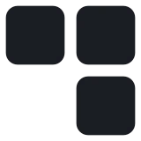
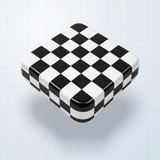

# 🔲 Dotty

## Profile

- Repository: [nocoo/dotty](https://github.com/nocoo/dotty)
- Website: [https://dotty.hexly.ai](https://dotty.hexly.ai)
- Website evidence: GitHub repository homepage
- Category: design
- Archived repository: No; [repository status evidence](../sources/repository-status-2026-09-06.json)
- English: A pixel-brutalist dashboard kit with monochrome geometry and stacked charts.
- Chinese: 像素与粗野主义风格的仪表盘模板，使用单色几何元素和堆叠图表。
- Profile section: Recent Projects
- Profile revision: `9a7ad63e1e96428f9dcd12214bcdbd470b3b51c6`
- Repository revision inspected: `1becb8026f44a20d9827cd5b4f100b6fb09836fe`

## Project goal

Reuse dashboard layouts, controls, and charts to build data interfaces with a cool monochrome visual style.

复用看板布局、控件和图表，搭建采用冷色灰阶风格的数据界面。

- [中文 README](https://github.com/nocoo/dotty/blob/main/README.md) · [English README](https://github.com/nocoo/dotty/blob/main/docs/README.en.md)
- Verified: 2026-09-08; [source revision](https://github.com/nocoo/dotty/tree/1becb8026f44a20d9827cd5b4f100b6fb09836fe)
- Source files: [`package.json`](https://github.com/nocoo/dotty/blob/1becb8026f44a20d9827cd5b4f100b6fb09836fe/package.json), [`src/App.tsx`](https://github.com/nocoo/dotty/blob/1becb8026f44a20d9827cd5b4f100b6fb09836fe/src/App.tsx), [`src/index.css`](https://github.com/nocoo/dotty/blob/1becb8026f44a20d9827cd5b4f100b6fb09836fe/src/index.css), [`src/data/mock.ts`](https://github.com/nocoo/dotty/blob/1becb8026f44a20d9827cd5b4f100b6fb09836fe/src/data/mock.ts), [`src/components/PixelBarChart.tsx`](https://github.com/nocoo/dotty/blob/1becb8026f44a20d9827cd5b4f100b6fb09836fe/src/components/PixelBarChart.tsx), [`src/pages/NetworkOpsDashboardPage.tsx`](https://github.com/nocoo/dotty/blob/1becb8026f44a20d9827cd5b4f100b6fb09836fe/src/pages/NetworkOpsDashboardPage.tsx), [`src/pages/LoginPage.tsx`](https://github.com/nocoo/dotty/blob/1becb8026f44a20d9827cd5b4f100b6fb09836fe/src/pages/LoginPage.tsx), [`src/viewmodels/usePortfolioViewModel.ts`](https://github.com/nocoo/dotty/blob/1becb8026f44a20d9827cd5b4f100b6fb09836fe/src/viewmodels/usePortfolioViewModel.ts), [`src/i18n/index.ts`](https://github.com/nocoo/dotty/blob/1becb8026f44a20d9827cd5b4f100b6fb09836fe/src/i18n/index.ts), [`vite.config.ts`](https://github.com/nocoo/dotty/blob/1becb8026f44a20d9827cd5b4f100b6fb09836fe/vite.config.ts), [`wrangler.toml`](https://github.com/nocoo/dotty/blob/1becb8026f44a20d9827cd5b4f100b6fb09836fe/wrangler.toml)

### Tech stack

| Technology | Role | 用途 |
| --- | --- | --- |
| TypeScript | Interface and viewmodel logic | 界面与 viewmodel 逻辑 |
| React | Dashboard examples | 看板示例 |
| Vite | SPA development and build | SPA 开发与构建 |
| React Router | Client-side routes | 客户端路由 |
| Tailwind CSS | Themes and styling | 主题与样式 |
| Radix UI | Interactive controls | 交互控件 |
| Recharts | Data visualization | 数据可视化 |
| i18next | Chinese and English interface | 中英文界面 |
| Cloudflare Workers | Static asset hosting | 静态资源托管 |

## Current logo

- Type: Original project artwork, copied without modification
- Subject: Floating black-and-white checker ceramic block
- [Source](https://github.com/nocoo/dotty/blob/1becb8026f44a20d9827cd5b4f100b6fb09836fe/logo.png): `logo.png`
- [Preserved asset](../../public/logos/originals/dotty-family-2026-09-07-01-01.png)
- Original dimensions: 2048 × 2048
- Original size: 2227338 bytes
- SHA-256: `ac943ec8efec9c3c3436ad4a062d60b351bf536b62fd3a4753dbecb4d5bf6e4e`
- Locally modified source: No
- Display derivatives: 32, 64, 160, and 1024 px WebP; contain-fit, transparent padding, no recoloring or cropping.

## Current palette

| Role | Value | Evidence |
| --- | --- | --- |
| primary | `#16181d` | src/index.css --primary: 220 14% 10% |
| background | `#f3f4f6` | src/index.css --background: 220 14% 96% |
| accent | `#1a1c1d` | Native dotty 6bb29358898d, sampled sRGB pixel (1057, 943); artwork/logo-family/dotty/2026-09-07-01/palette.json |
| accent | `#fbfbfb` | Native dotty 6bb29358898d, sampled sRGB pixel (1059, 371); artwork/logo-family/dotty/2026-09-07-01/palette.json |
| accent | `#919699` | Native dotty 6bb29358898d, sampled sRGB pixel (1511, 1152); artwork/logo-family/dotty/2026-09-07-01/palette.json |

Theme tokens take precedence. Additional colors are sampled from the preserved artwork. A transparent background means the source does not define an opaque background; the gallery's surrounding paper is not part of the project palette.

## Refined identity

- Status: Adopted in the source project; updated 2026-09-07.
- Study `2026-09-07-01`, finishing `01`
- Refined subject: Floating black-and-white checker ceramic block
- Site path: `/logos/dotty`; [local gallery](https://index.dev.hexly.ai/logos/dotty)
- [Static review HTML](../../artwork/logo-family/dotty/2026-09-07-01/review.html)
- [Full process archive](https://github.com/nocoo/hexly.ai/tree/main/artwork/logo-family/dotty/2026-09-07-01)
- [Transparent foreground](../../public/logos/family/dotty/2026-09-07-01/01/transparent.png); SHA-256: `ac943ec8efec9c3c3436ad4a062d60b351bf536b62fd3a4753dbecb4d5bf6e4e`
- [Square icon](../../public/logos/family/dotty/2026-09-07-01/01/icon.png), [rounded icon](../../public/logos/family/dotty/2026-09-07-01/01/rounded.png), [white version](../../public/logos/family/dotty/2026-09-07-01/01/white.png)
- [Untouched generation](../../public/logos/family/dotty/2026-09-07-01/01/raw.png), [exact prompt](../../public/logos/family/dotty/2026-09-07-01/01/prompt.txt), [public asset checksums](../../public/logos/family/dotty/2026-09-07-01/01/manifest.json)
- [Previous original](../../public/logos/originals/dotty.svg), copied from [its immutable source](https://github.com/nocoo/dotty/blob/33c0ffa370a7582d2655cac142e1e6bbff71e412/public/logo.svg)
- Previous SHA-256: `33c046a7f6647bd2af6d6e47c1e3d9b439e9a0d78773c94c3e2fa3a0ba842d49`
- Generation: gpt-image-2, native 2048 × 2048; transparent extraction and presentation are separate finishing steps.
- The finishing archive includes transparent, square, and rounded PNGs at 2048, 1024, 512, 256, 128, 64, 48, 32, 24, and 16 px.
- Application previews use the refined square icon without extra padding, backgrounds, or circular masks. Artwork previews and downloads use its own transparent foreground, independently of the preserved source logo above.

### Refined palette

| Role | Value | Evidence |
| --- | --- | --- |
| background | `#e5eaf1` | Selected Dotty presentation, 2026-09-07-01/01; background.base in archived settings.json |
| primary | `#1a1c1d` | Native dotty 6bb29358898d, sampled sRGB pixel (1057, 943); artwork/logo-family/dotty/2026-09-07-01/palette.json |
| accent | `#fbfbfb` | Native dotty 6bb29358898d, sampled sRGB pixel (1059, 371); artwork/logo-family/dotty/2026-09-07-01/palette.json |
| accent | `#919699` | Native dotty 6bb29358898d, sampled sRGB pixel (1511, 1152); artwork/logo-family/dotty/2026-09-07-01/palette.json |

### A suspended building block

A complete rounded square brick seen from an elevated three-quarter view, uniformly inset from every corner. The independent projected shadow makes its weight and hover gap legible.

完整的圆角厚方砖从斜上方呈现，整体统一缩放，为四角保留安全距离。独立投影表现重量与悬浮间隙。

### Opaque checker ceramic

Pure black and white inlays carry the identity. Physical ceramic shading, controlled reflections and soft bevels provide detail without a pixel-art treatment; white cells remain solid after extraction.

黑白镶嵌构成标识。陶瓷明暗、克制反光与柔和倒角提供精致细节，不使用像素画处理；白色格块在抠图后依然保持不透明。

### Precision drafting grid

Cool pale drafting paper uses fine Cartesian cells, larger construction divisions, registration crosses and a short ruler. Its separate soft floor shadow never enters transparent UI marks.

浅冷色制图纸配细笛卡尔网格、较大的工程分区、定位十字与短标尺。背景和柔和地面投影独立保存，小型透明标记不带底纹或阴影。

Small-size observation: At 128/64 px the checker rhythm, rounded thickness and hover shadow remain clear. At 32/24/16 px the transparent mark retains the alternating block silhouette; fine bevel reflections and drafting lines are deliberately left to the large presentation.

## Further refinements

This is an owner-directed physical material or architectural identity. Preserve its physical materials, complete silhouette, selected camera and distinct tonal presentation. The animal-series drawing and accessory rules do not apply.

Keep the complete object uniformly inset from the actual rounded outline, with backgrounds, projected shadows and any external emission separate from the transparent foreground. Compare artwork, app icon, sidebar, and favicon sizes in both themes before adopting a replacement. Preserve this reviewed composition and its archived predecessors.
