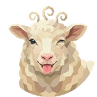
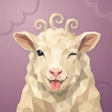

# 🐑 Wooly

## Profile

- Repository: [nocoo/wooly](https://github.com/nocoo/wooly)
- Website: No current website verified; navigation opens the repository.
- Website evidence: Not applicable
- Category: everyday
- Archived repository: No; [repository status evidence](../sources/repository-status-2026-09-06.json)
- English: Keep family perks in sight: card rewards, memberships, insurance, and expiry dates.
- Chinese: 把家庭的信用卡权益、会员、保险福利和到期时间放在眼前。
- Profile section: Recent Projects
- Profile revision: `9a7ad63e1e96428f9dcd12214bcdbd470b3b51c6`
- Repository revision inspected: `e516e1fbcbd146fcda6b80cf071bd5367e611afd`

## Current logo

- Type: Original project artwork, copied without modification
- Subject: Sheep portrait
- [Source](https://github.com/nocoo/wooly/blob/e516e1fbcbd146fcda6b80cf071bd5367e611afd/logo.png): `logo.png`
- [Preserved asset](../../public/logos/originals/wooly-family-2026-09-07-02-01.png)
- Original dimensions: 2048 × 2048
- Original size: 3895425 bytes
- SHA-256: `fc1f33d2e0f84f9498291f727a8ac0e6e3b822ffe947415ae1712ed1c987d12a`
- Locally modified source: No
- Display derivatives: 32, 64, 160, and 1024 px WebP; contain-fit, transparent padding, no recoloring or cropping.

## Current palette

| Role | Value | Evidence |
| --- | --- | --- |
| primary | `#dd3ca7` | src/app/globals.css --primary: 320 70% 55% |
| background | `#eeeff2` | src/app/globals.css --background: 220 14% 94% |
| accent | `#f3e6c4` | Native wooly 02c5ec40e8c1, sampled sRGB pixel (1254, 770); artwork/logo-family/wooly/2026-09-07-02/palette.json |
| accent | `#d4bc98` | Native wooly 02c5ec40e8c1, sampled sRGB pixel (538, 1304); artwork/logo-family/wooly/2026-09-07-02/palette.json |
| accent | `#ac806c` | Native wooly 02c5ec40e8c1, sampled sRGB pixel (1618, 562); artwork/logo-family/wooly/2026-09-07-02/palette.json |

Theme tokens take precedence. Additional colors are sampled from the preserved artwork. A transparent background means the source does not define an opaque background; the gallery's surrounding paper is not part of the project palette.

## Refined identity

- Status: Adopted in the source project; updated 2026-09-07.
- Study `2026-09-07-02`, finishing `01`
- Refined subject: Cream faceted sheep with three curls, a wink, and a pink tongue
- Site path: `/logos/wooly`; [local gallery](https://index.dev.hexly.ai/logos/wooly)
- [Static review HTML](../../artwork/logo-family/wooly/2026-09-07-02/review.html)
- [Full process archive](https://github.com/nocoo/hexly.ai/tree/main/artwork/logo-family/wooly/2026-09-07-02)
- [Transparent foreground](../../public/logos/family/wooly/2026-09-07-02/01/transparent.png); SHA-256: `fc1f33d2e0f84f9498291f727a8ac0e6e3b822ffe947415ae1712ed1c987d12a`
- [Square icon](../../public/logos/family/wooly/2026-09-07-02/01/icon.png), [rounded icon](../../public/logos/family/wooly/2026-09-07-02/01/rounded.png), [white version](../../public/logos/family/wooly/2026-09-07-02/01/white.png)
- [Untouched generation](../../public/logos/family/wooly/2026-09-07-02/01/raw.png), [exact prompt](../../public/logos/family/wooly/2026-09-07-02/01/prompt.txt), [public asset checksums](../../public/logos/family/wooly/2026-09-07-02/01/manifest.json)
- [Previous original](../../public/logos/originals/wooly.png), copied from [its immutable source](https://github.com/nocoo/wooly/blob/1eea8ada0a31fdd55b98062333ec4517f65609f4/logo.png)
- Previous SHA-256: `95798966dd1ac22371700d4845ab4537745484cfdf3ab323fbd61fbf0732ed36`
- Generation: gpt-image-2, native 2048 × 2048; transparent extraction and presentation are separate finishing steps.
- The finishing archive includes transparent, square, and rounded PNGs at 2048, 1024, 512, 256, 128, 64, 48, 32, 24, and 16 px.
- Application previews use the refined square icon without extra padding, backgrounds, or circular masks. Artwork previews and downloads use its own transparent foreground, independently of the preserved source logo above.

### Refined palette

| Role | Value | Evidence |
| --- | --- | --- |
| background | `#ad8093` | Selected Wooly presentation, 2026-09-07-02/01; background.base in archived settings.json |
| primary | `#f3e6c4` | Native wooly 02c5ec40e8c1, sampled sRGB pixel (1254, 770); artwork/logo-family/wooly/2026-09-07-02/palette.json |
| accent | `#d4bc98` | Native wooly 02c5ec40e8c1, sampled sRGB pixel (538, 1304); artwork/logo-family/wooly/2026-09-07-02/palette.json |
| accent | `#ac806c` | Native wooly 02c5ec40e8c1, sampled sRGB pixel (1618, 562); artwork/logo-family/wooly/2026-09-07-02/palette.json |
| accent | `#ef9790` | Native wooly 02c5ec40e8c1, sampled sRGB pixel (934, 1576); artwork/logo-family/wooly/2026-09-07-02/palette.json |
| accent | `#2c3441` | Native wooly 02c5ec40e8c1, sampled sRGB pixel (733, 846); artwork/logo-family/wooly/2026-09-07-02/palette.json |

### A mischievous pause

A portrait viewfinder catches the same wink and tongue as broad, natural fleece enters from below. The curls and ears have room inside the rounded frame.

取景框捕捉熟悉的眨眼和吐舌，宽厚而自然的羊毛从下方进入画面。卷毛和耳朵在圆角内保留充分余量。

### Cream planes, one pink gesture

Connected ivory and oat facets preserve the bright sheep identity. The tongue remains its single playful gesture; the pale anatomy stays opaque after extraction.

连续的象牙白与燕麦色面保持绵羊的明亮形象，舌头仍是单一俏皮动作，抠图后浅色身体保持不透明。

### Wool cloud folds

The selected deeper rose field keeps its uneven scalloped folds, fine grain, and shallow shadows. The background stays separate from the transparent animal.

沿用较深玫瑰底色、不均匀的云状褶皱、细颗粒与浅阴影，背景和透明动物独立保存。

Small-size observation: At 32 px, the cream ears, dark eye, and pink tongue carry the identity. The wink and tiny fleece facets simplify at 16 px; sidebar and browser marks use the transparent foreground.

## Further refinements

Keep this asset as the phase-one baseline. A future family version should use a recognizable animal, one principal hue, and restrained multicolored geometric fragments.

Use head portraits for large animals and optionally full-body poses for small animals. Compare artwork, app icon, sidebar, and favicon sizes in both themes before adopting a replacement. Preserve this reviewed composition and its archived predecessors.
