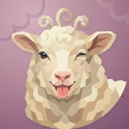

# 🐑 Wooly

## Profile

- Repository: [nocoo/wooly](https://github.com/nocoo/wooly)
- Website: No current website verified; navigation opens the repository.
- Website evidence: Not applicable
- Category: everyday
- Archived repository: No; [repository status evidence](../sources/repository-status-2026-09-06.json)
- English: Keep family perks in sight: card rewards, memberships, insurance, and expiry dates.
- Chinese: 把家庭的信用卡权益、会员、保险福利和到期时间放在眼前。
- Profile section: Recent Projects
- Profile revision: `9a7ad63e1e96428f9dcd12214bcdbd470b3b51c6`
- Repository revision inspected: `1eea8ada0a31fdd55b98062333ec4517f65609f4`

## Current logo

- Type: Original project artwork, copied without modification
- Subject: Sheep portrait
- [Source](https://github.com/nocoo/wooly/blob/1eea8ada0a31fdd55b98062333ec4517f65609f4/logo.png): `logo.png`
- [Preserved asset](../../public/logos/originals/wooly.png)
- Original dimensions: 2048 × 2048
- Original size: 4261802 bytes
- SHA-256: `95798966dd1ac22371700d4845ab4537745484cfdf3ab323fbd61fbf0732ed36`
- Locally modified source: No
- Display derivatives: 32, 64, 160, and 1024 px WebP; contain-fit, transparent padding, no recoloring or cropping.

## Current palette

| Role | Value | Evidence |
| --- | --- | --- |
| primary | `#dd3ca7` | src/app/globals.css --primary: 320 70% 55% |
| background | `#eeeff2` | src/app/globals.css --background: 220 14% 94% |
| accent | `#d4bc98` | Preserved project artwork, sampled pixel |
| accent | `#f3e5c4` | Preserved project artwork, sampled pixel |
| accent | `#ac806c` | Preserved project artwork, sampled pixel |

Theme tokens take precedence. Additional colors are sampled from the preserved artwork. A transparent background means the source does not define an opaque background; the gallery's surrounding paper is not part of the project palette.

## Refined identity

- Status: Adopted in the source project; updated 2026-09-07.
- Study `2026-09-07-01`, finishing `01`
- Refined subject: Original cream faceted sheep with a wink and pink tongue
- Site path: `/logos/wooly`; [local gallery](https://index.dev.hexly.ai/logos/wooly)
- [Static review HTML](../../artwork/logo-family/wooly/2026-09-07-01/review.html)
- [Full process archive](https://github.com/nocoo/hexly.ai/tree/main/artwork/logo-family/wooly/2026-09-07-01)
- [Transparent foreground](../../public/logos/family/wooly/2026-09-07-01/01/transparent.png); SHA-256: `95798966dd1ac22371700d4845ab4537745484cfdf3ab323fbd61fbf0732ed36`
- [Square icon](../../public/logos/family/wooly/2026-09-07-01/01/icon.png), [rounded icon](../../public/logos/family/wooly/2026-09-07-01/01/rounded.png), [white version](../../public/logos/family/wooly/2026-09-07-01/01/white.png)
- [Untouched original](../../public/logos/family/wooly/2026-09-07-01/01/source.png), [presentation brief](../../public/logos/family/wooly/2026-09-07-01/01/brief.txt), [public asset checksums](../../public/logos/family/wooly/2026-09-07-01/01/manifest.json)
- [Previous original](../../public/logos/originals/wooly.png), copied from [its immutable source](https://github.com/nocoo/wooly/blob/348dac5c402063de8ef6cf69f8c93f8da43347bf/logo.png)
- Previous SHA-256: `95798966dd1ac22371700d4845ab4537745484cfdf3ab323fbd61fbf0732ed36`
- Original artwork retained byte-for-byte at native 2048 × 2048. Zero image-generation calls; only background, grain, and shadow layers were composed.
- The finishing archive includes transparent, square, and rounded PNGs at 2048, 1024, 512, 256, 128, 64, 48, 32, 24, and 16 px.
- Application previews use the refined square icon without extra padding, backgrounds, or circular masks. Artwork previews and downloads use its own transparent foreground, independently of the preserved source logo above.

### Refined palette

| Role | Value | Evidence |
| --- | --- | --- |
| background | `#ad8093` | Selected Wooly presentation, finishing 01; background.base in archived settings.json |
| primary | `#f3e6c4` | Original wooly 95798966dd1a, sampled sRGB pixel (961, 149); palette.json |
| accent | `#d4bc98` | Original wooly 95798966dd1a, sampled sRGB pixel (1024, 143); palette.json |
| accent | `#ac806c` | Original wooly 95798966dd1a, sampled sRGB pixel (585, 768); palette.json |
| accent | `#ed9591` | Original wooly 95798966dd1a, sampled sRGB pixel (1041, 1539); palette.json |
| accent | `#2d3f4d` | Original wooly 95798966dd1a, sampled sRGB pixel (710, 871); palette.json |

### The same mischievous wink

The sheep, curled forelock, wink, tongue, ears, and original bust framing remain unchanged. No neck extension or new animal drawing is introduced.

绵羊、卷发、眨眼、舌头、耳朵和原来的头像构图全部保留，没有拉长脖子或重画动物。

### Cream planes and a pink accent

Broad ivory and warm cream facets keep the face light. The original tongue remains the playful accent; pale anatomy and antialiased boundaries are copied exactly.

大块象牙白与暖奶油色面保持脸部明亮，原来的舌头继续作为俏皮点缀；浅色解剖与抗锯齿边缘均准确复制。

### Soft cloud seams

A deeper rose field gives the ivory wool contrast. Wide uneven scallops, fine grain, and shallow lighting suggest a tactile wool fold around the empty edges.

较深玫瑰底色增强与象牙白羊毛的对比，宽而不均匀的云纹、微颗粒和浅层光照在留白边缘形成柔软触感。

Small-size observation: Cream ears, a dark eye, and the pink tongue remain the key cues at 32 px. Tiny wool facets simplify at 16 px; transparent artwork is used for the sidebar and favicon.

## Further refinements

Keep this asset as the phase-one baseline. A future family version should use a recognizable animal, one principal hue, and restrained multicolored geometric fragments.

Use head portraits for large animals and optionally full-body poses for small animals. Compare artwork, app icon, sidebar, and favicon sizes in both themes before adopting a replacement. Preserve this reviewed composition and its archived predecessors.
