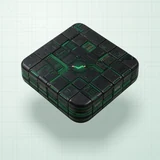

# 🧩 Matrix

## Profile

- Repository: [nocoo/matrix](https://github.com/nocoo/matrix)
- Website: [https://matrix.hexly.ai](https://matrix.hexly.ai)
- Website evidence: GitHub repository homepage
- Category: design
- Archived repository: No; [repository status evidence](../sources/repository-status-2026-09-06.json)
- English: A sci-fi dashboard kit for interfaces that feel like a glimpse into the digital world.
- Chinese: 带有科幻气息的仪表盘组件，让界面像是数字世界的一扇窗口。
- Profile section: Recent Projects
- Profile revision: `9a7ad63e1e96428f9dcd12214bcdbd470b3b51c6`
- Repository revision inspected: `8e6f9add035b35505576f161d95393c0b8b31e07`

## Project goal

Reuse terminal-inspired controls, charts, and page templates to build green-on-black data dashboards.

复用终端风格的控件、图表和页面模板，搭建绿黑配色的数据看板。

- [中文 README](https://github.com/nocoo/matrix/blob/main/README.md) · [English README](https://github.com/nocoo/matrix/blob/main/docs/README.en.md)
- Verified: 2026-09-08; [source revision](https://github.com/nocoo/matrix/tree/f349c07e0a7ac73e337b54014a4c45790a20da94)
- Source files: [`package.json`](https://github.com/nocoo/matrix/blob/f349c07e0a7ac73e337b54014a4c45790a20da94/package.json), [`src/App.tsx`](https://github.com/nocoo/matrix/blob/f349c07e0a7ac73e337b54014a4c45790a20da94/src/App.tsx), [`src/index.css`](https://github.com/nocoo/matrix/blob/f349c07e0a7ac73e337b54014a4c45790a20da94/src/index.css), [`src/components/ui/DataVizComponents.tsx`](https://github.com/nocoo/matrix/blob/f349c07e0a7ac73e337b54014a4c45790a20da94/src/components/ui/DataVizComponents.tsx), [`src/components/ui/MatrixExtras.tsx`](https://github.com/nocoo/matrix/blob/f349c07e0a7ac73e337b54014a4c45790a20da94/src/components/ui/MatrixExtras.tsx), [`src/components/ui/RunnerComponents.tsx`](https://github.com/nocoo/matrix/blob/f349c07e0a7ac73e337b54014a4c45790a20da94/src/components/ui/RunnerComponents.tsx), [`src/data/mock.ts`](https://github.com/nocoo/matrix/blob/f349c07e0a7ac73e337b54014a4c45790a20da94/src/data/mock.ts), [`src/viewmodels/useAccountsViewModel.ts`](https://github.com/nocoo/matrix/blob/f349c07e0a7ac73e337b54014a4c45790a20da94/src/viewmodels/useAccountsViewModel.ts), [`src/viewmodels/useLifeAiViewModel.ts`](https://github.com/nocoo/matrix/blob/f349c07e0a7ac73e337b54014a4c45790a20da94/src/viewmodels/useLifeAiViewModel.ts), [`src/pages/LoginPage.tsx`](https://github.com/nocoo/matrix/blob/f349c07e0a7ac73e337b54014a4c45790a20da94/src/pages/LoginPage.tsx), [`src/i18n/index.ts`](https://github.com/nocoo/matrix/blob/f349c07e0a7ac73e337b54014a4c45790a20da94/src/i18n/index.ts), [`vite.config.ts`](https://github.com/nocoo/matrix/blob/f349c07e0a7ac73e337b54014a4c45790a20da94/vite.config.ts), [`wrangler.toml`](https://github.com/nocoo/matrix/blob/f349c07e0a7ac73e337b54014a4c45790a20da94/wrangler.toml)

### Tech stack

| Technology | Role | 用途 |
| --- | --- | --- |
| TypeScript | Interface and viewmodel logic | 界面与 viewmodel 逻辑 |
| React | Dashboard pages and reusable controls | 看板页面与可复用控件 |
| Vite | SPA development and build | SPA 开发与构建 |
| React Router | Client-side routes | 客户端路由 |
| Tailwind CSS | Theme variables and styling | 主题变量与样式 |
| SVG | Charts and data visualization | 图表与数据可视化 |
| Canvas | Animated character rain | 动态字符雨 |
| i18next | Chinese and English interface | 中英文界面 |
| Cloudflare Workers | Static asset hosting | 静态资源托管 |

## Current logo

- Type: Original project artwork, copied without modification
- Subject: Floating black-and-green layered circuit deck
- [Source](https://github.com/nocoo/matrix/blob/8e6f9add035b35505576f161d95393c0b8b31e07/logo.png): `logo.png`
- [Preserved asset](../../public/logos/originals/matrix-family-2026-09-07-01-01.png)
- Original dimensions: 2048 × 2048
- Original size: 3271736 bytes
- SHA-256: `f9490707d630bdaed3f8891082e46e3315fa1e2c7be89e63f6994b633de3aaf8`
- Locally modified source: No
- Display derivatives: 32, 64, 160, and 1024 px WebP; contain-fit, transparent padding, no recoloring or cropping.

## Current palette

| Role | Value | Evidence |
| --- | --- | --- |
| primary | `#00ff41` | src/index.css --matrix-ink: #00ff41 |
| background | `#050505` | src/index.css --matrix-bg: #050505 |
| accent | `#1d2222` | Native matrix d6d796220a39, sampled sRGB pixel (1340, 376); artwork/logo-family/matrix/2026-09-07-01/palette.json |
| accent | `#29bf5a` | Native matrix d6d796220a39, sampled sRGB pixel (1258, 1177); artwork/logo-family/matrix/2026-09-07-01/palette.json |
| accent | `#a79667` | Native matrix d6d796220a39, sampled sRGB pixel (405, 666); artwork/logo-family/matrix/2026-09-07-01/palette.json |
| accent | `#b2f6cb` | Native matrix d6d796220a39, sampled sRGB pixel (973, 864); artwork/logo-family/matrix/2026-09-07-01/palette.json |

Theme tokens take precedence. Additional colors are sampled from the preserved artwork. A transparent background means the source does not define an opaque background; the gallery's surrounding paper is not part of the project palette.

## Refined identity

- Status: Adopted in the source project; updated 2026-09-07.
- Study `2026-09-07-01`, finishing `01`
- Refined subject: Floating black-and-green layered circuit deck
- Site path: `/projects/matrix#brand`; [local gallery](https://index.dev.hexly.ai/projects/matrix#brand)
- [Static review HTML](../../artwork/logo-family/matrix/2026-09-07-01/review.html)
- [Full process archive](https://github.com/nocoo/hexly.ai/tree/main/artwork/logo-family/matrix/2026-09-07-01)
- [Transparent foreground](../../public/logos/family/matrix/2026-09-07-01/01/transparent.png); SHA-256: `f9490707d630bdaed3f8891082e46e3315fa1e2c7be89e63f6994b633de3aaf8`
- [Square icon](../../public/logos/family/matrix/2026-09-07-01/01/icon.png), [rounded icon](../../public/logos/family/matrix/2026-09-07-01/01/rounded.png), [white version](../../public/logos/family/matrix/2026-09-07-01/01/white.png)
- [Untouched generation](../../public/logos/family/matrix/2026-09-07-01/01/raw.png), [exact prompt](../../public/logos/family/matrix/2026-09-07-01/01/prompt.txt), [public asset checksums](../../public/logos/family/matrix/2026-09-07-01/01/manifest.json)
- [Previous original](../../public/logos/emoji/matrix.png), copied from [its immutable source](https://github.com/nocoo/nocoo/blob/9a7ad63e1e96428f9dcd12214bcdbd470b3b51c6/README.md)
- Previous SHA-256: `21d9c4ed49bedc6010a787ae1a16c2b7e982be264dc5c3e446a2fe9ad122e8b3`
- Generation: gpt-image-2, native 2048 × 2048; transparent extraction and presentation are separate finishing steps.
- The finishing archive includes transparent, square, and rounded PNGs at 2048, 1024, 512, 256, 128, 64, 48, 32, 24, and 16 px.
- Application previews use the refined square icon without extra padding, backgrounds, or circular masks. Artwork previews and downloads use its own transparent foreground, independently of the preserved source logo above.

### Refined palette

| Role | Value | Evidence |
| --- | --- | --- |
| background | `#e2eee7` | Selected Matrix presentation, 2026-09-07-01/01; background.base in archived settings.json |
| primary | `#1d2222` | Native matrix d6d796220a39, sampled sRGB pixel (1340, 376); artwork/logo-family/matrix/2026-09-07-01/palette.json |
| accent | `#29bf5a` | Native matrix d6d796220a39, sampled sRGB pixel (1258, 1177); artwork/logo-family/matrix/2026-09-07-01/palette.json |
| accent | `#a79667` | Native matrix d6d796220a39, sampled sRGB pixel (405, 666); artwork/logo-family/matrix/2026-09-07-01/palette.json |
| accent | `#b2f6cb` | Native matrix d6d796220a39, sampled sRGB pixel (973, 864); artwork/logo-family/matrix/2026-09-07-01/palette.json |

### A fragment of the mothership

A floating thick square deck shares Dotty’s elevated camera and whole-object safety inset. Dense circuitry fills the top and stacked sidewalls while preserving one clear solid block.

悬浮的厚方形甲板延续 Dotty 的斜上方镜头与整体安全留白。密集电路铺满表面及层叠侧壁，仍保持一个清楚、完整的材质主体。

### Black structure, live green traces

Near-black panels, metallic contacts and many thin circuit layers read as a physical engineered material. One small arc bridges deck contacts; the separate subtle lower spill adds light only to large presentations.

近黑面板、金属触点与多层细电路组成拟物工程材质。小电弧连接表面触点，下缘微弱外发光单独处理，仅用于大尺寸展示。

### Circuit routing grid

Pale mint engineering paper combines fine cells with larger backplane divisions, stepped routes and terminal vias. The geometry differs from Dotty’s drafting marks and Basalt’s architectural elevations.

浅薄荷色工程纸结合细格、较大的背板分区、折线走线和端点过孔，纹理几何与 Dotty 的制图标记、Basalt 的建筑立面各不相同。

Small-size observation: At 128/64 px the deck shape, green routing and layered rim remain readable. At 32/24/16 px the transparent mark resolves to a dark diamond-like block with a green circuit signature; individual vias and the small arc merge into that accent.

## Further refinements

This is an owner-directed physical material or architectural identity. Preserve its physical materials, complete silhouette, selected camera and distinct tonal presentation. The animal-series drawing and accessory rules do not apply.

Keep the complete object uniformly inset from the actual rounded outline, with backgrounds, projected shadows and any external emission separate from the transparent foreground. Compare artwork, app icon, sidebar, and favicon sizes in both themes before adopting a replacement. Preserve this reviewed composition and its archived predecessors.
