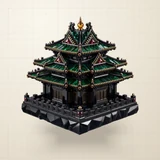

# 🎨 Basalt

## Profile

- Repository: [nocoo/basalt](https://github.com/nocoo/basalt)
- Website: [https://basaltui.com](https://basaltui.com)
- Website evidence: GitHub repository homepage and README at 9e226aa5c1376351ec76a659b1a33a8139892b4b
- Category: design
- Archived repository: No; [repository status evidence](../sources/repository-status-2026-09-06.json)
- English: Dense, dark, durable. A matte design system for information-rich software.
- Chinese: 沉稳、紧凑的哑光设计系统，为信息密集的软件界面而做。
- Profile section: Recent Projects
- Profile revision: `9a7ad63e1e96428f9dcd12214bcdbd470b3b51c6`
- Repository revision inspected: `9e226aa5c1376351ec76a659b1a33a8139892b4b`

## Current logo

- Type: Original project artwork, copied without modification
- Subject: Obsidian and gemstone Forbidden City corner tower
- [Source](https://github.com/nocoo/basalt/blob/9e226aa5c1376351ec76a659b1a33a8139892b4b/logo.png): `logo.png`
- [Preserved asset](../../public/logos/originals/basalt-family-2026-09-07-02-01.png)
- Original dimensions: 2048 × 2048
- Original size: 3445051 bytes
- SHA-256: `d093add49fd51eaa926db0fe260f6afa6d10c2619d141cbc35e518ad5a1cef94`
- Locally modified source: No
- Display derivatives: 32, 64, 160, and 1024 px WebP; contain-fit, transparent padding, no recoloring or cropping.

## Current palette

| Role | Value | Evidence |
| --- | --- | --- |
| primary | `#0a6099` | packages/basalt/src/styles/tokens.css --basalt-primary: 204 88% 32% |
| background | `#eeeff2` | packages/basalt/src/styles/tokens.css --basalt-background: 220 14% 94% |
| accent | `#17191c` | Native basalt 3b270748ea02, sampled sRGB pixel (601, 1192); artwork/logo-family/basalt/2026-09-07-02/palette.json |
| accent | `#0a6648` | Native basalt 3b270748ea02, sampled sRGB pixel (616, 1095); artwork/logo-family/basalt/2026-09-07-02/palette.json |
| accent | `#9e1c2b` | Native basalt 3b270748ea02, sampled sRGB pixel (849, 483); artwork/logo-family/basalt/2026-09-07-02/palette.json |
| accent | `#e4a228` | Native basalt 3b270748ea02, sampled sRGB pixel (1007, 257); artwork/logo-family/basalt/2026-09-07-02/palette.json |
| accent | `#b58e4d` | Native basalt 3b270748ea02, sampled sRGB pixel (1402, 797); artwork/logo-family/basalt/2026-09-07-02/palette.json |

Theme tokens take precedence. Additional colors are sampled from the preserved artwork. A transparent background means the source does not define an opaque background; the gallery's surrounding paper is not part of the project palette.

## Refined identity

- Status: Adopted in the source project; updated 2026-09-07.
- Study `2026-09-07-02`, finishing `01`
- Refined subject: Obsidian and gemstone Forbidden City corner tower
- Site path: `/logos/basalt`; [local gallery](https://index.dev.hexly.ai/logos/basalt)
- [Static review HTML](../../artwork/logo-family/basalt/2026-09-07-02/review.html)
- [Full process archive](https://github.com/nocoo/hexly.ai/tree/main/artwork/logo-family/basalt/2026-09-07-02)
- [Transparent foreground](../../public/logos/family/basalt/2026-09-07-02/01/transparent.png); SHA-256: `d093add49fd51eaa926db0fe260f6afa6d10c2619d141cbc35e518ad5a1cef94`
- [Square icon](../../public/logos/family/basalt/2026-09-07-02/01/icon.png), [rounded icon](../../public/logos/family/basalt/2026-09-07-02/01/rounded.png), [white version](../../public/logos/family/basalt/2026-09-07-02/01/white.png)
- [Untouched generation](../../public/logos/family/basalt/2026-09-07-02/01/raw.png), [exact prompt](../../public/logos/family/basalt/2026-09-07-02/01/prompt.txt), [public asset checksums](../../public/logos/family/basalt/2026-09-07-02/01/manifest.json)
- [Previous original](../../public/logos/originals/basalt.svg), copied from [its immutable source](https://github.com/nocoo/basalt/blob/68a3b545d8dbcfb1968a3be8031d4710bfe3c10c/public/favicon.svg)
- Previous SHA-256: `652ee2a1a62d12e0e9ae89b0a29381b5a03a91a80f75d3a07251fdef89bdb14a`
- Generation: gpt-image-2, native 2048 × 2048; transparent extraction and presentation are separate finishing steps.
- The finishing archive includes transparent, square, and rounded PNGs at 2048, 1024, 512, 256, 128, 64, 48, 32, 24, and 16 px.
- Application previews use the refined square icon without extra padding, backgrounds, or circular masks. Artwork previews and downloads use its own transparent foreground, independently of the preserved source logo above.

### Refined palette

| Role | Value | Evidence |
| --- | --- | --- |
| background | `#ede6d8` | Selected Basalt presentation, 2026-09-07-02/01; background.base in archived settings.json |
| primary | `#17191c` | Native basalt 3b270748ea02, sampled sRGB pixel (601, 1192); artwork/logo-family/basalt/2026-09-07-02/palette.json |
| accent | `#0a6648` | Native basalt 3b270748ea02, sampled sRGB pixel (616, 1095); artwork/logo-family/basalt/2026-09-07-02/palette.json |
| accent | `#9e1c2b` | Native basalt 3b270748ea02, sampled sRGB pixel (849, 483); artwork/logo-family/basalt/2026-09-07-02/palette.json |
| accent | `#e4a228` | Native basalt 3b270748ea02, sampled sRGB pixel (1007, 257); artwork/logo-family/basalt/2026-09-07-02/palette.json |
| accent | `#b58e4d` | Native basalt 3b270748ea02, sampled sRGB pixel (1402, 797); artwork/logo-family/basalt/2026-09-07-02/palette.json |

### A shallower architectural portrait

The corner tower replaces the rejected plain stone slab. A three-quarter camera around 25 degrees above horizontal emphasizes its tiered eaves and compact foundation; the complete tower is uniformly inset without clipping finials or roof tips.

角楼替换已否定的普通石砖。约 25° 俯视的斜向镜头突出重檐和紧凑基座；整座建筑统一缩放，尖顶与飞檐均完整保留。

### Obsidian and gemstones

Polished black obsidian defines the structure. Emerald roof inlays, restrained ruby accents, warm amber and fine gold trim follow the architecture as one coherent material system, with physical light and crisp high-resolution detail.

抛光黑曜石构成建筑主体。祖母绿屋面、克制的红宝石点缀、温暖琥珀及细金边沿建筑组织为一个统一材质体系，保留真实光感与清晰高清细节。

### Corner tower construction grid

Pale champagne drawing paper combines fine engineering cells, larger datum lines, sparse roof elevations and dimensional ticks. Its independent projected shadow creates a gentle hover gap under the obsidian foundation.

浅香槟色制图纸结合细工程网格、较大的基准线、稀疏屋顶立面与尺寸刻度，独立投影在黑曜石基座下形成轻盈的悬浮间隙。

Small-size observation: At 128/64 px the tiered roofs, obsidian base and emerald/amber accents establish the tower. At 32/24/16 px the transparent mark relies on the stepped architectural silhouette; tiny ruby inlays, railings and gold details naturally merge.

## Further refinements

This is an owner-directed physical material or architectural identity. Preserve its physical materials, complete silhouette, selected camera and distinct tonal presentation. The animal-series drawing and accessory rules do not apply.

Keep the complete object uniformly inset from the actual rounded outline, with backgrounds, projected shadows and any external emission separate from the transparent foreground. Compare artwork, app icon, sidebar, and favicon sizes in both themes before adopting a replacement. Preserve this reviewed composition and its archived predecessors.
