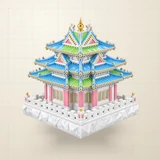

# 🎨 Basalt

## Profile

- Repository: [nocoo/basalt](https://github.com/nocoo/basalt)
- Website: [https://basaltui.com](https://basaltui.com)
- Website evidence: GitHub repository homepage and README at 9e226aa5c1376351ec76a659b1a33a8139892b4b
- Category: design
- Archived repository: No; [repository status evidence](../sources/repository-status-2026-09-06.json)
- English: Dense, dark, durable. A matte design system for information-rich software.
- Chinese: 沉稳、紧凑的哑光设计系统，为信息密集的软件界面而做。
- Profile section: Recent Projects
- Profile revision: `9a7ad63e1e96428f9dcd12214bcdbd470b3b51c6`
- Repository revision inspected: `9e226aa5c1376351ec76a659b1a33a8139892b4b`

## Project goal

Give React applications a consistent set of controls, layered surfaces, charts, and page layouts.

为 React 应用提供统一的控件、分层表面、图表和页面布局。

- [中文 README](https://github.com/nocoo/basalt/blob/main/README.md) · [English README](https://github.com/nocoo/basalt/blob/main/docs/README.en.md)
- Verified: 2026-09-08; [source revision](https://github.com/nocoo/basalt/tree/9b498d3feb8faaeee668229820801d527e07ccb3)
- Source files: [`package.json`](https://github.com/nocoo/basalt/blob/9b498d3feb8faaeee668229820801d527e07ccb3/package.json), [`packages/basalt/package.json`](https://github.com/nocoo/basalt/blob/9b498d3feb8faaeee668229820801d527e07ccb3/packages/basalt/package.json), [`packages/basalt/src/index.ts`](https://github.com/nocoo/basalt/blob/9b498d3feb8faaeee668229820801d527e07ccb3/packages/basalt/src/index.ts), [`packages/basalt/src/components/date-picker.tsx`](https://github.com/nocoo/basalt/blob/9b498d3feb8faaeee668229820801d527e07ccb3/packages/basalt/src/components/date-picker.tsx), [`packages/basalt/src/components/data-table.tsx`](https://github.com/nocoo/basalt/blob/9b498d3feb8faaeee668229820801d527e07ccb3/packages/basalt/src/components/data-table.tsx), [`src/App.tsx`](https://github.com/nocoo/basalt/blob/9b498d3feb8faaeee668229820801d527e07ccb3/src/App.tsx), [`vite.config.ts`](https://github.com/nocoo/basalt/blob/9b498d3feb8faaeee668229820801d527e07ccb3/vite.config.ts), [`wrangler.toml`](https://github.com/nocoo/basalt/blob/9b498d3feb8faaeee668229820801d527e07ccb3/wrangler.toml), [`scripts/docs-gate.ts`](https://github.com/nocoo/basalt/blob/9b498d3feb8faaeee668229820801d527e07ccb3/scripts/docs-gate.ts), [`scripts/consumer-gate.ts`](https://github.com/nocoo/basalt/blob/9b498d3feb8faaeee668229820801d527e07ccb3/scripts/consumer-gate.ts), [`INTEGRATION.md`](https://github.com/nocoo/basalt/blob/9b498d3feb8faaeee668229820801d527e07ccb3/INTEGRATION.md), [`fixtures/README.md`](https://github.com/nocoo/basalt/blob/9b498d3feb8faaeee668229820801d527e07ccb3/fixtures/README.md)

### Tech stack

| Technology | Role | 用途 |
| --- | --- | --- |
| TypeScript | Typed component APIs | 组件类型与 API |
| React | Reusable UI components | 可复用 UI 组件 |
| Radix UI | Accessible interaction primitives | 交互基础控件 |
| Tailwind CSS | Optional utility-based styling | 可选的工具类样式 |
| CSS | Tokens and standalone styles | 设计 tokens 与独立样式 |
| Recharts | Chart components | 图表组件 |
| Vite | Library and showcase builds | 组件库与示例站构建 |
| Cloudflare Workers | Static showcase hosting | 示例站静态托管 |

## Current logo

- Type: Original project artwork, copied without modification
- Subject: Obsidian and gemstone Forbidden City corner tower
- [Source](https://github.com/nocoo/basalt/blob/9e226aa5c1376351ec76a659b1a33a8139892b4b/logo.png): `logo.png`
- [Preserved asset](../../public/logos/originals/basalt-family-2026-09-07-02-01.png)
- Original dimensions: 2048 × 2048
- Original size: 3445051 bytes
- SHA-256: `d093add49fd51eaa926db0fe260f6afa6d10c2619d141cbc35e518ad5a1cef94`
- Locally modified source: No
- Display derivatives: 32, 64, 160, and 1024 px WebP; contain-fit, transparent padding, no recoloring or cropping.

## Current palette

| Role | Value | Evidence |
| --- | --- | --- |
| primary | `#0a6099` | packages/basalt/src/styles/tokens.css --basalt-primary: 204 88% 32% |
| background | `#eeeff2` | packages/basalt/src/styles/tokens.css --basalt-background: 220 14% 94% |
| accent | `#17191c` | Native basalt 3b270748ea02, sampled sRGB pixel (601, 1192); artwork/logo-family/basalt/2026-09-07-02/palette.json |
| accent | `#0a6648` | Native basalt 3b270748ea02, sampled sRGB pixel (616, 1095); artwork/logo-family/basalt/2026-09-07-02/palette.json |
| accent | `#9e1c2b` | Native basalt 3b270748ea02, sampled sRGB pixel (849, 483); artwork/logo-family/basalt/2026-09-07-02/palette.json |
| accent | `#e4a228` | Native basalt 3b270748ea02, sampled sRGB pixel (1007, 257); artwork/logo-family/basalt/2026-09-07-02/palette.json |
| accent | `#b58e4d` | Native basalt 3b270748ea02, sampled sRGB pixel (1402, 797); artwork/logo-family/basalt/2026-09-07-02/palette.json |

Theme tokens take precedence. Additional colors are sampled from the preserved artwork. A transparent background means the source does not define an opaque background; the gallery's surrounding paper is not part of the project palette.

## Refined identity

- Status: Local review; this finishing pass has not been adopted in the source project; updated 2026-09-08.
- Study `2026-09-08-01`, finishing `01`
- Refined subject: A candy-colored Forbidden City corner tower on white Hanbaiyu marble
- Site path: `/logos/basalt`; [local gallery](https://index.dev.hexly.ai/logos/basalt)
- [Static review HTML](../../artwork/logo-family/basalt/2026-09-08-01/review.html)
- [Full process archive](https://github.com/nocoo/hexly.ai/tree/main/artwork/logo-family/basalt/2026-09-08-01)
- [Transparent foreground](../../public/logos/family/basalt/2026-09-08-01/01/transparent.png); SHA-256: `97144a6615113b5981454492776755d486183c219e5f1d8155f17572d21564e7`
- [Square icon](../../public/logos/family/basalt/2026-09-08-01/01/icon.png), [rounded icon](../../public/logos/family/basalt/2026-09-08-01/01/rounded.png), [white version](../../public/logos/family/basalt/2026-09-08-01/01/white.png)
- [Untouched generation](../../public/logos/family/basalt/2026-09-08-01/01/raw.png), [exact prompt](../../public/logos/family/basalt/2026-09-08-01/01/prompt.txt), [public asset checksums](../../public/logos/family/basalt/2026-09-08-01/01/manifest.json)
- [Previous original](../../public/logos/originals/basalt-family-2026-09-07-02-01.png), copied from [its immutable source](https://github.com/nocoo/basalt/blob/9e226aa5c1376351ec76a659b1a33a8139892b4b/logo.png)
- Previous SHA-256: `d093add49fd51eaa926db0fe260f6afa6d10c2619d141cbc35e518ad5a1cef94`
- Generation: gpt-image-2, native 2048 × 2048; transparent extraction and presentation are separate finishing steps.
- The finishing archive includes transparent, square, and rounded PNGs at 2048, 1024, 512, 256, 128, 64, 48, 32, 24, and 16 px.
- Application previews use the refined square icon without extra padding, backgrounds, or circular masks. Artwork previews and downloads use its own transparent foreground, independently of the preserved source logo above.

### Refined palette

| Role | Value | Evidence |
| --- | --- | --- |
| background | `#ede6d8` | Selected local Basalt presentation, 2026-09-08-01/01; background.base in archived settings.json |
| primary | `#5ac2f6` | Native basalt 0acb99561768, sampled sRGB pixel (638, 850); artwork/logo-family/basalt/2026-09-08-01/palette.json |
| accent | `#8dd35a` | Native basalt 0acb99561768, sampled sRGB pixel (935, 575); artwork/logo-family/basalt/2026-09-08-01/palette.json |
| accent | `#f694b2` | Native basalt 0acb99561768, sampled sRGB pixel (780, 1350); artwork/logo-family/basalt/2026-09-08-01/palette.json |
| accent | `#eec14b` | Native basalt 0acb99561768, sampled sRGB pixel (1026, 209); artwork/logo-family/basalt/2026-09-08-01/palette.json |
| accent | `#edeeeb` | Native basalt 0acb99561768, sampled sRGB pixel (842, 1763); artwork/logo-family/basalt/2026-09-08-01/palette.json |
| accent | `#d3d7d8` | Native basalt 0acb99561768, sampled sRGB pixel (960, 717); artwork/logo-family/basalt/2026-09-08-01/palette.json |

### The familiar stepped roofline

The three-quarter view, tiered roofs, upturned eaves, finial and low square foundation preserve the earlier tower. One uniform 80% placement gives every architectural tip room inside the rounded tile; the nearest visible feature sits about 220 native pixels from its boundary.

保留原有斜向镜头、层叠屋顶、飞檐、宝顶和低方基座。整座角楼统一按 80% 放入圆角取景框，最近的可见边缘也留有约 220 个原生像素的空间。

### Hanbaiyu and candy color

Opaque white marble replaces the black plinth and balustrade. Blue and green roof surfaces, pink columns, pearl structure and yellow-gold details translate Basalt’s existing candy palette into a crafted miniature. Veining, latticework and small bevels retain physical depth under broad studio light.

白色汉白玉替换黑色基座与栏杆；蓝绿屋面、粉色立柱、珍珠色构件与金黄细节，把 Basalt 现有糖果色板转化为精工微缩建筑。石材纹理、窗棂和小倒角在宽柔光下保留真实层次。

### Champagne construction paper

The existing Basalt field keeps fine engineering cells, larger datum lines, spare roof elevations and dimensional ticks. Independent projected shadows lift the marble base gently from the paper. The transparent master contains the complete tower without the field, grain or cast shadow.

沿用 Basalt 的细工程格线、较大基准线、疏朗屋顶立面与尺寸刻度。独立投影让汉白玉基座轻轻悬于纸面；透明母版只保留完整角楼，不含底色、颗粒或外部投影。

Small-size observation: At 128/64 px the colored roof tiers and white marble foundation remain distinct. At 32/24/16 px the mark relies on its blue-and-green stepped silhouette; latticework, veining and gold beads merge. The pale foundation softens on light interfaces, while sidebar and favicon specimens retain the transparent foreground.

## Further refinements

This is an owner-directed physical material or architectural identity. Preserve its physical materials, complete silhouette, selected camera and distinct tonal presentation. The animal-series drawing and accessory rules do not apply.

Keep the complete object uniformly inset from the actual rounded outline, with backgrounds, projected shadows and any external emission separate from the transparent foreground. Compare artwork, app icon, sidebar, and favicon sizes in both themes before adopting a replacement. Preserve this reviewed composition and its archived predecessors.
