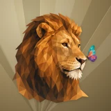

# 🛡️ Surety

## Profile

- Repository: [nocoo/surety](https://github.com/nocoo/surety)
- Website: [https://surety.hexly.ai](https://surety.hexly.ai)
- Website evidence: README.md browser access
- Category: everyday
- Archived repository: No; [repository status evidence](../sources/repository-status-2026-09-06.json)
- English: A private, local-first home for your family insurance policies.
- Chinese: 以隐私和本地数据为先，为家庭保险保单建立一个清晰的档案。
- Profile section: Recent Projects
- Profile revision: `9a7ad63e1e96428f9dcd12214bcdbd470b3b51c6`
- Repository revision inspected: `f257e0977e85358f9d02ed3f79a9fad8862e5117`

## Current logo

- Type: Original project artwork, copied without modification
- Subject: Amber lion portrait with one multicolored butterfly
- [Source](https://github.com/nocoo/surety/blob/f257e0977e85358f9d02ed3f79a9fad8862e5117/logo.png): `logo.png`
- [Preserved asset](../../public/logos/originals/surety-family-2026-09-07-01-01.png)
- Original dimensions: 2048 × 2048
- Original size: 3212224 bytes
- SHA-256: `cb590912df7eb4ad0cf505b195870d448cde7ee3c8038ed7ea8a7ca5a8462314`
- Locally modified source: No
- Display derivatives: 32, 64, 160, and 1024 px WebP; contain-fit, transparent padding, no recoloring or cropping.

## Current palette

| Role | Value | Evidence |
| --- | --- | --- |
| primary | `#ed511d` | apps/web/src/globals.css --primary: 15 85% 52% |
| background | `#eeeff2` | apps/web/src/globals.css --background: 220 14% 94% |
| accent | `#754321` | Native surety ae84f2009fb7, sampled sRGB pixel (466, 1388); artwork/logo-family/surety/2026-09-07-01/palette.json |
| accent | `#edcfa7` | Native surety ae84f2009fb7, sampled sRGB pixel (1466, 1263); artwork/logo-family/surety/2026-09-07-01/palette.json |
| accent | `#19989b` | Native surety ae84f2009fb7, sampled sRGB pixel (1778, 915); artwork/logo-family/surety/2026-09-07-01/palette.json |

Theme tokens take precedence. Additional colors are sampled from the preserved artwork. A transparent background means the source does not define an opaque background; the gallery's surrounding paper is not part of the project palette.

## Refined identity

- Status: Adopted in the source project; updated 2026-09-07.
- Study `2026-09-07-01`, finishing `01`
- Refined subject: Amber lion portrait with one multicolored butterfly
- Site path: `/logos/surety`; [local gallery](https://index.dev.hexly.ai/logos/surety)
- [Static review HTML](../../artwork/logo-family/surety/2026-09-07-01/review.html)
- [Full process archive](https://github.com/nocoo/hexly.ai/tree/main/artwork/logo-family/surety/2026-09-07-01)
- [Transparent foreground](../../public/logos/family/surety/2026-09-07-01/01/transparent.png); SHA-256: `cb590912df7eb4ad0cf505b195870d448cde7ee3c8038ed7ea8a7ca5a8462314`
- [Square icon](../../public/logos/family/surety/2026-09-07-01/01/icon.png), [rounded icon](../../public/logos/family/surety/2026-09-07-01/01/rounded.png), [white version](../../public/logos/family/surety/2026-09-07-01/01/white.png)
- [Untouched generation](../../public/logos/family/surety/2026-09-07-01/01/raw.png), [exact prompt](../../public/logos/family/surety/2026-09-07-01/01/prompt.txt), [public asset checksums](../../public/logos/family/surety/2026-09-07-01/01/manifest.json)
- [Previous original](../../public/logos/originals/surety.png), copied from [its immutable source](https://github.com/nocoo/surety/blob/aad7b0298935b71642e8d25abb125c0cb9cc0d22/logo.png)
- Previous SHA-256: `13b22815f3d07d56ee294f005db9638809e0329fedce51887dd55cba75b01dc6`
- Generation: gpt-image-2, native 2048 × 2048; transparent extraction and presentation are separate finishing steps.
- The finishing archive includes transparent, square, and rounded PNGs at 2048, 1024, 512, 256, 128, 64, 48, 32, 24, and 16 px.
- Application previews use the refined square icon without extra padding, backgrounds, or circular masks. Artwork previews and downloads use its own transparent foreground, independently of the preserved source logo above.

### Refined palette

| Role | Value | Evidence |
| --- | --- | --- |
| background | `#9b865c` | Selected Surety presentation, 2026-09-07-01/01; background.base in archived settings.json |
| primary | `#cc8330` | Native surety ae84f2009fb7, sampled sRGB pixel (1280, 708); artwork/logo-family/surety/2026-09-07-01/palette.json |
| accent | `#754321` | Native surety ae84f2009fb7, sampled sRGB pixel (466, 1388); artwork/logo-family/surety/2026-09-07-01/palette.json |
| accent | `#edcfa7` | Native surety ae84f2009fb7, sampled sRGB pixel (1466, 1263); artwork/logo-family/surety/2026-09-07-01/palette.json |
| accent | `#19989b` | Native surety ae84f2009fb7, sampled sRGB pixel (1778, 915); artwork/logo-family/surety/2026-09-07-01/palette.json |
| accent | `#6f4584` | Native surety ae84f2009fb7, sampled sRGB pixel (1770, 1105); artwork/logo-family/surety/2026-09-07-01/palette.json |

### The guardian pauses

The complete irregular mane frames a quiet head turn. A butterfly beside the nose adds a single secondary focus; the whole group sits safely inside the rounded tile.

完整而自然的鬃毛围住安静转动的脸，鼻尖旁的蝴蝶成为唯一的兴趣点。整组主体在圆角内保留留白。

### Amber takes the lead

Broad honey and umber planes describe the face and mane. The former tiger identity is replaced by a recognizable lion, with color concentrated in one small butterfly.

大块蜜金与深棕色面描绘脸部和鬃毛。旧虎形标识替换为清晰的狮子，多彩点缀集中在一只小蝴蝶上。

### Folded amber fan

Unequal fan folds spread from a low off-center pivot. Deeper ochre, fine grain and shallow shadows give the mane separation without competing with its expression.

不等宽的扇形折面从偏下方展开，较深赭色、细颗粒和浅阴影托起鬃毛，同时保留表情的主导地位。

Small-size observation: The whole mane and butterfly stay inside the rounded outline with at least 145.5 px of native clearance. Small marks use the transparent lion; butterfly details simplify at 16 px.

## Further refinements

Keep this asset as the phase-one baseline. A future family version should use a recognizable animal, one principal hue, and restrained multicolored geometric fragments.

Use head portraits for large animals and optionally full-body poses for small animals. Compare artwork, app icon, sidebar, and favicon sizes in both themes before adopting a replacement. Preserve this reviewed composition and its archived predecessors.
