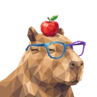

# 🧬 Life.ai

## Profile

- Repository: [nocoo/life.ai](https://github.com/nocoo/life.ai)
- Website: No current website verified; navigation opens the repository.
- Website evidence: Not applicable
- Category: everyday
- Archived repository: No; [repository status evidence](../sources/repository-status-2026-09-06.json)
- English: Bring health, places, and spending into one personal picture.
- Chinese: 把健康指标、位置足迹和消费记录，汇成一幅个人生活图景。
- Profile section: Recent Projects
- Profile revision: `9a7ad63e1e96428f9dcd12214bcdbd470b3b51c6`
- Repository revision inspected: `4e23d62f401ba4aa2fab39956b49312e5818d50d`

## Current logo

- Type: Original project artwork, copied without modification
- Subject: Capybara portrait with an apple
- [Source](https://github.com/nocoo/life.ai/blob/4e23d62f401ba4aa2fab39956b49312e5818d50d/logo.png): `logo.png`
- [Preserved asset](../../public/logos/originals/life-ai.png)
- Original dimensions: 2048 × 2048
- Original size: 4312191 bytes
- SHA-256: `306b58b664359d913e95828db42a754cfc1dfa1b6b007db5b6ed33f3d63d726d`
- Locally modified source: No
- Display derivatives: 32, 64, 160, and 1024 px WebP; contain-fit, transparent padding, no recoloring or cropping.

## Current palette

| Role | Value | Evidence |
| --- | --- | --- |
| primary | `#3c83f6` | dashboard/src/app/globals.css --primary: 217 91% 60% |
| background | `#eeeff2` | dashboard/src/app/globals.css --background: 220 14% 94% |
| accent | `#854e40` | Preserved project artwork, sampled pixel |
| accent | `#a87f5c` | Preserved project artwork, sampled pixel |
| accent | `#dcb281` | Preserved project artwork, sampled pixel |

Theme tokens take precedence. Additional colors are sampled from the preserved artwork. A transparent background means the source does not define an opaque background; the gallery's surrounding paper is not part of the project palette.

## Future family notes

Keep this asset as the phase-one baseline. A future family version should use a recognizable animal, one principal hue, and restrained multicolored geometric fragments.

Use head portraits for large animals and optionally full-body poses for small animals. Compare artwork, app icon, sidebar, and favicon sizes in both themes before adopting a replacement. No new logo is generated in phase one.
