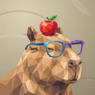

# 🧬 Life.ai

## Profile

- Repository: [nocoo/life.ai](https://github.com/nocoo/life.ai)
- Website: No current website verified; navigation opens the repository.
- Website evidence: Not applicable
- Category: everyday
- Archived repository: No; [repository status evidence](../sources/repository-status-2026-09-06.json)
- English: Bring health, places, and spending into one personal picture.
- Chinese: 把健康指标、位置足迹和消费记录，汇成一幅个人生活图景。
- Profile section: Recent Projects
- Profile revision: `9a7ad63e1e96428f9dcd12214bcdbd470b3b51c6`
- Repository revision inspected: `b6f3e7f426315062e0492e00c4d9448bfa3b8031`

## Project goal

Import personal health, location, and bookkeeping exports, then compare them through daily, monthly, and yearly views.

导入个人健康、位置足迹和记账导出文件，通过日、月、年视图对照查看。

- [中文 README](https://github.com/nocoo/life.ai/blob/main/README.md) · [English README](https://github.com/nocoo/life.ai/blob/main/docs/README.en.md)
- Verified: 2026-09-08; [source revision](https://github.com/nocoo/life.ai/tree/56df330ee15eada49dd0f926e4e9e73775fdcfea)
- Source files: [`package.json`](https://github.com/nocoo/life.ai/blob/56df330ee15eada49dd0f926e4e9e73775fdcfea/package.json), [`dashboard/package.json`](https://github.com/nocoo/life.ai/blob/56df330ee15eada49dd0f926e4e9e73775fdcfea/dashboard/package.json), [`dashboard/src/lib/db.ts`](https://github.com/nocoo/life.ai/blob/56df330ee15eada49dd0f926e4e9e73775fdcfea/dashboard/src/lib/db.ts), [`dashboard/src/lib/auth.ts`](https://github.com/nocoo/life.ai/blob/56df330ee15eada49dd0f926e4e9e73775fdcfea/dashboard/src/lib/auth.ts), [`scripts/import/applehealth/cli.ts`](https://github.com/nocoo/life.ai/blob/56df330ee15eada49dd0f926e4e9e73775fdcfea/scripts/import/applehealth/cli.ts), [`scripts/import/footprint/cli.ts`](https://github.com/nocoo/life.ai/blob/56df330ee15eada49dd0f926e4e9e73775fdcfea/scripts/import/footprint/cli.ts), [`scripts/import/pixiu/cli.ts`](https://github.com/nocoo/life.ai/blob/56df330ee15eada49dd0f926e4e9e73775fdcfea/scripts/import/pixiu/cli.ts), [`dashboard/src/views/day/day-page.tsx`](https://github.com/nocoo/life.ai/blob/56df330ee15eada49dd0f926e4e9e73775fdcfea/dashboard/src/views/day/day-page.tsx)

### Tech stack

| Technology | Role | 用途 |
| --- | --- | --- |
| TypeScript | Import scripts and application logic | 导入脚本与应用逻辑 |
| Bun | Data processing and SQLite runtime | 数据处理与 SQLite 运行环境 |
| Next.js | Web dashboard and APIs | Web Dashboard 与 API |
| React | Data views | 数据视图 |
| SQLite | Local health, route, and finance databases | 本地健康、轨迹与记账数据库 |
| Leaflet | Route maps | 轨迹地图 |
| Recharts | Charts and trends | 图表与趋势 |
| Zustand | Dashboard state | Dashboard 状态 |

## Current logo

- Type: Original project artwork, copied without modification
- Subject: Capybara portrait with an apple
- [Source](https://github.com/nocoo/life.ai/blob/b6f3e7f426315062e0492e00c4d9448bfa3b8031/logo.png): `logo.png`
- [Preserved asset](../../public/logos/originals/life-ai-family-2026-09-07-01-02.png)
- Original dimensions: 2048 × 2048
- Original size: 2268740 bytes
- SHA-256: `dc9f9d0a07acd163c5837d831f38beab0bdbe206a693221f40892801b9a493ca`
- Locally modified source: No
- Display derivatives: 32, 64, 160, and 1024 px WebP; contain-fit, transparent padding, no recoloring or cropping.

## Current palette

| Role | Value | Evidence |
| --- | --- | --- |
| primary | `#3c83f6` | dashboard/src/app/globals.css --primary: 217 91% 60% |
| background | `#eeeff2` | dashboard/src/app/globals.css --background: 220 14% 94% |
| accent | `#c18d57` | Native life-ai 705264fc5b59, sampled sRGB pixel (1101, 935); artwork/logo-family/life-ai/2026-09-07-01/palette.json |
| accent | `#694936` | Native life-ai 705264fc5b59, sampled sRGB pixel (1086, 1860); artwork/logo-family/life-ai/2026-09-07-01/palette.json |
| accent | `#e1412e` | Native life-ai 705264fc5b59, sampled sRGB pixel (1079, 312); artwork/logo-family/life-ai/2026-09-07-01/palette.json |

Theme tokens take precedence. Additional colors are sampled from the preserved artwork. A transparent background means the source does not define an opaque background; the gallery's surrounding paper is not part of the project palette.

## Refined identity

- Status: Adopted in the source project; updated 2026-09-07.
- Study `2026-09-07-01`, finishing `02`
- Refined subject: Caramel capybara with closed eyes, blue-purple glasses, and an apple with leaves
- Site path: `/projects/life-ai#brand`; [local gallery](https://index.dev.hexly.ai/projects/life-ai#brand)
- [Static review HTML](../../artwork/logo-family/life-ai/2026-09-07-01/review.html)
- [Full process archive](https://github.com/nocoo/hexly.ai/tree/main/artwork/logo-family/life-ai/2026-09-07-01)
- [Transparent foreground](../../public/logos/family/life-ai/2026-09-07-01/02/transparent.png); SHA-256: `dc9f9d0a07acd163c5837d831f38beab0bdbe206a693221f40892801b9a493ca`
- [Square icon](../../public/logos/family/life-ai/2026-09-07-01/02/icon.png), [rounded icon](../../public/logos/family/life-ai/2026-09-07-01/02/rounded.png), [white version](../../public/logos/family/life-ai/2026-09-07-01/02/white.png)
- [Untouched generation](../../public/logos/family/life-ai/2026-09-07-01/02/raw.png), [exact prompt](../../public/logos/family/life-ai/2026-09-07-01/02/prompt.txt), [public asset checksums](../../public/logos/family/life-ai/2026-09-07-01/02/manifest.json)
- [Previous original](../../public/logos/originals/life-ai.png), copied from [its immutable source](https://github.com/nocoo/life.ai/blob/4e23d62f401ba4aa2fab39956b49312e5818d50d/logo.png)
- Previous SHA-256: `306b58b664359d913e95828db42a754cfc1dfa1b6b007db5b6ed33f3d63d726d`
- Generation: gpt-image-2, native 2048 × 2048; transparent extraction and presentation are separate finishing steps.
- The finishing archive includes transparent, square, and rounded PNGs at 2048, 1024, 512, 256, 128, 64, 48, 32, 24, and 16 px.
- Application previews use the refined square icon without extra padding, backgrounds, or circular masks. Artwork previews and downloads use its own transparent foreground, independently of the preserved source logo above.

### Refined palette

| Role | Value | Evidence |
| --- | --- | --- |
| background | `#b7aa8e` | Selected Life.ai presentation, 2026-09-07-01/02; background.base in archived settings.json |
| primary | `#c18d57` | Native life-ai 705264fc5b59, sampled sRGB pixel (1101, 935); artwork/logo-family/life-ai/2026-09-07-01/palette.json |
| accent | `#694936` | Native life-ai 705264fc5b59, sampled sRGB pixel (1086, 1860); artwork/logo-family/life-ai/2026-09-07-01/palette.json |
| accent | `#e1412e` | Native life-ai 705264fc5b59, sampled sRGB pixel (1079, 312); artwork/logo-family/life-ai/2026-09-07-01/palette.json |
| accent | `#77a848` | Native life-ai 705264fc5b59, sampled sRGB pixel (1205, 111); artwork/logo-family/life-ai/2026-09-07-01/palette.json |
| accent | `#276da5` | Native life-ai 705264fc5b59, sampled sRGB pixel (999, 918); artwork/logo-family/life-ai/2026-09-07-01/palette.json |
| accent | `#793ca6` | Native life-ai 705264fc5b59, sampled sRGB pixel (1732, 721); artwork/logo-family/life-ai/2026-09-07-01/palette.json |

### A calm, balanced moment

The broad muzzle and relaxed closed eyes stay dominant. A natural short neck and shoulder enter from the lower left, leaving the whole apple, ear, and outer glasses arm inside the safe frame.

宽鼻口与放松闭眼仍是主体，短颈和肩部从左下自然进入画面，完整苹果、耳朵和外侧镜框都留在安全范围内。

### Caramel facets, familiar accents

Warm connected polygons retain the capybara’s coat and expression. The original apple and blue-purple glasses keep their color relationship, with clean transparent gaps around the frame.

暖色连续多边形保留水豚毛色与表情，原有苹果和蓝紫眼镜保持配色关系，镜框空隙干净透明。

### Riverbank ripples

Broken elliptical water rings and one quiet leaf-vein impression fill a warm sand field. The broad tonal texture gives the portrait a calm setting without becoming a scene.

断续椭圆水纹与一处安静叶脉落在暖沙色底面上，以宽阔同色纹理衬托平静头像。

Small-size observation: The broad caramel muzzle, red apple, and blue-purple glasses remain visible at 32 px. Closed eyes and small leaf facets simplify at 16 px; the 192 px login asset is also transparent.

## Further refinements

Keep this asset as the phase-one baseline. A future family version should use a recognizable animal, one principal hue, and restrained multicolored geometric fragments.

Use head portraits for large animals and optionally full-body poses for small animals. Compare artwork, app icon, sidebar, and favicon sizes in both themes before adopting a replacement. Preserve this reviewed composition and its archived predecessors.
