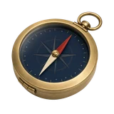

# 🚀 Echo

## Profile

- Repository: [nocoo/echo](https://github.com/nocoo/echo)
- Website: [https://echo.nocoo.cloud](https://echo.nocoo.cloud)
- Website evidence: GitHub repository homepage
- Category: tools
- Archived repository: No; [repository status evidence](../sources/repository-status-2026-09-06.json)
- English: A small, fast IP lookup service, built with Bun and TypeScript.
- Chinese: 用 Bun 与 TypeScript 构建的轻量 IP 查询服务。
- Profile section: Recent Projects
- Profile revision: `9a7ad63e1e96428f9dcd12214bcdbd470b3b51c6`
- Repository revision inspected: `59730aa033b97d0a9ff917b34a90bedef2a06c39`

## Project goal

Give network diagnostic tools IP location and network data, plus observations of DNS resolver exit addresses.

为网络诊断工具提供 IP 位置与运营商信息，并观察 DNS 解析器的出口地址。

- [中文 README](https://github.com/nocoo/echo/blob/main/README.md) · [English README](https://github.com/nocoo/echo/blob/main/docs/README.en.md)
- Verified: 2026-09-08; [source revision](https://github.com/nocoo/echo/tree/b7373ec8e5d09a59847b3b9aa04f73526a019a41)
- Source files: [`package.json`](https://github.com/nocoo/echo/blob/b7373ec8e5d09a59847b3b9aa04f73526a019a41/package.json), [`packages/ip-service/package.json`](https://github.com/nocoo/echo/blob/b7373ec8e5d09a59847b3b9aa04f73526a019a41/packages/ip-service/package.json), [`packages/ip-service/src/server.ts`](https://github.com/nocoo/echo/blob/b7373ec8e5d09a59847b3b9aa04f73526a019a41/packages/ip-service/src/server.ts), [`packages/ip-service/src/services/ipLookup.ts`](https://github.com/nocoo/echo/blob/b7373ec8e5d09a59847b3b9aa04f73526a019a41/packages/ip-service/src/services/ipLookup.ts), [`packages/ip-service/src/services/selectBest.ts`](https://github.com/nocoo/echo/blob/b7373ec8e5d09a59847b3b9aa04f73526a019a41/packages/ip-service/src/services/selectBest.ts), [`packages/ip-service/vercel.json`](https://github.com/nocoo/echo/blob/b7373ec8e5d09a59847b3b9aa04f73526a019a41/packages/ip-service/vercel.json), [`packages/collector/package.json`](https://github.com/nocoo/echo/blob/b7373ec8e5d09a59847b3b9aa04f73526a019a41/packages/collector/package.json), [`packages/collector/src/index.ts`](https://github.com/nocoo/echo/blob/b7373ec8e5d09a59847b3b9aa04f73526a019a41/packages/collector/src/index.ts), [`packages/collector/wrangler.toml`](https://github.com/nocoo/echo/blob/b7373ec8e5d09a59847b3b9aa04f73526a019a41/packages/collector/wrangler.toml), [`packages/dns-probe/main.go`](https://github.com/nocoo/echo/blob/b7373ec8e5d09a59847b3b9aa04f73526a019a41/packages/dns-probe/main.go), [`packages/dns-probe/go.mod`](https://github.com/nocoo/echo/blob/b7373ec8e5d09a59847b3b9aa04f73526a019a41/packages/dns-probe/go.mod), [`.github/workflows/release.yml`](https://github.com/nocoo/echo/blob/b7373ec8e5d09a59847b3b9aa04f73526a019a41/.github/workflows/release.yml), [`LICENSE`](https://github.com/nocoo/echo/blob/b7373ec8e5d09a59847b3b9aa04f73526a019a41/LICENSE)

### Tech stack

| Technology | Role | 用途 |
| --- | --- | --- |
| TypeScript | IP API and result collector | IP API 与结果收集服务 |
| Bun | Local API runtime and workspaces | 本地 API 运行时与工作区管理 |
| Hono | IP lookup HTTP routes | IP 查询 HTTP 路由 |
| Vercel | IP service hosting | IP 服务托管 |
| Go | Authoritative DNS probe | 权威 DNS 探针 |
| Cloudflare Workers | DNS result collection API | DNS 结果收集 API |
| Cloudflare KV | Short-lived resolver observations | 短期保存解析器观察记录 |
| Vitest | IP service unit and HTTP tests | IP 服务单元与 HTTP 测试 |

## Current logo

- Type: Original project artwork, copied without modification
- Subject: A brass and navy pocket compass
- [Source](https://github.com/nocoo/echo/blob/59730aa033b97d0a9ff917b34a90bedef2a06c39/logo.png): `logo.png`
- [Preserved asset](../../public/logos/originals/echo-family-2026-09-07-01-01.png)
- Original dimensions: 2048 × 2048
- Original size: 5170077 bytes
- SHA-256: `ba7421a11db8e5a5e16e3199b8d6612edd65b6ba3e98855328b2cb027644c58d`
- Locally modified source: No
- Display derivatives: 32, 64, 160, and 1024 px WebP; contain-fit, transparent padding, no recoloring or cropping.

## Current palette

| Role | Value | Evidence |
| --- | --- | --- |
| primary | `#192d3e` | Native echo bce159d3b8a5, sampled sRGB pixel (1080, 1178); artwork/logo-family/echo/2026-09-07-01/palette.json |
| background | `#bfd4d7` | Adopted Echo presentation, 2026-09-07-01/01; background.base in archived settings.json |
| accent | `#b19254` | Native echo bce159d3b8a5, sampled sRGB pixel (272, 960); artwork/logo-family/echo/2026-09-07-01/palette.json |
| accent | `#a42f1e` | Native echo bce159d3b8a5, sampled sRGB pixel (1294, 585); artwork/logo-family/echo/2026-09-07-01/palette.json |
| accent | `#e2cfa2` | Native echo bce159d3b8a5, sampled sRGB pixel (952, 978); artwork/logo-family/echo/2026-09-07-01/palette.json |

Theme tokens take precedence. Additional colors are sampled from the preserved artwork. A transparent background means the source does not define an opaque background; the gallery's surrounding paper is not part of the project palette.

## Refined identity

- Status: Adopted in the source project; updated 2026-09-07.
- Study `2026-09-07-01`, finishing `01`
- Refined subject: A brass and navy pocket compass
- Site path: `/projects/echo#brand`; [local gallery](https://index.dev.hexly.ai/projects/echo#brand)
- [Static review HTML](../../artwork/logo-family/echo/2026-09-07-01/review.html)
- [Full process archive](https://github.com/nocoo/hexly.ai/tree/main/artwork/logo-family/echo/2026-09-07-01)
- [Transparent foreground](../../public/logos/family/echo/2026-09-07-01/01/transparent.png); SHA-256: `ba7421a11db8e5a5e16e3199b8d6612edd65b6ba3e98855328b2cb027644c58d`
- [Square icon](../../public/logos/family/echo/2026-09-07-01/01/icon.png), [rounded icon](../../public/logos/family/echo/2026-09-07-01/01/rounded.png), [white version](../../public/logos/family/echo/2026-09-07-01/01/white.png)
- [Untouched generation](../../public/logos/family/echo/2026-09-07-01/01/raw.png), [exact prompt](../../public/logos/family/echo/2026-09-07-01/01/prompt.txt), [public asset checksums](../../public/logos/family/echo/2026-09-07-01/01/manifest.json)
- [Previous original](../../public/logos/emoji/echo.png), copied from [its immutable source](https://github.com/nocoo/nocoo/blob/9a7ad63e1e96428f9dcd12214bcdbd470b3b51c6/README.md)
- Previous SHA-256: `b7a3eb2ada128f64271d7a91ceab4d58ff4589bdca20c07fb056270454dc68ca`
- Generation: gpt-image-2, native 2048 × 2048; transparent extraction and presentation are separate finishing steps.
- The finishing archive includes transparent, square, and rounded PNGs at 2048, 1024, 512, 256, 128, 64, 48, 32, 24, and 16 px.
- Application previews use the refined square icon without extra padding, backgrounds, or circular masks. Artwork previews and downloads use its own transparent foreground, independently of the preserved source logo above.

### Refined palette

| Role | Value | Evidence |
| --- | --- | --- |
| background | `#bfd4d7` | Adopted Echo presentation, 2026-09-07-01/01; background.base in archived settings.json |
| primary | `#192d3e` | Native echo bce159d3b8a5, sampled sRGB pixel (1080, 1178); artwork/logo-family/echo/2026-09-07-01/palette.json |
| accent | `#b19254` | Native echo bce159d3b8a5, sampled sRGB pixel (272, 960); artwork/logo-family/echo/2026-09-07-01/palette.json |
| accent | `#a42f1e` | Native echo bce159d3b8a5, sampled sRGB pixel (1294, 585); artwork/logo-family/echo/2026-09-07-01/palette.json |
| accent | `#e2cfa2` | Native echo bce159d3b8a5, sampled sRGB pixel (952, 978); artwork/logo-family/echo/2026-09-07-01/palette.json |

### A direction found

A red-and-ivory needle crosses a deep navy compass face. The close brass hanging ring and complete circular instrument share one gentle diagonal.

红白指针划过深蓝罗盘，紧靠的黄铜提环与完整仪器沿同一条温和斜线组织。

### Brass and navy glass

Softly brushed brass, a controlled glass reflection and engraved direction marks retain physical depth. The hanging-ring opening is truly transparent.

柔和拉丝黄铜、克制玻璃反光和方向刻痕保留拟物深度，提环镂空保持真实透明。

### Survey bearings

Latitude arcs, a sparse meridian fan and short bearing marks in pale harbor-blue paper. The field, grain and contact shadow are independent of transparent app marks.

浅蓝纸面上的经纬弧线与偏移导航刻度，呼应 IP 位置查询。 底色、颗粒与接触阴影均独立于透明应用标记。

Small-size observation: At 128/64 px, the gold compass rim and red needle remain clear. At 32/24/16 px, the compact silhouette and dominant colors carry recognition; fine material detail, printed marks and background lines naturally merge.

## Further refinements

This is an owner-directed physical material or architectural identity. Preserve its physical materials, complete silhouette, selected camera and distinct tonal presentation. The animal-series drawing and accessory rules do not apply.

Keep the complete object uniformly inset from the actual rounded outline, with backgrounds, projected shadows and any external emission separate from the transparent foreground. Compare artwork, app icon, sidebar, and favicon sizes in both themes before adopting a replacement. Preserve this reviewed composition and its archived predecessors.
